# **TABLE** OF CONTENTS

---

#### Section 1 - Summarize Fundamental Security Concepts

- 1.1 - Introduction To Information Security
- 1.2 - Cybersecurity Framework
- 1.3 - Gap Analysis
- 1.4 - Control Objectives
- 1.5 - Security Control Categories
- 1.6 - Security Control Functional Types
- 1.7 - Security Roles & Responsibilities

#### Section 2 - Explaining Threat Actors And Threat Vectors

- 2.1 - Vulnerability, Threat And Risk
- 2.2 - Attributes Of Threat Actors
- 2.3 - Threat Actors
- 2.4 - Attack Surface & Attack Vectors
- 2.5 - Vulnerable Software & Network Vectors
- 2.6 - Lure-Based & Message-Based Vectors
- 2.7 - Third Party Risks
- 2.8 - Intro To Social Engineering

#### Section 3 - Explain Cryptographic Solutions

- 3.1 - Introduction To Cryptography And Hashing
- 3.2 - Encryption
- 3.3 - Cryptographic Modes Of Operation & Cipher Suites
- 3.4 - Cryptographic Use Cases
- 3.5 - Longevity, Salting , Stretching & Other Types Of Cryptographic Technologies
- 3.6 - Certificates, Pkis, Ras & Csrs
- 3.7 - Digital Certificates
- 3.8 - Key Management
- 3.9 - Certificate Management

#### Section 4 - Implement Identity and Access Management

- 4.1 - Identity Access Management
- 4.2 - Authentication Factors, Design And Attributes
- 4.3 - Biometric Authentication
- 4.4 - Password Concepts
- 4.5 - Authorization Solutions - Part 1
- 4.6 - Authorization Solutions - Part 2
- 4.7 - Account Attributes & Access Policies
- 4.8 - Privileged Access Management
- To protect privileged account credentials, it is important not to sign in on untrusted workstations. A secure administrative workstation (SAW) is a computer with a very low attack surface running the minimum possible apps.
- 4.9 - Local, Network & Remote Authentication
- 4.10 - Kerberos Authentication & Authorization

#### Section 5 - Secure Enterprise Network Architecture

- 5.1 - Secure Network Designs
- 5.2 - Network Segmentation, Topology & DMZs
- 5.3 - Device Placement & Attributes
- 5.4 - Secure Switching And Routing
- 5.5 - Routing & Switching Protocols
- 5.6 - Using Secure Protocols
- 5.7 - Attack Surface
- 5.8 - Firewalls
- 5.9 - Firewall Implementation
- 5.10 - Remote Access Architecture

#### Section 6 - Secure Cloud Network Architecture

- 6.1 - Cloud Deployment Models
- 6.2 - Responsibility Matrix
- 6.3 - Cloud Security Solutions
- 6.4 - Infrastructure As Code Concepts
- 6.5 - Zero Trust
- 6.6 - Embedded Systems
- 6.7 - Industrial Control Systems & Internet Of Things

#### Section 7 - Explain Resiliency and Site Security Concepts

- 7.1 - Backup Strategies & Storage
- 7.2 - Implementing Redundancy Strategies
- 7.3 - Cyber Security Resilient Strategies
- 7.4 - Physical Security Controls
- 7.5 - physical host security controls

#### Section 8 - Explain Vulnerability Management

- 8.1 - Vulnerability Discoverer
- 8.2 - Weak host & Network configurations
- 8.3 - Evaluation Scope
- 8.4 - Overflows, Resource Exhaustion, Memory Leaks & Race Conditions 
- 8.5 - Sideloading, Rooting & Jailbreaking 
- 8.6 - Threat Research Sources 
- 8.7 - Threat Intelligence Providers 
- 8.8 - Threat Data Feeds
- 8.9 - Vulnerability Response & Remediation 

#### Section 9 - Evaluate Network Security Capabilities

- 8.1 - Bench Marks & Secure Configuration Guides 
- 8.2 - Hardening Concepts 
- 8.3 - Wi-Fi Authentication Methods 
- 8.4 - Network Access Control 
- 8.5 - Network Security Monitoring 
- 8.6 - Web Filtering 

#### Section 10 - Assess Endpoint Security Capabilities

- 10.1 - Endpoint Security 
- 10.2 - Segmentation 
- 10.3 - Mobile Device Management
- 10.4 - Secure Mobile Device Connections 

#### Section 11 - Enhance Application Security Capabilities

- 11.1 - Dns Security, Directory Services & Snmp 
- 11.2 - Secure Application Operations Protocols 
- 11.3 - File Transfer, Email & Video Services 
- 11.4 - Email Security 
- 11.5 - Secure Coding Techniques 

#### Section 12 - Explain Incident Response and Monitoring Concepts

- 12.1 - Incident Response Process 
  12.2 - Cyber Incident Response Team
  12.3 - Incident Response Plan 
  12.4 - Incident Response Exercises, Recovery And Retention Policy 
  12.5 - Incident Identification 
  12.6 - Digital Forensics Documentation 
  12.7 - Digital Forensics Evidence Acquisition 
  12.8 - Data Sources 

- #### Section 13 - Section 13 - Analyze Indicators of Malicious Activity


- 13.1 - Malware Classification
- 13.2 - Computer Viruses
- 13.3 - Computer Worms & Fileless Malware
- 13.4 - Spyware, Keyloggers, Rootkits, Backdoors, Ransomware & Logic Bombs
- 13.5 - Malware Indicators & Process Analysis
- 13.6 - Password Attacks
- 13.7 - Tactics, Techniques & Procedures
- 13.8 - Privilege Escalation & Error Handling
- 13.9 - Uniform Resource Locator Analysis & Percent Encoding
- 13.10 - Api & Replay Attacks, Cross-Site Request Forgery, Clickjacking & Ssl Strip Attacks
- 13.11 - Injection Attacks

#### Section 14 - Summarize Security Governance Concepts

- 14.1 - Regulations, Standards & Legislation
- 14.2 - ISO and Cloud Frameworks 
- 14.3 - Governance Structure 
- 14.4 - Governance Documents 
- 14.5 - Change Management 
- 14.6 - Configuration Management 
- 14.7 - Scripting, Automation & Orchestration 

#### Section 15 - Explain Risk Management

- 15.1 - Risk management process 
- 15.2 - Risk Controls 
- 15.3 - Business Impact Analysis 
- 15.4 - Third-Party Risk Management & Security Agreements 
- 15.5 - Audit & Assurance 
- 15.6 - PenTest Attack Life Cycle 

#### Section 16 - Summarize Data Protection and Compliance Concepts

- 16.1 - Privacy & Sensitive Data Concepts 
- 16.2 - Data Sovereignty, Privacy Breaches & Data Sharing 
- 16.3 - Privacy And Data Controls 
- 16.4 - Privacy Principles 
- 16.5 - Compliance Monitoring 
- 16.6 - Education, Training & Awareness 
- 16.7 - Personnel Policies 

---

# Section 1 - SUMMARIZE FUNDAMENTAL SECURITY CONCEPTS

## 1.1 Introduction To Information Security

Information security is based on the CIA and DAD triads. Information and cyber security professionals strive to accomplish the CIA triad.

- **Confidentiality** - Data is accessed by only those with the right permit and can be achieved with the use of encryption, passwords, biometrics, 2fa and so on.
- **Integrity** - This ensures that data has not been tampered or altered in any way with the use of hashing, checksums etc
- **Availability** - Data and resources are available to be accessed or shared at all times. This can be achieved with network access, server and data availability.
  Black hat hackers and cyber criminals aim for the DAD triad.
- **Disclosure** - Hwwvwere data is accessed by non-authorized users with the use of trojans, brute force attacks and theft
- **Alteration** - This means data has been compromised or tampered with. This can be attained by malware, viruses and attacks like sql injection.
- **Deniability** - This means data is not made available to those who need it with the use of attacks like dos and ddos as well as ransomware.

**Non-repudiation** - means a subject cannot deny something such as creating, modifying or sending a resource.

## 1.2 Cybersecurity Framework

Information security and cyber tasks can be classified as five functions following the framework developed by the national institute of standards and technology (NIST).

**The NIST Framework Has 5 Parts**

- **Identify** - Evaluate Risks, Threats & Vulnerabilities And Recommend Security Controls To Mitigate Them.
- **Protect** - Procure/Develop, Install, Operate And Decommission It Hardware & Software Assets With Security As An Embedded Requirement At Every Stage.
- **Detect** - Perform Ongoing Proactive Monitoring To Ensure That Security Controls Are Effective And Capable Of Protection Against New Types Of Threats.
- **Respond** - Identify, Analyze, Contain And Eradicate Threats To Systems And Data Security.
- **Recover** - Implement Cyber Security Resilience To Restore Systems And Data If Other Controls Are Unable To Prevent Attacks.

## 1.3 Gap Analysis

Gap analysis is a process that identifies how an organization’s security systems deviate from those required or recommended by a framework. This will be performed when first adopting a framework or when meeting a new industry or legal compliance requirement. The analysis might be repeated every few years to meet compliance requirements or to validate any changes.

For each section of the framework, a gap analysis report will provide an overall score, a detailed list of missing or poorly configured controls associated with that section, and recommendations for remediation.

While some or all work involved in gap analysis could be performed by the internal security team, a gap analysis is likely to involve third-party consultants. Frameworks and compliance requirements from regulations and legislation can be complex enough to require a specialist. Advice and feedback from an external party can alert the internal security team to oversights and to new trends and changes in best practice.

## 1.4 Control Objectives

Controls are tactics or strategies that proactively minimize risk by reducing or eliminating:

- A vulnerability
- The likelihood that a threat actor will exploit a vulnerability
- The impact of an exploit

Countermeasures are controls implemented to address a **specific** threat.

**Controls can be measured by:**

- **Functionality** - what the control does
- **Effectiveness** - how well a control works (consistency, reliability, timeliness)
- **Assurance** - a measure of confidence that intended security controls are effective in their application
- Cost-Benefit

Control objectives refer to a statement of a desired result that should be achieved by implementing a control or set of controls.

**Defense-in-depth**

Design and implementation of multiple overlapping layers of diverse controls. Controls should maintain independence and not be subject to the cascading effect.

**Security Control Baselines**

These express the minimum standards for a given environment

**Fine-Tuning Controls**

- **Scoping** - Eliminating unnecessary baseline recommendations that are not applicable
- **Tailoring** - Customizing baseline recommendations to align with objectives
- **Compensating** - Substituting a recommended baseline control with a similar control
- **Supplementing** - Adding to the baseline recommendations

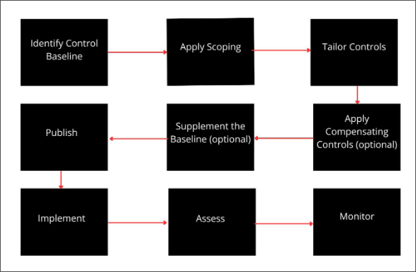


## 1.5 Security Control Categories

A security control is something designed to give a system or digital asset the properties of CIA & Non-Repudiation.

There are three main Security Control categories

- **Technical** - Implemented as a system such as firewalls, anti-malware and OS access control. They can also be referred to as logical controls.
- **Operational** - Implemented primarily by people rather than systems e.g. security guards and training programs
- **Managerial** - These controls give oversight of the information system e.g. risk identification tools or security policies.

## 1.6 Security Control Functional Types

- **Preventive** - These controls act to eliminate or reduce the likelihood that an attack can succeed e.g. ACLs, anti-malware, directives and standard operating procedures (sops) can be regarded as administrative versions of preventative controls.
- **Detective** - These controls may not deter access but will identify and record any attempted or successful intrusion e.g logs & audits
- **Corrective** - These controls act to eliminate or reduce the impact of an intrusion event e.g. backups and patch management.
- **Physical** - These include alarms, security cameras and guards and can be used to deter physical access to premises and hardware
- **Deterrent** - These controls can psychologically discourage an attacker from attempting an intrusion e.g signs and warnings of legal penalties.
- **Compensating** - These controls serve as a substitute for a principal control by a security standard and affords the same (or better) level of protection but uses a different methodology or technology.

## 1.7 Security Roles & Responsibilities

Security professionals must be competent in a wide range of disciplines from network to application design and procurement of security resources.

```
- Participate In Risk Assessments
- Source, Install And Configure Security Devices And Software
- Set Up And Maintain Document Access Control
- Monitor Audit Logs And Review User Privileges
- Manage Security-Related Incident Response And Reporting
- Create And Test Business Continuity And Disaster Recovery Plans
- Participate In Security Training And Education Programs
```


- A security policy is a formalized statement that defines how security will be implemented within an organization and can contain multiple individual policies.

- Overall internal responsibility might be allocated to a dedicated department run by a director of security, chief security officer or chief information security officer
- Managers may have responsibility for a domain such as building control, ICT or even accounting.

**Security Operations Center (SOC)** - this is a location where security professionals monitor and protect critical information assets across other business functions such as finance, operations and marketing, typically employed by larger corporations such as government agencies or a healthcare company.

**Devseops** - Devops is a cultural shift within an organization to encourage much more collaboration between developers and system admins. Devseops extends the boundary to security specialists reflecting the principle that security is a primary consideration at every stage of software development **(known as shift left)**

**Incident Response** - A Dedicated Cyber Incident Response Team (CIRT) / Computer Security Incident Response Team (CSIRT) / Computer Emergency Response Team (CERT) As a Single Point-Of-Contact for the notification of Security Incidents.


---

# Section 2 - EXPLAINING THREAT ACTORS AND THREAT VECTORS

## 2.1 Vulnerability, Threat And Risk

**Vulnerability** - this is a weakness that could be triggered accidentally or exploited intentionally to cause a security breach. threats can exist even when there are no vulnerabilities.

Threats can exist without risks but a risk needs an associated threat to exist the path or tool used by a malicious threat actor can be referred to as the attack vector.

Risks are often measured based on the **probability** that an event might occur as well as the impact of the event on the business.

Threat assessment is the combination of a threat actor’s **intentions** to harm combined with an assessment of that actor’s **capability** to carry out those intentions.

Risk assessment involves identification of security risks through the analysis of assets, threats and vulnerabilities, including their impacts and likelihood.

Risks are event focused (the database server goes down) while threats focus on intentions (a hacker wants to take down the database server).


## 2.2 Attributes Of Threat Actors

**Location** - An external threat or actor is one that has no account or authorized access to the target system. such threats must use malware and or social engineering to infiltrate the security system. Conversely, an internal or insider threat actor is one that has been granted permissions on the system and typically means either an employee or a third party contractor.

**Intent**/**motivation** - Intent describes what an attacker hopes to achieve from the attack while motivation is the reason for perpetuating the attack. motivation could be driven by greed, curiosity or grievance.

Threats can either be structured or unstructured. A criminal gang attempting to steal financial data is a structured targeted threat while a script kiddie launching a series of spam emails is unstructured and opportunistic.

**Level of sophistication/capability** - the technical abilities and resources/funding the adversary possesses must also be considered. capability refers to a threat actor’s ability to craft novel exploit techniques and tools.

## 2.3 Threat Actors

- **Script kiddie** - Use hacker tools without necessarily understanding how they work or have the ability to craft new attacks.
- **Black hats** - Very skilled and have financial interests
- **White hat** - Hack systems and networks with full authorization typically to discover vulnerabilities and test current security setup.
- **Gray hats** - Are very skilled and typically employ black hat tactics for white hat objectives
- **Hacktivists** - hacking for a cause. they might attempt to obtain and release confidential information to the public or deface a website. (anonymous, wikileaks)
- **State actors & advanced persistent threats** - The term atp was coined to understand the behavior underpinning modern types of cyber adversaries. it refers to the ongoing ability of an adversary to compromise network security and maintain access by using a variety of tools and techniques.
- **Criminal syndicates** - Criminal syndicates can operate across the internet from different jurisdictions than its victim, increasing the complexity of prosecution.
- **Insider threats** - These include compromised employees, disgruntled employee (ex, second streamer, spy/saboteur, shadow IT, unintentional)

## 2.4 Attack Surface & Attack Vectors

**Attack Surface** - This refers to all the points at which a malicious threat actor could try to exploit a vulnerability. The attack surface for an external actor is and should be far smaller than that for an insider threat. Minimizing the attack surface means restricting access so that only a few known endpoints, protocols/ports and services are permitted.

The attack vector is the path that a threat actor uses to gain access to a secure system and can include

- Direct Access
- Removable Media
- Email
- Remote & Wireless
- Supply Chain
- Web & Social Media
- Cloud
- Internet/Cloud

## 2.5 Vulnerable Software & Network Vectors

**Vulnerable software** is one that contains a flaw in its code or design that can be exploited to circumvent access control or to crash the process.

**Unsupported systems & applications** - An unsupported system is one whose vendor no longer develops updates or patches for it.

One strategy for dealing with unsupported apps that cannot be replaced is to try to isolate them from other systems. The idea is to reduce opportunities for a threat actor to access the vulnerable app and run exploit code. Using isolation as a substitute for patch management is an example of a compensating control.

**Network Vectors** - An exploit technique for any given software vulnerability can be classed as either remote or local.

- Remote means the vulnerability can be exploited by sending code to the target over a network.
- Local means that the exploit code must be executed from an authenticated session on the computer.

An unsecured network is one that lacks the attributes of CIA while a secure network uses an access control framework and cryptographic solutions to identify, authenticate, authorize and audit network users, hosts and traffic.

#### Some specific threat vectors associated with unsecured networks are:

- **Direct Access -** Getting physical access to an unlocked workstation, stealing a PC or maybe using a boot disk to install malicious tools.
- **Wired Network -** A threat actor attaches an unauthorized device to a physical network port and is able to launch eavesdropping or DoS attacks.
- **Remote & Wireless Network -** The attacker either obtains credentials for a remote access or wireless connection to the network or cracks the security protocols used for authentication.
- **Cloud Access -** The attacker is likely to target the accounts used to develop services in the cloud or manage cloud systems. They may also try to attack the cloud service provider (CSP) as a way of accessing the victim system.
- **Bluetooth Network -** The threat actor exploits a vulnerability or misconfiguration to transmit a malicious file to a user’s device over the Bluetooth personal area wireless networking protocol.
- **Default Credentials -** The attacker gains control of a network device or app because it has been left configured with a default password.
- **Open Service Port -** The threat actor is able to establish an unauthenticated connection to a logical TCP or UDP network port.

## 2.6 Lure-Based & Message-Based Vectors

This is something superficially attractive that causes its target to want it even though it may be concealing something dangerous.

In cybersecurity terms, when the target opens the file bait, it delivers a malicious payload hook that will typically give the threat actor control over the system or perform service disruption

- **Removable Device -** The attacker conceals malware on a USB thumb drive or memory card and tries to trick employees into connecting the media to a PC or smartphone typically through a drop attack.
- **Executable File -** The threat actor conceals exploit code in a program file (Trojan Malware).
- **Document Files -** Malware is concealed by embedding it in word processing and PDF format files.
- **Image Files -** The exploit code is concealed in an image file that targets a vulnerability in browser or document editing software.

**Message-Based Vectors**

- **Email** - The attacker sends a malicious file attachment via email that allows attachments (phishing).
- Short Message Service (SMS)
- **Instant Messaging** - Most apps for this are more secure than SMS because they use encryption but they can still contain software vulnerabilities.
- **Web & Social Media -** Malware may be concealed in files attached to posts or presented as downloads.

The most powerful exploits are **zero-click** which means that simply receiving an attachment or viewing an image on a web page can trigger the exploit.

## 2.7 Third Party Risks

Vendor Management is the process of choosing supplier companies and evaluating the risks inherent in relying on a third party product or service.

Within vendor management, system integration refers to the process of using components from multiple vendors to implement a business workflow.

There are two main Data Risks When Using Third Parties

- The vendor may need to be granted access to your data
- The vendor may have to be used to host the data or the data backups

**Data Storage**

The Following Precautions Should Be Taken:

- Ensure the same protections For Data as though it were stored On-Premises.
- Monitor and Audit Third-Party access to the Data
- Evaluate compliance impacts from Storing Personal Data on a Third-Party System

## 2.8 Intro To Social Engineering

This is the exploitation of human emotions and interactions to extract valuable information, more dangerous than traditional methods of hacking as it relies on human error which is subjective & less predictable than software/hardware vulnerabilities.

Social engineering relies heavily on human emotions such as fear, curiosity, excitement, anger and guilt.

**Phishing** - Relies on creating a sense of excitement or panic in the target using emails.
**Spear phishing** - A phishing attack against a very specific individual or organization
**Angler phishing** - A phishing attack directed specifically at social media users
**Whaling** - A phishing attack targeted at senior executives of an organization
**Tailgating** - The attacker without access authorization closely follows an authorized person in a reserved area

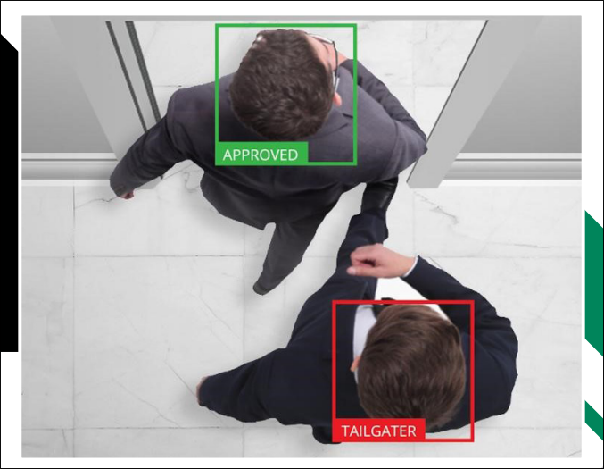

**Vishing** - Relies on creating a sense of excitement or panic in the target using a phone call

**Smishing** - Relies on creating a sense of excitement or panic in the target using a text message

**Hoaxes** - The hacker impersonates an employee or angry customer

**Baiting** - Dropping infected USB drives in the parking lot to influence employees

**Piggybacking** - An attacker enters a secure building with the permission of an employee

**Shoulder** **Surfing** - Obtaining sensitive information by spying

**Dumpster** Diving - Obtaining sensitive information by going through the company trash

**Credential** Harvesting - Using phishing emails and spamming campaigns to gather information which can then be sold

**Pharming** - Redirecting victims to a malicious website using DNS cache poisoning

**Watering Hole Attack** - An attack that aims to compromise a specific group of end-users by infecting existing websites or creating a new one that will attract them

**Typo Squatting / url Hijacking** - Hackers register misspelled domain names of popular websites hoping to capture sensitive information, e.g. Facebook.com, Instagram.com

**Influence Campaigns** - A major program launched by an adversary with a high level of capability such as a nation-state actor or terrorist group. The goal is to shift public opinion on some topic and when deployed along with espionage, disinformation/fake news and hacking, it can be characterized as a hybrid warfare.


---

# SECTION 3 - EXPLAIN CRYPTOGRAPHIC SOLUTIONS

## 3.1 Introduction To Cryptography And Hashing

Cryptography is a secure communication Technique that allows only the Sender and Receiver of a Message to view it.

**Plaintext** - An Unencrypted Message 

**Ciphertext** - An Encrypted Message

**Cipher** - The Process (Algorithm) Used to Encrypt and Decrypt a Message

**Cryptanalysis** - The Art of Cracking Cryptographic Systems

**There Are Three Main Types Of Cryptographic Algorithms:**

- Hashing Algorithms 

- Symmetric Encryption Cipher 

- Asymmetric Encryption Cipher


**Hashing Algorithms** - the simplest type of cryptographic operation and produces a fixed length string from an input plaintext that can be of any length. A **hashing collision** occurs when two different plain texts produce the exact same hash value. encryption algorithms must demonstrate collision avoidance.


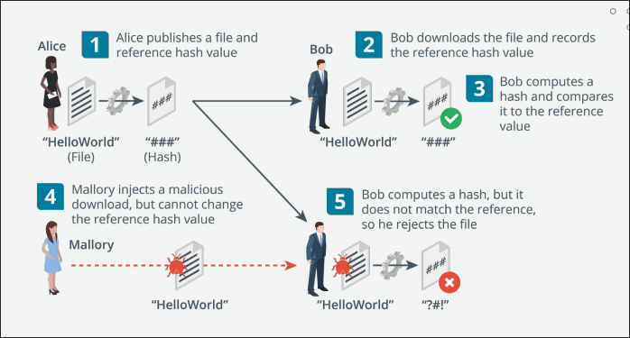


**Hashing Algorithms** 

- **Secure Hash Algorithm (Sha)** - Considered to be the Strongest Algorithm with the most Popular Being The Sha-256 which produces A 256-Bit Digest.
- **Message Direct Algorithm #5 (Md5)** - produces A 128-Bit Digest Birthday Attack - a brute force attack aimed at exploiting collisions in hash functions. could be used for forging a digital signature

## 3.2 Encryption

An encryption algorithm is a type of cryptographic process that encodes data so that it can be recovered or decrypted.

The use of a key, with the encryption cipher ensures that decryption can only be performed by authorized persons.

A substitution cipher involves replacing units in the plain text with different cipher text. e.g rot13 rotates at letter 13 places so a becomes n

The cipher text **"uryyb jbeyq"** means "hello world"

In contrast to substitution ciphers, the units in a transposition cipher stay the same in plain text and cipher text but their order is changed according to some mechanism.

Consider the cipher text “hoole l w r d”
h l o o l
e l w r d

The letters are simply written as columns and the rows are concatenated.

**Symmetric Encryption** - here both encryption and decryption are performed by the same secret key and can be used for confidentiality. It is very fast and is used or bulk encryption of large amounts of data but can be vulnerable if the key is stolen.

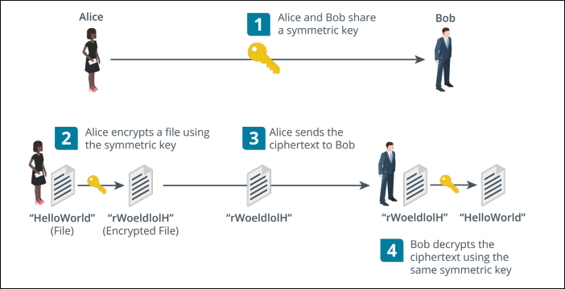

**There are two types** - Stream ciphers & block ciphers

**Stream cipher** - The plaintext is combined with a separate randomly generated message calculated from the key and an initialization vector (iv). each byte or bit of data is encrypted one at a time.

**Block cipher** - The plaintext is divided into equal-size blocks (usually 128-bit). if there is not enough data in the plaintext, it is padded to the correct size. e.g, a 1200-bit plaintext would be padded with an extra 80 bits to fit into 10 x 128-bit blocks.

**Asymmetric Encryption** - Here both encryption and decryption are performed by two different but related public and private keys in a key pair. Each key is capable of reversing the operation of its pair and they are linked in such a way as to make it impossible to derive one from the other.

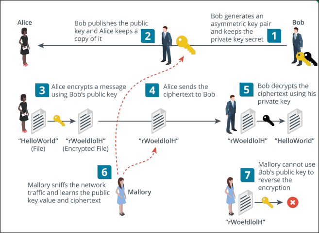

- Can be used to Prove Identity as the holder of the Private Key Cannot be Impersonated by anyone Else.
- The Major Drawback of this Encryption is that it Involves Substantial Computing Resources.
- Mostly Used for Authentication and Non-Repudiation and for Key Agreement and Exchange.
- Asymmetric Encryption is often referred to as Public Key Cryptography and the Products are Based on The Rsa Algorithm.
- Ron Rivest, Adi Shamir and Leonard Adleman Published The RSA cipher In 1977.


## 3.3 Cryptographic Modes Of Operation & Cipher Suites

- A mode of operation is a means of using a cipher within a product to achieve a security goal such as confidentiality or integrity.
- Public Key Cryptography can authenticate a Sender while Hashing can Prove Integrity.
- Both can be combined to authenticate a sender and prove the integrity of a message and this usage is called a **digital signature.**
- Symmetric encryption can encrypt and decrypt large amounts of data but it's difficult to distribute the secret key securely.
- Asymmetric (pK) encryption can distribute the key easily but cannot be used for large amounts of data.
- **Digital Certificates** - public keys are used and are freely available but how can anyone trust the identity of the person or server issuing a public key
- A third party known as a certificate authority (ca) can validate the owner of the public key by issuing the subject with a certificate.
- The Process of Issuing and Verifying Certificates Is Called **Public Key Infrastructure (Pki)**
- **Cipher Suite** - This is the combination of ciphers supported and is made Up of
  - **Signature Algorithm** - Used to Assert the Identity of The Server’s Public Key and Facilitate Authentication
  - **Key Exchange/Agreement Algorithm** - Used by the Client and Server to Derive The Same Bulk Encryption Symmetric Key.

## 3.4 Cryptographic Use Cases

**Cryptography supporting authentication & non-repudiation** - a single hash function, symmetric or asymmetric cipher is called a cryptographic primitive. a complete cryptographic system or product is likely to use multiple cryptographic primitives such as within a cipher suite.

Authentication & non-repudiation depend on the recipient not being able to encrypt the message or the recipient would be able to impersonate the sender. Basically the recipient must be able to use the cryptographic process to decrypt authentication and integrity data but not to encrypt it.

**Cryptography supporting confidentiality** - cryptography removes the need to store data in secure media as even if the cipher text is stolen, the threat actor will not be able to understand or change what has been stolen.

**Cryptography supporting Integrity & resilience** - integrity is proved by hashing algorithms which allow two parties to derive the same checksum and show that a message or data has not been tampered with. Cryptography can be used to design highly resilient control systems and secure computer code.

A developer can make tampering more difficult through obfuscation which is the art of making a message difficult to understand. Cryptography is a very effective way of obfuscating code but it also means the computer might not be able to understand and execute the code.


## 3.5 Longevity, Salting , Stretching & Other Types Of Cryptographic Technologies

**Longevity** - This Refers to the Measure of Confidence That People have in a Given Cipher. In Another Sense, it is the Consideration of how Long data must be kept secure.

**Salting** - passwords stored as hashes are vulnerable to brute force and dictionary attacks. a password hash cannot be decrypted as they are one-way. however, an attacker can generate hashes to try and find a match for the captured password hash through a brute force or dictionary attack.

A Brute Force Attack Will Run Through a Combination of Letters, Numbers and Symbols while a Dictionary Attack Creates Hashes of Common Words and Phrases.

**Both Attacks can be Slowed Down by Adding a Salt Value when Creating the Hash.**

**(Salt + Password) * Sha = Hash**

The salt is not kept secret because any system verifying the hash must know the value of the salt but it's presence means that an attacker cannot use pre-computed tables of hashes.

**Key Stretching** - this takes a key that's generated from a user password plus a random salt value and repeatedly converts it to a longer and more random key. this means the attacker will have to do extra processing for each possible key value thus make the attack even slower.

This can be performed by using a particular software library to hash and save passwords when they are created. the **password-based key derivation function 2 (PBKDF2)** is widely used for this purpose.

**Homomorphic Encryption** - This Is The Conversion of Data Into Cipher text that can be analyzed and Worked with As If It Were Still In Its Original Form.

It enables Complex Mathematical Operations to be Performed on encrypted data without Compromising The Encryption.

**Blockchain** - This is a concept in which an expanding list of transactional records is secured using cryptography. Each record is referred to as a block and is run through a hash function. The hash value of the previous block in the chain is added to the hash calculation of the next block and thus ensures that each successive block is cryptographically linked.

**Steganography** - This is a technique for obscuring the presence of a message such as hiding a message in a picture, the container document or file is called the cover text.


## 3.6 Certificates, Pkis, Ras & Csrs

**Public & Private Key Usage**

When you want others to send you confidential messages, you give them your public key to encrypt the message and then you decrypt the message with your private key.

When You Want To Authenticate Yourself To Others, you create a Signature and Sign It Using Your Private Key To Encrypt It. You give others your Public Key to Decrypt the Signature.

**Certificate Authority** - This is the Entity Responsible for Issuing and Guaranteeing Certificates.

**Pki Trust Models Include:**

- **Single CA** - A Single CA issues certificates to Users and the Users Trust Certificates by that CA exclusively. If the CA is Compromised, the Entire PKI Collapses

- **Hierarchical (Intermediate CA) -** A single CA called the root issues certificates to several intermediate CAs. The intermediate CAs issue certificates to subjects (leaf or end entities). Each leaf certificate can be traced back to the root CA along the certification path and this is referred to as a certificate chain or chain of trust. The root is still a single point of failure but it can be taken off-line as most of the regular CA activities are handled by the intermediate CA servers.


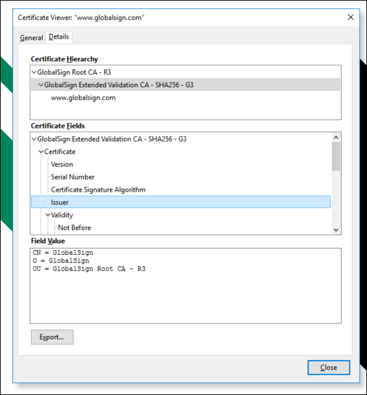


- **Online Versus Offline Cas** - An online CA is one that is available to accept and process certificate signing requests and management tasks. Because of the high risk posed by a compromised root CA, a secure configuration will involve making the root an off-line CA meaning it is disconnected from any network and only brought back on line to add or update intermediate CAs.


**Registration authorities and CSRS** - registration is the process by which end users create an account with the CA and become authorized to request certificates.

When a subject Wants to Obtain a Certificate, It Completes a Certificate Signing Request (CSR) and Submits It to the CA.

The CA Reviews The Certificate and checks that the Information is Valid. If the Request Is accepted, The CA Signs the Certificate and Sends It to the Subject.


## 3.7 Digital Certificates

- A Digital Certificate is essentially a Wrapper for a Subject’s Public Key. As well as the Public Key, it Contains Information about The Subject and the Certificate’s Issuer.
- When Certificates Were First Introduced, The Common Name (CN) Attribute was Used to Identify The FQDN by Which The Server is Accessed.
- The **Subject Alternative Name (SAN)** Extension Field is Structured to Represent Different Types of Identifiers Including Domain Names.
- A **Wildcard** Domain Such as *.compia.org means that the Certificate Issuer will be accepted as Valid for all Subdomains.


| Field                          | Usage                                                        |
| ------------------------------ | ------------------------------------------------------------ |
| Serial number                  | A number uniquely identifying the certificate within the domain of its CA. |
| Signature algorithm            | The algorithm used by the CA to sign the certificate.        |
| Issuer                         | The name of the CA.                                          |
| Valid from/to                  | Date and time during which the certificate is valid.         |
| Subject                        | The name of the certificate holder (DN). Within this, the common name (CN) part should usually match either the fully qualified domain name (FQDN) of the server or a user email address. |
| Public key                     | Public key and algorithm used by the certificate holder.     |
| Extensions                     | Data about certificate extensions.                           |
| Subject alternative name (SAN) | The DNS Name(s) or other identities the certificate covers.  |


**EkU Field - Can Have The Following Values**

- Server Authentication
- Client Authentication
- Code Signing
- Email Protection

**Web Server Certificate Types Include:**

- Domain Validation (Dv) - Proves The Ownership Of A Particular Domain
- Extended Validation (Ev) - Subjecting To A Process That Requires More Rigorous Checks On The Subject’s Legal Identity And Control Over The Domain.

**Other Certificate Types Include:**

- Machine/Computer Certificates
- Email/User Certificates
- Code Signing Certificates
- Root Certificate
- Self-Signed Certificates


## 3.8 Key Management

This refers to Operational Considerations For The Various Stages In A Key’s Life Cycle And Can Be **Centralized** Meaning One Admin Controls The Process Or **Decentralized** In Which Each User Is Responsible For His Or Her Keys.

**Key Life Cycle**

- Key Generation
- Certificate Generation
- Storage
- Revocation
- Expiration And Renewal

If the key used to decrypt data is lost or damaged, encrypted data cannot be recovered unless a backup of the key exists. however making too many backups can make it more difficult to keep the key secure.

**Escrow** means that something is held independently which in terms of key management, means a third party is trusted to store the key securely.


## 3.9 Certificate Management

When you are renewing a certificate, it is possible to use the existing **key referred** to specifically as key renewal or generate a new key in which case, the certificate is **rekeyed.**

Certificates are issued with a limited duration set by the ca policy for the certificate type e.g a root certificate might have a 10 year expiry date while a web server certificate might be issued for 1 year only.

A certificate may be revoked or suspended. a revoked certificate is no longer valid and cannot be reinstated while a suspended certificate can be re-enabled. A certificate may be revoked or suspended for a variety of reasons such as the private key compromise, business closure or user leaving the company. These reasons are codified under

- Unspecified
- Key Compromise
- Ca Compromise
- Superseded
- Cessation Of Operation

A suspended Key is given the Code **Certificate Hold**


# Section 4 - Implement Identity and Access Management

## 4.1 Identity Access Management

Covers The Authentication & Authorization Aspects Of A System And How Privileged Users Are Managed.

**There Are Four Phases Involved In IAM**

- Identity - Supply Identification Information
- Authenticate - Identity Information Is Verified
- Authorize - Allows Actions Based On Verified Identification
- Audit - Keeps Track Of Actions Performed With The Identification

**Identity & Access Threats**

- Spoofing
- Identity Theft
- Keylogging
- Escalation Of Privilege
- Information Leakage

**IM Tools & Techniques**

- Identity Manager
- Fraud Analytics
- Multi Factor Authentication

**Am Tools & Techniques**

- Single Sign On
- Behavior Analytics
- Role Based Approach


## 4.2 Authentication Factors, Design And Attributes

Authentication Factors

- **Something You Know** - This Includes Passwords, Passphrases Or Pins. A **Knowledge Factor** Is Also Used For Accessor Reset Mechanisms.
- **Something You Have** - An **Ownership Factor** Means That The Account Holder Possesses Something That No One Else Does Such As A Smart Card, Hardware Token Or Smartphone.
- **Something You Are/Do** - A **Biometric Factor** Uses Either Physiological Identifiers Like Fingerprints Or Behavioral Identifiers Such As The Way Someone Walks And Talks.

Multi Factor Authentication - This Combines The Use Of More Than One Authentication Factor And Can Either Be 2factor Or 3 Factor Authentication.

Multifactor authentication requires a combination of different technologies. for example, requiring a pin along with a date of birth isn’t multifactor.

**Authentication Attributes**

Compared to the authentication factors, an authentication attribute is either a non- unique property or a factor that cannot be used independently.

- **Somewhere you are** - This could be a geographic location measured using a device’s location service or ip address. This isn’t used as a primary authentication factor but may be used as a continuous authentication mechanism.
- **Something you can do** - Behavioral characteristics such as the way you walk or hold your smartphone can be used to identify you to a considerable degree of activity.
- **Something you exhibit** - This also refers to a behavioral-based authentication and authorization with specific emphasis on personality traits such as the way you use smartphone apps or web search engines.
- **Someone you know** - This uses a web of trust model where new users are vouched for by existing users.


## 4.3 Biometric Authentication

The first step is enrollment and the chosen biometric is scanned by a biometric reader and converted to binary information. The biometric template is kept in the authentication server database and when a user wants to access a resource, they are scanned and the scan is compared to the template to determine if access will be granted or denied.

- **False rejection rate (FRR)** - Where a legitimate user is not recognized, also referred to as a type 1 error or false non-match rate (FNMR).
- **False acceptance rate (FAR)** - Where an interloper is accepted, also referred to as type 2 error or false match rate (FMR).
- **Crossover error rate (CER)** - The point at which FRR and FAR meet. The lower the CER, the more efficient and reliable the technology.

**Fingerprint & facial recognition** - Fingerprint recognition is the most widely used as it’s inexpensive and non-invasive. facial recognition records multiple factors about the size and shape of the face.

[Image: Retina Scan illustration]

**Facial Recognition**

- **Retinal Scan** - An Infrared Light Is Shone Into The Eye To Identify The Pattern Of Blood Vessels. It Is Very Accurate, Secure But Also Quite Expensive.
- **Iris Scan** - Matches Patterns On The Surface Of The Eye Using Near-Infrared Imaging And Is Less Intrusive Than Retinal Scan.

**Behavioral Technology** - A Template Is Created By Analyzing A Behavior Such As Typing Or Walking.

- **Voice Recognition** - Relatively Cheap But Subject To Impersonation And Background Noise
- **Gait Analysis -** Human Movement
- **Signature Recognition** - Records The User Applying Their Signature (Stroke, Speed And Pressure Of The Stylus)
- **Typing** - Matches The Speed And Pattern Of A User’s Input Of A Passphrase Continuous Authentication Verifies That The User Who Logged On Is Still Operating The Device.


## 4.4 Password Concepts

**Password Length** - Enforces a minimum length for passwords.
**Password Complexity** - Enforces password complexity rules
**Password Aging** - Forces the user to select a new password after a set period
**Password Reuse and History** - Prevents the selection of a password that has been used already.

Under the most recent **NIST** guidelines:
Complexity rules should not be enforced and the only restriction should be to block common passwords.
Aging policies should not be enforced. Users should be able to select if and when a password should be changed
Password hints should not be used.

**Password Managers** - These are used to mitigate poor credential management practices that are hard to control.

The main risks involved are selection of a weak master password, compromise of the vendor’s cloud storage or systems and impersonation attacks designed to trick the manager into filling a password to a spoofed site.


## 4.5 Authorization Solutions - Part 1

An important consideration when designing a security system is to determine how users receive rights or permissions.

The different models are referred to as access control schemes.

**Discretionary Access Control (DAC)** - it is very flexible but also the easiest to compromise as it's vulnerable to insider threats and abuse of compromised accounts.

This is based on the primacy of the resource owner and this means the owner has full control over the resource and can decide who to grant rights to.

**Role-Based Access Control (RBAC)** - RBAC can be partially implemented through the use of security group accounts.

This adds an extra degree of centralized control to the DAC model where users are not granted rights explicitly (assigned directly) but rather implicitly (through being assigned a role)

**File System Permissions (Linux) - In Linux, There Are Three Basic Permissions:**

- Read(R) - The Ability To Access And View The File

- Write(W) - The Ability To Modify The File

- Execute(X) - The Ability To Run A Script Or Program Or Perform A Task On That Directory.


These Permissions Can Be Applied In The Context Of The Owner User(U), A Group Account(G) And All Other Users/World(O).

**D Rwx R-X R-X Home**

The String Above Shows That For The Directory(D), The Owner Has Read, Write And Execute Permissions While The Group Context And Others Have Read And Execute Permissions

The Chmod Command Is Used To Modify Permissions And Can Be Used Either In Symbolic Or Absolute Mode.

**In Symbolic Mode, The Command Works As Follows:**

**Chmod G+W, O-X Home**

The Effect Of This Command Is to append Write Permission To The Group Context And Remove Execute Permission From The Other Context.

By Contrast, The Command Can Also Be Used To Replace Existing Permissions.

**Chmod U=Rwx, G=Rx, O=Rx Home**

**D rwxr-xr-x home**

In absolute mode, permissions are assigned using octal notation where r=4, w=2 and x=1

**Chmod 755 home**

**Mandatory Access Control (MAC)** - this is based on the idea of security clearance levels (labels) instead of ACLs. In a hierarchical one, subjects are only permitted to access objects at their own clearance level or below.

**Attribute-Based Access Control (ABAC) -** this is the most fine-grained type of access control mode and it is capable of making access decisions based on a combination of subject and

object attributes plus any system-wide attributes.

This system can monitor the number of events or alerts associated with a user account or track resources to ensure they are consistent in terms of timing of requests.

Rule-based access control - this is a term that can refer to any sort of access control model where access control policies are determined by system-enforced rules rather than system users.

As such RBAC, ABAC and MAC are all examples of rule-based (or non-discretionary) access control.


## 4.6 Authorization Solutions - Part 2

**Directory services** - Directory services are the principal means of providing privilege management and authorization on an enterprise network as well as storing information about users, security groups and services.

The types of attributes, what information they contain and the way object types are defined through attributes is described by the directory schema.

**Cn - common name ou - organizational unit c - country dc - domain component**

**E.G the distinguished name of a web server operated by widget in the uk might be:**

**Cn = widgetweb, ou = marketing, o = widget, c = uk, dc = widget, dc = foo**

**Federation** - Federation means that the company trusts accounts created and managed by a different network.

This is the notion that a network needs to be accessible to more than just a well-defined group of employees. In business, a company might need to make parts of its network open to partners, suppliers and customers.

**Cloud versus on-premises requirements** - Where a company needs to make use of cloud services or share resources with business partner networks, authorization and authentication design comes with more constraints and additional requirements.

**Oauth and openid connect** - Many public clouds use application programming interfaces (apis) based on representational state transfer (rest) rather than soap.

Authentication and authorization for a restfull api is often implemented using the open authorization (oauth) protocol. Oauth is designed to facilitate sharing of information within a user profile between sites.


## 4.7 Account Attributes & Access Policies

A user account is defined by a unique security identifier (sid), a name and a credential. Each account is associated with a profile which can be defined with custom identity attributes describing the user, such as full name, email address, contact number, etc.

Each account can be assigned permissions over files and other network resources. These permissions might be assigned directly to the account or inherited through membership of a security group or role. On a Windows active directory network, access policies can be configured via group policy objects (gpos).


**Location-Based Policies** - A User Or Device Can Have A Logical Network Location Identified By An Ip Address Which Can Be Used As An Account Restriction Mechanism.

The Geographical Location Of A User Or Device Can Be Calculated Using A Geographical Mechanism.

**Geofencing** Refers To Accepting Or Rejecting Access Requests Based On Location.

**Time-Based Restrictions** - There Are Three Main Types Of Time-Based Policies.

- A Time Of Day Policy Established Authorized Logon Hours For An Account
- A Time-Based Login Policy Established The Maximum Amount Of Time An Account May Be Logged In For
- An Impossible Travel Time/Risky Login Policy Tracks The Location Of Logon Events Over Time.

**Account & Usage audits** - accounting and auditing processes are used to detect whether an account has been compromised or is being misused. Usage auditing means configuring the security log to record key indicators and then reviewing the logs for suspicious activity.

**Account lockout & Disablement** - if account misuse is detected or suspected, the account can be manually disabled by setting an account property. an account lockout means that login is prevented for a period.

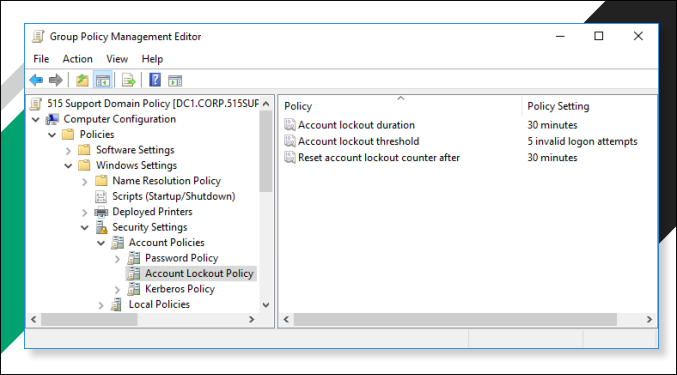


## 4.8 Privileged Access Management

A privileged account is one that can make significant configuration changes to a host, such as installing software or disabling a firewall or other security system. Privileged accounts also have the right to manage network appliances, application servers, and databases.

**Privileged Access Management (PAM)** refers to policies, procedures and technical controls to prevent compromise of privileged accounts.

It is a good idea to restrict the number of administrative accounts as much as possible. The more accounts there are, the more likely it is that one of them will be compromised. On the other hand, you do not want administrators to share accounts or to use default accounts, as that compromises accountability.

To protect privileged account credentials, it is important not to sign in on untrusted workstations. A **secure administrative workstation (SAW)** is a computer with a very low attack surface running the minimum possible apps.

Traditional administrator accounts have standing permissions. **Just-in-time (JIT)** permissions means that an account’s elevated privileges are not assigned at log-in. Instead, the permissions must be explicitly requested and are only granted for a limited period. This is referred to as zero standing privileges (ZSP).

There are three main models for implementing this

- **Temporary Elevation** - Means that the account gains administrative rights for a limited period. The User Account Control (UAC) feature of Windows and the sudo command in Linux use this concept.
- **Password Vaulting/Brokering** - The privileged account must be “checked out” from a repository and is made available for a limited amount of time. The administrator must log a justification for using the privileges.
- **Ephemeral Credentials** - Means the system generates or enables an account to use to perform the administrative task and then destroys or disables it once the task has been performed. Temporary or ephemeral membership of security groups or roles can serve a similar purpose.


## 4.9 Local, Network & Remote Authentication

This involves a complex architecture of components but the following three scenarios are typical:

### Windows Authentication

- **Windows local sign-in** - the Local Security Authority (LSA) compares the submitted credential to a hash stored in the Security Accounts Manager (SAM) database.
- **Windows network sign-in** - the LSA can pass the credentials for authentication to a network service either Kerberos or NT LAN Manager (NTLM) authentication.
- **Remote sign-in** - if the user’s device is not connected to the local network, authentication can take place over some type of virtual private network (VPN) or web portal.

**Linux Authentication** - Local user account names are stored in **/etc/passwd**. When a user logs in to a local interactive shell, the password is checked against a hash stored in /etc/shadow.

A pluggable authentication module (PAM) is a package for enabling different authentication providers.

**Single Sign-On (SSO) -** This system allows the user to authenticate once to a local device and be authenticated to compatible application servers without having to re-enter credentials again.

In Windows, SSO is provided by the Kerberos framework.


## 4.10 Kerberos Authentication & Authorization

Kerberos is a single sign-on network authentication and authorization protocol used on many networks notably as implemented by Microsoft’s Active Directory (AD) service.

Kerberos Authentication - This protocol is made up of 3 parts

- KDC (Authentication Service)
- Principal
- Application Server


# SECTION 5 - SECURE ENTERPRISE NETWORK ARCHITECTURE

## 5.1 Secure Network Designs

**Switches -** forward frames between nodes in a cabled network.
They work at layer 2 of the OSI model and make forwarding messages based on the hardware or media access control (MAC) address of attached nodes.

They can establish network segments that either map directly to the underlying cabling or to logical segments created in the switch configuration as virtual LANs (VLans)

**Wireless access points** - provide a bridge between a cabled network and wireless clients or stations. They also work at layer 2 of the OSI model.

**Load balancers** - distribute traffic between network segments or servers to optimize performance. They work at layer 4 of the OSI model or higher

**Routers** - forward packets around an internetwork, making forward decisions based on IP addresses. They work at layer 3 of the OSI model. They can apply logical IP subnet addresses to segments within a network.

**Firewalls** - they apply an access control list (ACL) to filter traffic passing in or out of a network segment. They can work at layer 3 of the OSI model or higher.

**Domain name system (DNS) servers** - host name records and perform name resolution to allow applications and users to address hosts and services using fully qualified domain names (FQDNs) rather than IP addresses.

DNS works at layer 7 of the OSI model.


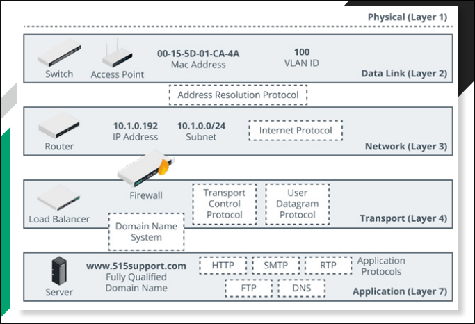


## 5.2 Network Segmentation, Topology & DMZs

A network segment is one where all the hosts attached to the segment can use local (layer 2) forwarding to communicate freely with one another.

**Segregation** means that the hosts in one segment are restricted in the way they communicate with hosts in other segments.

**Freely** means that no network appliances or policies are preventing communications. a network topology is a description of how a computer network is physically or logically organized.

The main building block of a topology is a zone which is an area of the network where the security configuration is the same for all hosts within it.

Zones can be segregated with VLANs while the traffic between them can be controlled using a security device, typically a firewall.

**Network Zones**

- **Intranet (Private Network)** - This is a Network Of Trusted Hosts Owned And Controlled By The Organization.
- **Extranet** - This is A Network Of Semi-Trusted Hosts Typically Representing Business Parties, Suppliers Or Customers.
- **Internet/Guest** - This Is A Zone Permitting Anonymous Access By Untrusted Hosts Over The Internet.

**Demilitarized Zones (DMZs)** - The Most Important Distinction between Different Security Zones Is Whether A Host Is Internet-Facing.
An Internet-Facing Host accepts Inbound Connections from and makes Connections To Hosts on The Internet.

Such hosts are placed in a DMZ (perimeter or edge network). In a DMZ, external clients are allowed to access data on private systems such as web servers without compromising the security of the internal network as a whole.

**Triple-Homed Firewall** - A DMZ can also Be Established Using One Router/Firewall Appliance With three Network Interfaces, Referred To As Triple-Homed.

- One Interface in the DMZ
- The Second is the Public One
- The Third Connects to the LAN

East-West Traffic - traffic that goes to and from a data center is referred to as **north-south**. This traffic represents clients outside the data center making requests.

However in data centers that support cloud services, most traffic is actually between servers within that data center and this traffic is referred to as **east-west** traffic.

**Zero trust** - this is based on the idea that perimeter security is unlikely to be robust enough, as such in a zero trust model, continuous authentication and conditional access are used to mitigate threats.

Zero trust also uses a technique called **microsegmentation**. This is a security process that is capable of applying policies to a single node as though it was in a zone of its own.

## 5.3 Device Placement & Attributes

The process of choosing the type and placement of security controls to ensure the goals of the CIA triad and compliance with any framework requirements.

The selection of effective controls is governed by the principle of defense in depth.

- **Preventive Controls** - Are often placed at the border of a network segment or zone. Preventive controls such as firewalls enforce security policies on traffic entering and exiting the segment, ensuring confidentiality and integrity. A load balancer control ensures high availability for access to the zone.
- **Detective Controls** - Might be placed within the perimeter to monitor traffic exchanged between hosts within the segment. This provides alerting of malicious traffic that has evaded perimeter controls.
- **Preventive, Detective & Corrective Controls** - Might be installed on hosts as a layer of endpoint protection in addition to the network infrastructure controls.


Attributes determine the precise way in which a device can be placed within the network topology

A **passive security control** is one that does not require any sort of client or agent configuration or host data transfer to operate.

An **active security control** that performs scanning must be configured with credentials and access permissions and exchange data with target hosts. An active control that performs filtering requires hosts to be explicitly configured to use the control. This might mean installing agent software on the host, or configuring network settings to use the control as a gateway.

**Inline vs Monitor**

A device that is deployed inline becomes part of the cable path. No changes in the IP or routing topology are required. The device's interfaces are not configured with MAC or IP addresses.

**SPAN (Switched Port Analyzer)/Mirror Port -** This means that the sensor is attached to a specially configured monitor port on a switch that receives copies of frames addressed to nominated access ports (or all the other ports). This method is not completely reliable. Frames with errors or frames may be dropped under heavy load.

**Test Access Point (TAP) -** This is a box with ports for incoming and outgoing network cabling and an indutor or optical splitter that physically copies the signal from the cabling to a monitor port. Unlike SPAN every single frame is copied or received.

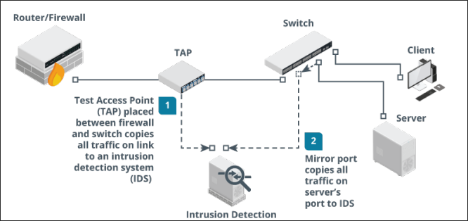

**Fail-Open versus Fail-CLOSED**

A security device could enter a failure state for a number of reasons. There could be a power or hardware fault, an irreconcilable policy violation, or a configuration error. Hardware failure can be caused by power surges, overheating, and physical damage.

Software failure can occur because of bugs, security vulnerabilities, and compatibility issues. Configuration issues can be caused by human errors such as inattention, fatigue, or lack of training.

When a device fails, it can be configured to fail-open or fail-closed

- Fail-open means that network or host access is preserved. This mode prioritizes availability over confidentiality and integrity.
- Fail-closed means that access is blocked. This mode prioritizes confidentiality and integrity over availability.


## 5.4 Device Placement & Attributes

**Man-In-The-Middle & Layer 2 Attacks -** Most Attacks At Layer 1 And 2 Of The OSI Model Are Typically Focused On Information Gathering Through Network Mapping And Eavesdropping.

A MITM can also be performed on this layer due to the lack of security.

**MAC cloning** or **MACaddress spoofing** - Changes the hardware address of an adapter to an arbitrary one either by overriding the original address in software via os commands or with the use of packet crafting software.

**Arp Poisoning Attack** - Arp poisoning attack uses a packet crafter such as ettercap to broadcast unsolicited arp reply packets.

Because arp has no security mechanism, the receiving devices trust this communication and update their mac:ip address cache table with the spoofed address.

From the second image:
**MAC flooding attacks** - Where arp poisoning is directed at hosts, mac flooding is used to attack a switch.

The idea here is to exhaust the memory used to store the switch’s mac address table which is used by the switch to determine which port to use to forward unicast traffic to its correct destination.

Overwhelming the table can cause the switch to stop trying to apply mac-based forwarding and simply flood unicast traffic out of all ports.

### Router / Switch Security

- **Physical Port Security -** Access to physical switch ports and hardware should be restricted to authorized staff by using a secure server room or lockable hardware cabinets.

- **Mac Limiting/Filtering -** Configuring mac filtering on a switch means defining which mac addresses are allowed to connect to a particular port by creating a list of valid mac addresses. mac limiting involves specifying a limit to the number of permitted addresses that can connect to a port.

- **Dhcp Snooping -** Dynamic host configuration protocol is one that allows a server to assign an ip address to a client when it connects to a network. dhcp snooping inspects this traffic arriving on access ports to ensure that a host is not trying to spoof its mac address, with dhcp snooping, only dhcp messages from ports configured as trusted are allowed.

- **Network Access Control -** Nac products can extend the scope of authentication to allow admins to devise policies or profiles describing a minimum security configuration that devices must meet to be granted network access. This is called a health policy.

- **Route Security -** A successful attack against route security enables the attacker to redirect traffic from its intended destination. routes between networks and subnets can be configured manually, but most routers automatically discover routes by communicating with each other.


### routing is subject to numerous vulnerabilities

- **Spoofed Routing Information (Route Injection) -** Traffic is misdirected to a monitoring port (sniffing) or continuously looped around the network causing dos.

- **Source Routing -** This uses an option in the ip header to pre-determine the route a packet will take through the network. This can be used to spoof ip addresses and bypass router/firewall filters.

- **Software Exploits In The Underlying Operating System -** Cisco devices typically use the internet working operating system (ios) which suffer from fewer exploitable vulnerabilities than full network operating systems.


## 5.5 Routing & Switching Protocols

Layer 3 Forwarding Or Routing Occurs Between Both Logically And Physically Defined Networks. A Single Network Divided Into Multiple Logical Broadcast Domains Is Said To Be Subnetted.

At Layer 3, Nodes Are Identified By Ip Addresses.

**Address Resolution Protocol (Arp)** - This Maps A Mac Address To An Ip Address.

Normally A Device That Needs To Send A Packet To An Ip Address But Does Not Know The Receiving Device’s Mac Address Broadcasts An Arp Request And The Device With The Matching Ip Responds With An Arp Reply.

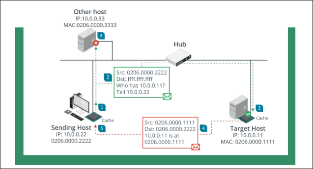


internet protocol (IP)

This Provides the addressing mechanism for logical networks and subnets

 **172.16.1.101/16** 

The /16 Prefix Indicates That The First Half Of The Address (172.16.0.0) Is The Network Id While The Remainder Uniquely Identifies A Host On That Network. Networks Also Use 128-bit IPv6 addressing. [Note: If there's more content, please specify which portion you want extracted.]

From the subsequent slides (additional content visible in the third image):

Bit IPv6 Addressing.

**2001:Db8::Abc:0:Def:0:1234**

The First 64-Bits Contain Network Information While The Last Are Fixed As The Host’s Interface Id.

A Route To A Network Can Be Configured Statistically But Most Networks Use Routing Protocols To Transmit New And Updated Routes Between Routers.

Some Common Routing Protocols Include

- Border Gateway Protocol (BGP)
- Open Shortest Path First (OSPF)
- Enhanced Interior Gateway Routing Protocol (EIGRP)
- Routing Information Protocol (RIP)


## 5.6 Using Secure Protocols

Secure protocols have places in many parts of your network and infrastructure. Security professionals need to be able to recommend the right protocol for each of the following scenarios:

- Voice and video rely on a number of common protocols. Videoconferencing tools often rely on HTTPS, but secure versions of the Session Initiation Protocol (SIP) and the Real-time Transport Protocol (RTP) exist in the form of SIPS and SRTP, which are also used to ensure that communications traffic remains secure.
- A secure version of the Network Time Protocol (NTP) exists and is called NTS, but NTS has not been widely adopted. Like many other protocols, NTS does not protect the timestamp data. Instead, it focuses on authentication to make sure that the time information is from a trusted server and has not been changed in transit.
- Email and web traffic relies on a number of secure options, including HTTPS, IMAPS, POPS, and security protocols like Domain-based Message Authentication Reporting and Conformance (DMARC), DomainKeys Identified Mail (DKIM), and Sender Policy Framework (SPF) as covered earlier in this chapter.
- File Transfer Protocol (FTP) has largely been replaced by a combination of HTTPS file transfers and SFTP or FTPS, depending on organization needs.
- Directory services like LDAP can be moved to LDAPS, a secure version of LDAP.

- Remote access technologies-including shell access, which was once accomplished via telnet and is now almost exclusively done via SSH-can also be secured. Microsoft's RDP is encrypted by default, but other remote access tools may use other protocols, including HTTPS, to ensure that their traffic is not exposed.

- Domain name resolution remains a security challenge, with multiple efforts over time that have had limited impact on DNS protocol security, including DNSSEC and DNS reputation lists.

- Routing and switching protocol security can be complex, with protocols like Border Gateway Protocol (BGP) lacking built-in security features. Therefore, attacks such as BGP hijacking attacks and other routing attacks remain possible. Organizations cannot rely on a secure protocol in many cases and need to design around this lack.

- Network address allocation using DHCP does not offer a secure protocol, and network protection against DHCP attacks relies on detection and response rather than a secure protocol.

- Subscription services such as cloud tools and similar services frequently leverage HTTPS but may also provide other secure protocols for their specific use cases. The wide variety of possible subscriptions and types of services means that these services must be assessed individually with an architecture and design review, as well as data flow reviews all being part of best practices to secure subscription service traffic if options are available.

## 5.7 Attack Surface

The network attack surface refers to all the points at which a threat actor could gain access to hosts and services.

Using the OSI model we can analyze the potential attack surface:
- **Layer 1/2** - Allows the attacker to connect to wall ports or wireless networks and communicate with hosts within the same broadcast domain
- **Layer 3** - Allows the attacker to obtain a valid network address possibly by spoofing and communicate with hosts in other zones
- **Layer 4/7** - Allows the attacker to establish connections to TCP or UDP ports and communicate with application layer protocols and services.

Each layer requires its own type of security controls to prevent, detect, and correct attacks. Provisioning multiple control categories and functions to enforce multiple layers of protection is referred to as **defense in depth.**

Security controls deployed to the network perimeter are designed to prevent external hosts from launching attacks at any network layer. The division of the private network into segmented zones is designed to mitigate risks from internal hosts that have either been compromised or that have been connected without authorization.

typical weaknesses in a network include:

- single points of failure
- complex dependencies 
- availability over confidentiality and integrity
- lack of documentation
- over dependence on perimeter security


## 5.8 Firewalls

**Packet Filtering Firewalls** - These are the earliest type of firewalls and are configured by specifying a group of rules called an access control list (acl.

Each rule defines a specific type of data packet and the appropriate action to take when a packet matches the rule. An action can either be to deny or to accept the packet.

This firewall can inspect the headers of ip packets meaning that the rules can be based on the information found in those headers; in certain cases, the firewall can control only inbound or both inbound and outbound traffic and this is often referred to as **ingress** and **egress** traffic or filtering.

A basic packet filtering firewall is stateless meaning that it does not preserve any information about network sessions.

**Stateful Inspection Firewalls -** This type of firewall can track information about the session established between two hosts and the session data is stored in a state table.

Stateful inspection can occur at two layers: transport and application.

**Transport Layer (OSI Layer 4) -** Here, the firewall examines the tcp three-way handshake to distinguish new from established connections.


**syn > syn/ack > ack**

any deviations from this sequence can be dropped as malicious flooding or session hijacking attempts

application layer (osi layer 7) - this type of firewall can inspect the contents of packets at the application layer and one key feature is to verify the application protocol matches the port e.g http web traffic will use port 80

ip table - **iptables** is a command on linux that allows admins to edit the rules enforced by the linux kernel firewall

iptables works with chains which apply to the different types of traffic such as the input chain for traffic destined for the local host, each chain has a default policy set to drop or allow traffic that does not match a rule

the rules in this example will drop any traffic from the specific host 10.1.0.192 and allow icmp echo requests (pings), dns and http/https traffic either from the local subnet (10.1.0.0/24) or from any network (0.0.0.0/0)

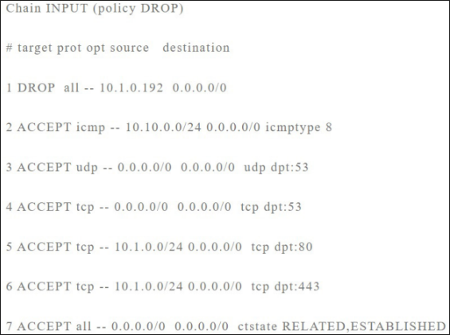


## 5.9 Firewall Implementation

**Firewall Appliances** - This Is A Stand-Alone Firewall Deployed To Monitor Traffic Passing Into And Out Of A Network Zone. It Can Be Deployed In Two Ways:

- Routed (Layer 3) - The Firewall Performs Forwarding Between Subnets

- Bridged (Layer 2) - The Firewall Inspects Traffic Between Two Nodes Such As A Router And A Switch.


Application-Based Firewalls

- Host-Based (Personal) - Implemented As A Software Application Running On A Single Host Designed To Protect The Host Only.

- Application Firewall - Software Designed To Run On A Server To Protect A Particular Application Only

- Network Operating System (Nos) Firewall - A Software Based Firewall Running Under A Network Server Os Such As Windows Or Linux.


**Proxies And Gateways** - A Firewall That Performs Application Layer Filtering Is Likely To Be Implemented As A Proxy.

Proxy Servers Can Either Be Non-Transparent Or Transparent.

- Non-Transparent Means The Client Must Be Configured With The Proxy Server Address And Port Number To Use It

- Transparent (Forced Or Intercepting) Intercepts Client Traffic Without The Client Having To Be Reconfigured


**Reverse Proxy Servers** - These Provide For Protocol-Specific Inbound Traffic.

A Reverse Proxy Can Be Deployed On The Network Edge And Configured To Listen For Client Requests From A Public Network


## 5.10 Remote Access Architecture

Most remote access is implemented as a virtual private network (VPN) running over the internet but it can be more difficult to ensure the security of remote workstations and servers than those on the LAN. A VPN can also be deployed in a site-to-site model to connect two or more private networks and is typically configured to operate automatically

**Open VPN** - this is an open source example of a TLS VPN. openvpn can work in tap (bridged) mode to tunnel layer 2 frames or in tun (routed) mode to forward IP packets.

Another option is Microsoft's secure sockets tunneling protocol (SSTP) which works by tunneling point-to-point protocol (PPP) layer 2 frames over a TLS session.

**Internet protocol security (IPSEC)** - TLS is applied at the application level either by using a separate secure port or by using commands in the application protocol to negotiate a secure connection.

IPSEC operates at the network layer (layer 3) so it can operate without having to configure specific application support.

**Authentication Header (AH)** - this performs a cryptographic hash on the whole packet including the IP header plus a shared secret key and adds this HMAC in its header as integrity check value (ICV)

The recipient performs the same function on the packet and key and should derive the same value to confirm that the packet has not been modified.

**Encapsulation Security Payload (ESP) -** this provides confidentiality and/or authentication and integrity. it can be used to encrypt the packet rather than simply calculating an HMAC.

ESP attaches three fields to the packet: a header, a trailer (providing padding for the cryptographic function) and an ICV.

**Ipsec Transport And Tunnel Modes** - Ipsec Can Be Used In Two Modes:

- **Transport Mode** - This Mode Is Used To Secure Communications Between Hosts On A Private Network. Here The Ip Header For Each Packet Is Not Encrypted, Just The Payload Data. If Ah Is Used In This Mode, It Can Provide Integrity For The Ip Header.


- **Tunnel Mode -** This Mode Is Used For Communications Between DNS Gateways Across An Unsecure Network And Is Also Referred To As Router Implementation. With Esp, The Whole Ip Packet (Header And Payload) Is Encrypted And Encapsulated As A Datagram With A New Ip Header.


**Internet Key Exchange (IKE)** - ipsec's encryption and hashing functions depend on a shared secret. the secret must be communicated to both hosts and the hosts must confirm one another's identity (mutual authentication) otherwise the connection is vulnerable to MITM and spoofing attacks. the IKE protocol handles authentication and key exchange referred to as security associations (SA).

IKE negotiations take place over two phases:

Phase 1 establishes the identity of the two hosts and performs key agreement using the dh algorithm to create a secure channel. digital certificates and pre-shared key are used for authenticating hosts. Phase 2 uses the secure channel created in phase 1 to establish which ciphers and key sizes will be used with ah and/or esp in the IPSEC session.

**VPN Client Configuration** to configure a VPN client, you may need to install the client software if the VPN type is not natively supported by the OS.

**Always-on VPN** - this means that the computer establishes the VPN whenever an Internet connection over a trusted network is detected, using the user's cached credentials to authenticate.

When a client connected to a remote access VPN tries to access other sites on the Internet, there are two ways to manage the connection:

**Split tunnel** - the client accesses the internet directly using its "native" ip configuration and DNS servers.

**Full tunne**l - internet access is mediated by the corporate network, which will alter the client's IP address and DNS servers and may use a proxy. Full tunnel offers better security but the network address translations and DNS operations required may cause problems with some websites especially cloud services.

**Out-of-band management** - remote management methods can be described as either in-band or out-of-band (OOB).

An **In-Band** Management Link Is One That Shares Traffic With Other Communications On The "Production" Network While A Serial Console Or Modem Port On A Router Is A Physically **Out-Of-Band** Management Method.

**Secure Shell** - This Is The Principal Means Of Obtaining Secure Remote Access To A Command Line Terminal. Mostly Used For Remote Administration And Secure File Transfer (Sftp).

Ssh Servers Are Identified By A Public/Private Key Pair (The Host Key).


# SECTION 6- SECURE CLOUD NETWORK ARCHITECTURE

## 6.1 Cloud Deployment Models

**Public (multi-tenant)** - A service offered over the internet by cloud service providers (csps) to cloud consumers

**Hosted Private** - Hosted by a third party for the exclusive use of an organization. Better performance but more expensive than public.

**Private** - Cloud infrastructure that is completely private and owned by the organization. Geared more towards banks and governmental services where security and privacy is of utmost importance.

**Community** - Several organizations share the costs of either a hosted private or fully private cloud.

**Cloud Service Models** - Cloud services can also be differentiated on the level of complexity and pre-configuration provided (sometimes referred to as anything as a service xaas)

Most common implementations are infrastructure, software and platform.

**Infrastructure As A Service (IAAS) -** It resources (servers, load balancers and san) are provided here. Examples include amazon elastic compute cloud, oracle cloud and microsoft azure virtual machines.

**Software As A Service (SAAS)** - Provisioning of software applications and can be purchased on a pay-as-you-go or lease arrangement. Examples are microsoft 365, salesforce and adobe creative cloud.

**Platform As A Service (PAAS)** - Provides resources somewhere between saas and iaas. A typical paas solution would provide servers and storage network infrastructure and also a web-application or database platform on top.

Examples include oracle database, microsoft azure sql database and google app engine.

### Security As A Service

- **Consultants** - can be used for framework analysis or for more specific projects.
- **Managed Security Services Provider (MSSP)** - fully outsourcing responsibility for information assurance to a third party. can be expensive but a good fit for an SME that has no in-house security capability.
- **Security As A Service (SECAAS) -** can mean a lot of things but typically means implementing a particular security control such as malware scanning in the cloud. examples include CloudFlare, Mandiant/fireeye and SonicWall.


## 6.2 Responsibility Matrix

The shared responsibility model describes the balance of responsibility between a customer and a cloud service provider (CSP) for implementing security in a cloud platform.

The division of responsibility becomes more or less complicated based on whether the service model is SaaS, PaaS, or laas. For example, in a SaaS model, the CSP performs the operating system configuration and control as part of the service offering.

In contrast, operating system security is shared between the CSP and the customer in an laas model.

A **responsibility matrix** sets out these duties in a clear table.

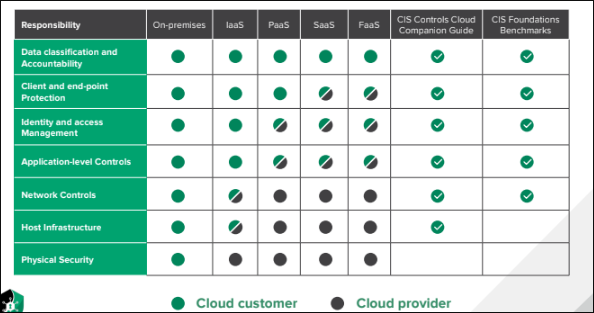


## 6.3 Cloud Security Solutions

Cloud computing is also a means of transferring risk and as such it is important to identify which risks are being transferred and what responsibilities both the company and service provider will undertake.

A company will always still be held liable for legal and regulatory consequences in case of a security breach though the service provider could be sued for the breach.

The company will also need to consider the legal implications of using a csp if its servers are located in a different country.

Application security in the cloud refers both to the software development process and to the identify and access management (iam) features designed to ensure authorized use of applications.

Cloud provides resources abstracted from physical hardware via one or more layers of virtualization and the compute component provides process and system memory (ram) resources as required for a particular workload.

**High availability -** one of the benefits of using the cloud is the potential for providing services that are resilient to failures at different levels.

In terms of storage performance, high availability (ha) refers to storage provisioned with a guarantee of 99.99% Uptime or better and the csp typically uses redundancy to make multiple disk controllers and storage devices available to a pool of storage resources.

**Replication -** data replication allows businesses to copy data to where it can be utilized most effectively and the cloud may be used as a central storage area.

The terms hot and cold storage refer to how quickly data is retrieved and hot storage is quicker but also more expensive to manage.

- **Local replication** - Replicates data within a single data center in the region where the storage account was created.

- **Regional replication** - Replicates data across multiple data centers within one or two regions.

- **Geo-redundant storage (grs**) - Replicates data to a secondary region that is distant from the primary region. This safeguards data in the event of a regional outage or a disaster.

**Virtual private clouds (VPCs) -** each customer can create one or more VPCs attached to their account. By default, a vpc is isolated from other csp accounts and from other VPCs operating in the same account.

Each subnet within a vpc can either be private or public. For external connectivity that isn't appropriate for public.

Routing can be configured between subnets in a vpc and between VPCs in the same account or with VPCs belonging to different accounts.

Configuring additional VPCs rather than subnets within a vpc allows for a greater degree of segmentation between instances.

A VPC endpoint is a means of publishing a service that is accessible by instances in other VPCs using only the aws internal network and private ip addresses. There are two types -gateway and interface

- **Cloud firewall security** - Filtering decisions can be made based on packet headers and payload contents at various layers

- **Network layer 3** - The firewall accepts/denies connections based on the ip addresses or address ranges and tcp/udp port numbers (actually contained in layer 4 headers but the functionality is still always described as layer 3 filtering).

- **Transport layer 4 -** The firewall can store connection states and use rules to allow established traffic.

- **Application layer 7** - The firewall can parse application protocol headers and payloads and make decisions based on their contents.

Firewalls in the cloud can be implemented in several ways to suit different purposes.

- As software running on an instance

- As a service at the virtualization layer to filter traffic between vpc subnets and instances. This equates to an on-premises network firewall.

Cloud access security brokers (CASB) -CASBs provide you with visibility into how clients and other network nodes are using cloud services.

- Enable single sign-on authentication and enforces access controls and authorizations from the enterprise network to the cloud provider

- Scan for malware and rouge devices

- Monitor and audit user and resource activity

- Mitigate data exfiltration

Casbs are implemented in one of three ways:

- **Forward proxy -** positioned at the client network edge that forwards user traffic to the cloud network

- **Reverse proxy** - positioned at the cloud network edge and directs traffic to cloud services

- api


## 6.4 - Infrastructure As Code Concepts

Service-Oriented Architecture (SOA) - this conceives of atomic services closely mapped to business workflows. each service takes defined inputs and produces defined outputs.

Service functions are self-contained, do not rely on the state of other services and expose clear input/output (i/o) interfaces.

Micro-services - micro service-based development shares many similarities with agile software project management and the processes of continuous delivery and deployment.

The main difference from SOA is that while SOA allows a service to be built from other services, each micro-service should be capable of being developed, tested and deployed independently (highly decoupled).

Services Integration - service integration refers to ways of making these decoupled services work together to perform a workflow. Where SOA used the concept of an enterprise service bus, micro-services integration and cloud services/virtualization, integration generally is very often implemented using **orchestration** tools.

Automation focuses on making a single discrete task easily repeatable while orchestration performs a sequence of automated tasks.

Cloud orchestration platforms connect to and provide administration, management and orchestration for many popular cloud platforms and services.


Application Programming Interfaces (Api) - Soa, Microservices, Service Integration, Automation And Orchestration All Depend On Apis

- **Simple Object Access Protocol (SOAP)** - uses XML format messaging and has a number of extensions in the form of web services standards that support common features such as authentication, transport security and asynchronous messaging.

- **Representational State Transfer (REST)** - a much looser architectural framework also referred to as restful API. soap requests must be sent in correctly formatted XML document while rest requests can be submitted as an http operation.

**Serverless architecture** - This is a modern design pattern for service delivery and is strongly associated with modern web applications - netflix.

billing is based on execution time rather than hourly charges and this type of service provision is also called function as a service (FAAS).

Serverless architecture eliminates the need to manage physical or virtual server instances so there is no need for software and patches or file system security monitoring.

**Infrastructure as code** - An approach to infrastructure management where automation and orchestration fully replace manual configuration is referred to as infrastructure as code (IAC)

The main objective of iac is to eliminate snowflake systems which are basically systems that are different from others and this can happen when there is a lack of consistency in terms of patch updates and stability issues.

By rejecting manual configuration of any kind, iac ensures idempotence which means making the same call with the same parameters will always produce the same result.

lac means using carefully developed and tested scripts and orchestration runbooks to generate consistent builds.

**Fog & Edge Computing** - Traditional data center architecture sensors are quite likely to have low bandwidth and higher latency WAN links to data networks.

Fog computing developed by cisco addresses this by placing fog node processing resources close to the physical location for the iot sensors. The sensors communicate with the fog node using wi-fi or 4g/5g and the fog node prioritizes traffic, analyzes and remediates alertable conditions.


Edge Computing Is A Broader Concept Partially Developed From Fog Computing.

- Edge Devices Collect and Depend Upon Data for Their Operation.

- Edge Gateways Perform Some Pre-Processing of Data to And From Edge Devices to Enable Prioritization.

- Fog Nodes can be Incorporated as a Data Processing Layer Positioned Closed To The Edge Gateways.

- The Cloud Or Data Center Layer Provides the Main Storage and Processing Resources Plus Distribution and Aggregation of Data Between Sites.

Instead of depending on a cluster of clouds for computing and data storage, edge computing leverages local computing (routers, PCs, smartphones) to produce shorter response time as the data is processed locally.


## 6.5 Zero Trust

This is a security framework requiring all subjects, assets and workflows to be authenticated, authorized and continuously validated before being granted or keeping access to the data or application.

**Zero Trust View**

- **No Implicit Zone Trust** - Assets should always act as though an attacker was present in the enterprise network

- Devices on the network cannot be owned or configured by users

- Assume all network connections are insecure

**Zero Trust Core Principles (NIST SP800-207)**

-  **Continuous Verification** - Always verify access all the time

- **Access Limitation** - Access to resources are granted strictly on a per-session basis

- **Limit the "Blast Radius"** - Minimize the impact of a breach

- **Automate** - Automate context, collection and response for credentials, workloads, threat intelligence and endpoints

**Control & Data Planes**

- **Control Plane** - Used by infrastructure components to maintain and configure assets, access control and communication security.

- **Data Plane** - Used for communication between software components.

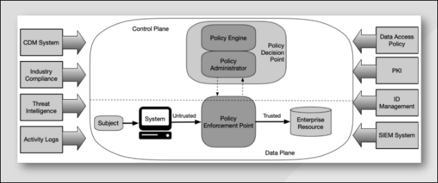


## Zero Trust Architecture

#### Zero Trust Logical Components

- **Policy Decision Point (PDP)** - The gatekeeper and is made up of the policy engine and policy administrator.

- **Policy Engine (PE) -** is responsible for granting access to a resource

- **Policy Administrator (PA)** - generates any session-specific authentication token or credential used to access an enterprise resource.

- **Policy Enforcement Point (PEP) -** is responsible for enabling, monitoring and terminating connections between a subject and an enterprise resource.

#### Zero Trust Disadvantages

- Can be complex and expensive

- Slows down application performance

- Hampers employee productivity


## 6.6 Embedded Systems

This is a complete system designed to perform a specific dedicated function.

These systems can be a micro-controller in a small device or could be as large and complex as the network of control devices managing a water treatment plant.

Embedded systems are characterized as static environments while a PC is a dynamic environment because both software and hardware changes can be made by the user.

Embedded Systems are Usually Constrained by:

-  Processor Capability

- Power (Battery)

- System Memory

- Authentication Technologies

- Persistent Storage

- Cryptographic Identification

- Cost

- Network And Range Constraints


**System On Chip** - this is a system where all processors, controllers and devices are provided on a single processor die or chip. this is often very power efficient and is commonly used with embedded systems.

RaspberryPl and Arduino are examples of soc boards initially devised as educational tools but now widely used for industrial applications and hacking.

**Field Programmable Gate Array (FPGA)** - as many embedded systems perform simple and repetitive operations, it is more efficient to design the hardware controller to perform only the instructions needed. An example of this is the application-specific integrated circuits (ASICS) used in ethernet switches but they can be quite expensive and work only for a single application.

An FPGA solves the problem because the structure is not fully set at the time of manufacture giving the end customer the ability to configure the programming logic of the device to run a specific application.

**Operational Technology (OT) Networks** - these are cabled networks for industrial applications and typically use either serial data protocols or industrial Ethernet. Industrial ethernet is optimized for real-time and deterministic transfers.

**Cellular Networks** - a cellular network enables long-distance communication over the same system that supports mobile and smartphones.

#### Also known as Baseband Radio and there are Two Main Radio Technologies:

- **Narrowband-lot (Nb-lot) -** This Refers to Low-Power Version Of The Long Term Evolution (Lte) Or 4g Cellular Standard.

- **Lte Machine Type Communication (Lte-M) -** This is Another Low-Power System But Supports Higher Bandwidth (Up To About 1 Mbps)

Any LTE-based cellular radio uses a subscriber identity module (SIM) card as an identifier. the sim is issued by a cellular provider with roaming to allow the use of other supplier's tower relays.


## 6.7 Industrial Control Systems & Internet Of Things

Industrial systems have different priorities to it systems and tend to prioritize availability and integrity over confidentiality (reversing the CIA triad as the AIC triad).

Workflow and Process Automation Systems - industrial control systems (ICs) provide mechanisms for workflow and process automation and these systems control machinery used in critical infrastructure like power and water suppliers and health services. An ICS comprises plant devices and equipment with embedded PLCs.

Supervisory Control and Data Acquisition (SCADA) - A SCADA system takes the place of a server in large scale multiple-site ICSS. SCADA typically run as software on ordinary computers, gathering data from and managing plant devices and equipment with embedded PLCs referred to as field devices.

ICS/SCADA Applications - these types of systems are used within many sectors of industry

- Power Generation And Distribution

- Mining And Refining Raw Materials

- Fabrication And Manufacturing

- Logistics


Site And Building Management Systems

**Internet Of Things (IoT)** - This is Used to describe a Global Network of Appliances and Personal Devices that have Been Equipped with Sensors, Software and Network Connectivity.


# SECTION 7- EXPLAIN RESILIENCY AND SITE SECURITY CONCEPTS

## 7.1 Backup Strategies & Storage

**Backups & Retention Policies** - as Backups take up Space, There is the Need for Storage Management Routines while also Giving Adequate Coverage Of The Required Window.

The recovery Window is determined by the Recovery Point Objective (RPO) which is determined through Business Continuity Planning.

**Backup Types**

- Full includes all files and directories while incremental and differential check the status of the archive attribute before including a file. The archive attribute is set whenever the file is modified so the backup software knows which files have been changed and need to be copied.

- Incremental makes a backup of all new files as well as files modified since the last backup while differential makes a backup of all new and modified files since the last full backup. Incremental backups save backup time but can be more time-consuming when the system must be restored. The system is restored first from the last full backup set and then from each incremental backup that has subsequently occurred.

**Snapshots and images** - snapshots are used for open files that are being used all the time because copy-based mechanisms are not able to backup open files.

In windows, snapshots are provided for on NTFS by the volume shadow copy service (VSS).

**Backup Storage Issues** - backups require CIA as well and must be secured at all times. Natural disasters such as fires and earthquakes must also be accounted for.

**Distance Consideration** Is a calculation of how far offsite Backups need to be Kept Given different disaster scenarios However they mustn't be too far to slow down a Recovery Operation.

The 3-2-1 Rule States that You Should Have 4 Copies of Your Data Across Two Media Types with one copy held Offline and Offsite.

**Backup Media Types**

- Disk
-  Network attached storage (nas) - An appliance that is a specially configured type of server that makes raid storage available over common network protocols

- Tape - Very cost effective and can be transported offsite but slow compared to disk-based solutions especially for restore operations

- San & cloud

**Restoration order** - If a site suffers an uncontrolled outage, ideally processing should be switched to an alternate site. However, if an alternate processing site is not available, then the main site must be brought back online as quickly as possible to minimize service disruption.

A complex facility such as a data center or campus network must be reconstituted according to a carefully designed order of restoration.

- Enable and test power delivery systems (grid power, ups, secondary generators and so on)

- Enable and test switch infrastructure then routing appliances and systems

- Enable and test network security appliances (firewalls, ids)

- Enable and test critical network servers (dhcp. DNS, ntp and directory services)

- Enable and test back-end and middleware (databases). verify data integrity

- Enable and test front-end applications

- Enable client workstations and devices and client browser access.

**Non-persistence**

- **Snapshot/revert to known state** - A saved system state that can be reapplied to the instance.

- Rollback to known configuration

- **Live boot media** - An instance that boots from read-only storage to memory rather than being installed on a local read/write hard disk.

When provisioning a new or replacement instance automatically, the automation system may use one of two types of mastering instructions.

- **Master image** - the "gold copy" of a server instance with the os applications and patches all installed and configured.

- **Automated build from a template** - similar to a master image and is the build instructions for an instance. rather than storing a master image, the software may build and provision an instance according to the template instructions.

## 7.2 Implementing Redundancy Strategies

**High Availability** - a key property of any resilient system and is typically measured over a period of one year.

**The Maximum Tolerable Downtime (MTD)** metric expresses the availability requirement for a particular business function.

High availability also means that a system is able to cope with rapid growth in demand.

Scalability is the capacity to increase resources to meet demands with similar cost ratios

- To Scale Out is to Add More Resources In Parallel with Existing Resources

- To Scale Up is to Increase the Power of Existing Resources.

**Elasticity** refers to the system's ability to handle these changes on demand in real time.

**Fault Tolerance & Redundancy** - a system that can experience failures and continue to provide the same or nearly the same level of service is said to be fault tolerant.

Fault tolerance is often achieved by provisioning redundancy for critical components and single points of failure.

#### Power Redundancy

- Dual Power Supplies

- Managed Power Distribution Units (Pdus)

- Battery Backups and Ups

- Generators

A Ups Is Always Required To Protect Against Any Interruption As A Backup Generator Cannot Be Brought Online Fast Enough To Respond To A Power Failure.

**Network Redundancy** - Network Interface Card (Nic) Teaming Means The Server Is Installed With Multiple Nics Or Nics With Multiple Ports Or Both. Each Port Is Connected To Separate Network Cabling.

For Example Four 1gb Ports Gives An Overall Bandwidth Of 4gb So If One Port Goes Down, 3gb Of Bandwidth Will Still Be Provided.

**Switching & Routing** - Network Cabling Should Be Designed To Allow For Multiple Paths Between The Various Switches And Routers So That During A Failure Of One Part Of The Network, The Rest Remains Operational.

**Load Balancers** - Nic Teaming Provides Load Balancing At The Adapter Level, Load Balancing And Clustering Can Also Be Provisioned At A Service Level.

- A Load Balancing Switch Distributes Workloads Between Available Servers.

- A Load Balancing Cluster Enables Multiple Redundant Servers To Share Data And Session Information To Maintain A Consistent Service If There Is Failover From One Server To Another.

**Disk Redundancy** - Redundant Array Of Independent Disks (Raid) - Here Many Disks Can Act As Backups For Each Other To Increase Reliability And Fault Tolerance.

There Are Several Raid Levels Numbered 0 To 6


| RAID Level                | Fault Tolerance                                              |
| ------------------------- | ------------------------------------------------------------ |
| Level 1                   | Mirroring means that data is written to two disks simultaneously, providing redundancy (if one disk fails, there is a copy of data on the other). The main drawback is that storage efficiency is only 50%. |
| Level 5                   | Striping with parity means that data is written across three or more disks, but additional information (parity) is calculated. This allows the volume to continue if one disk is lost. This solution has better storage efficiency than RAID 1. |
| Level 6                   | Double parity, or level 5 with an additional parity stripe, allows the volume to continue when two devices have been lost. |
| Nested (0+1, 1+0, or 5+0) | Nesting RAID sets generally improves performance or redundancy.For example, some nested RAID solutions can support the failure ofmore than one disk. |


**Geographical Redundancy & Replication -** Data Replication can be applied In Many Contexts:

- **Storage Area Networks** - Redundancy can be Provided Within the SAN and Replication can also Take Place Between SANs using WAN Links.

- Database

- **Virtual Machine** - The Same VM Instance Can Be Deployed In Multiple Locations. This Can Be Achieved By Replicating The Vm's Disk Image And Configuration Settings.

**Geographical Dispersal** Refers to Data Replicating Hot And Warm Sites that are Physically Distant from One Another. This Means that Data is Protected Against a Natural Disaster Wiping Out Storage at one of the Sites.

#### Asynchronous & Synchronous Replication

- Synchronous Replication is designed to write data to all replicas simultaneously therefore all replicas should always have the same data all the time.

- Asynchronous Replication writes data to the primary storage first and then copies data to the replicas scheduled intervals. it isn't a good choice for a solution that requires data in multiple locations to be consistent


## 7.3 Cyber Security Resilient Strategies

**Configuration management** - Configuration management ensures that each component of ict infrastructure is in a trusted state that has not diverged from its documented properties.

Change control and change management reduce the risk that changes to these components could cause service disruption.

**Asset management** - An asset management process tracks all the organization's critical systems, components, devices and other objects of value in an inventory.

An asset management database can be configured to store as much or as little information as it deemed necessary though typical data would be type, model, serial number, asset id, location, user(s), value and service information.

**Asset identification & standard naming conventions** - Tangible assets can be identified using a barcode label or frequency id (rfid) tag attached to the device. the rfid tag is a chip programmed with asset data and can help to also track the location of the device making theft more difficult.

A standard naming convention for hardware and digital assets such as accounts and virtual machines makes the environment more consistent. This means errors are easier to spot and it's easier to automate through scripting.

The naming strategy should allow admins to identify the type and function of any particular resource or location at any point in the network directory.

**Change control & change management -** A change control process can be used to request and approve changes in a planned and controlled way. change requests are usually generated when

- Something needs to be corrected

- When something changes

- Where there is room for improvement in a process or system currently in place.

In a formal change management process, the need or reasons for change and the procedure for implementing the change is captured in a request for change (rfc) document and submitted for approval.

The implementation of changes should be carefully planned, with consideration for how the change will affect dependent components.

For major changes, a trial change should be attempted first and every change should be accompanied by a rollback plan so the change can be reversed if it has a negative impact.

**Site resiliency** - An alternate processing site might always be available and in use while a recovery site might take longer to set up or only be used in an emergency.

- A hot site can failover almost immediately.

- A warm site could be similar but with the requirement that the latest data set will need to be loaded.

- A cold site takes longer to set up and could be an empty building waiting to have whatever equipment that is needed to be installed in it.


Diversity and defense in depth - layered security is typically seen as improving cybersecurity resiliency because it provides defense in depth (multiple security controls).

Allied with defense in depth is the concept of security through diversity. Technology diversity refers to a mix of oss, applications, coding languages and so on while control diversity means that the layers of controls should combine different classes of technical and administrative controls with the range of control functions to prevent, detect, correct and deter.

**Vendor diversity** - As well as deploying multiple types of controls, there are also advantages in leveraging vendor diversity.

While single vendor solutions provide interoperability and can reduce training and support costs, it does have several disadvantages.

- Not obtaining best-in-class performance

- Less complex attack surface.

- Less innovation


#### Deception and disruption strategies

**Active defense** means an engagement with the adversary and can mean the deployment of decoy assets to act as lures or bait.

A honey **pot** is a system set up to attract threat actors, with the intention of analyzing attack strategies and tools to provide early warnings of attack attempts. it could also be used to detect internal fraud, snooping and malpractice.

A honeynet is an entire decoy network.

On a production network, a honeypot is more likely to be located in a dmz, or on an isolated segment on the private network if the honeypot is seeking to draw out insider threats.


A honeypot or honeynet can be combined with the concept of a **honeyfile** which is convincingly useful but actually fake data.

Some examples of disruption strategies include:

- Using bogus DNS entries to list multiple non-existent hosts

- Configuring a web server with multiple decoy directories

- Using port triggering or spoofing to return fake telemetry data when a host detects port scanning activity. This will result in multiple ports being falsely reported as open.

- Using a DNS sinkhole to route suspect traffic to a different network such as a honeynet.


## 7.4 - Physical Security Controls

**Physical access controls** - These are security measures that restrict and monitor access to specific physical areas or assets. They can control access to buildings, server rooms, data centers, finance or legal areas and so on.

Physical access controls depend on the same access control fundamentals as network or os security:

- Authentication - Create lists of approved people

- Authorization - Create barriers around a resource so access to it is controlled through defined entry and exit points

- Accounting - Keep a record of when entry/exit points are used and detect security breaches.


**Site layout, fencing & lighting** - Given constraints of cost and existing infrastructure, try to plan the site using the following principles

- Locate secure zones

- Use a demilitarized zone design for the physical space and position public access areas so that guests do not pass near secure zones.

- Use signage and warnings to enforce the idea that security is tightly controlled.

- Entry points to secure zones should be discreet. Do not allow an intruder the opportunity to inspect security mechanisms.

- Try to minimize traffic having to pass between zones. The flow should be "in and out" rather than "across and between"

- Give high traffic public areas high visibility

- In secure zones, do not display screens facing toward pathways or windows. Alternatively use one-way glass so that no one can look in through windows.


**Gateways and locks** - in order to secure a gateway, it must be fitted with a lock. Lock types can be categorized as follows:

- Physical - A conventional lock that prevents the door handle from being operated without the use of a key.
- Electronic - Rather than a key, the lock is operated by entering a pin on an electronic keypad. This type of lock is also referred to as cipher, combination or keyless.

- Biometric - A lock may be integrated with biometric scanner


**Physical attacks against smart cards and usb** - smart cards used to bypass electronic locks can be vulnerable to cloning and skimming attacks.

- Card cloning - Making one or more copies of an existing card. A lost or stolen card with no cryptographic protections can be physically duplicated.

- Skimming - Refers to using a counterfeit card to capture card details which are then used to program a duplicate.


Malicious usb charging cables and plugs are also a widespread problem. A usb data blocker can provide mitigation against "juice-jacking" attacks by preventing any sort of data transfer when the smartphone is connected to a charge point.

### Alarm systems & sensors

there are five main types of alarms

- Circuit - A circuit-based alarm sounds when the circuit is opened or closed depending on the type of alarm. Could be caused by a door or window opening or by a fence being cut.

- Motion detection - A motion-based alarm is linked to a detector triggered by any movement within an area.

- Noise detection - An alarm triggered by sounds picked up by a microphone.
- Proximity - Rfid tags and readers can be used to track the movement of tagged objects within an area.
- Duress - This type of alarm is triggered manually by staff if they come under threat.


**Security guards & cameras** - Surveillance is typically a second layer of security designed to improve the resilience of perimeter gateways.

Security guards can be placed in front of secure and important zones and can act as a very effective intrusion detection and deterrence mechanism but can be expensive.

Cctv is a cheaper means of providing surveillance than using security guards.

The other big advantage is that movement and access can also be recorded but the main drawback is that response times are longer and security may be compromised if not enough staff are present to monitor the camera feeds.

**Reception personnel & id badges** - A very important aspect of surveillance is the challenge policy and can be quite effective against social engineering attacks.

An access list can be held at the reception area for each secure area to determine who is allowed to enter.

Reception areas for high-security zones might be staffed by at least two people at all times


## 7.5 - physical host security controls

**Secure Areas** - A secure area is designed to store critical assets with a higher level of access protection than general office areas. The most vulnerable point of the network infrastructure will be the communications or server room.

**Air gap/ dmz** - An air gapped host is one that is not physically connected to any network. Such a host would normally have stringent physical access controls.

An air gap within a secure area serves the same function as a dmz. As well as being disconnected from any network, the physical space around the host makes it easier to detect unauthorized attempts to approach the asset.

**Protected Distribution & Faraday Cages** - A physically secure cabled network is referred

to as protected cable distribution or as a protected distribution system (pds). There are two main risks:

- An attacker could eavesdrop using a tap

- An attacker could cut the cable (dos)


**Heating, Ventilation & Air Conditioning** - Environmental controls mitigate the loss of availability through mechanical issues with equipment such as overheating.

For computer rooms and data centers, the environment is typically kept at a temperature of about 20-22 degrees centigrade and relative humidity of 50%.

**Hot and Cold Aisles** - A server room or data center should be designed in such a way as to maximize air flow across the server or racks.

The servers are placed back-to-back not front-to-back so that the warm exhaust from one bank of servers is not forming the air intake for another bank. This is referred to as a hot/cold aisle arrangement.


**Fire detection & suppression** - Fire suppression systems work on the basis of the fire triangle. This triangle works on the principle that a fire requires heat, oxygen and fuel to ignite and burn so removing any one of them will suppress the fire.

Overhead sprinklers may also be installed but there is the risk of a burst pipe and accidental triggering as well as the damage it could cause in the event of an actual fire.

**Secure data destruction** - Physical security controls also need to take account of the disposal phase of the data life cycle. Media sanitization and remnant removal refer to erasing data from hard drives, flash drives and tape media before they are disposed of.

There are several physical destruction options:

- Burning

- Shredding and pulping

- Pulverization

- Degaussing - Exposing a hard disk to a powerful electromagnet disrupts the magnetic pattern that stores the data.


**Data Sanitization Tools** - The standard method of sanitizing an HDD is called overwriting.

This can be performed using the driver's firmware tools or a utility program.

The most basic type of overwriting is called zero filling which just sets each bit to zero. Single pass zero filling can leave patterns that can be read with specialist tools.

**Secure Erase (SE)** Since 2001, the SATA and serial attached SCSI (SAS) specifications have included a secure erase (SE) command. This command can be invoked using a drive/array utility or the hdparm Linux utility. On HDDs, this performs a single pass of zero-filling.

**Instant Secure Erase (ISE)** - Hdds and ssds that are self-encrypting drives (seds) support another option invoking a sanitize command set in sata and SAS standards from 2012 to perform a crypto ease. Drive vendors implement this as ISE. With an ISE, all data on the drive is encrypted using media encryption key (MEK) and when the erase command is issued, the MEK is erased rendering the data unrecoverable.


# SECTION 8 EXPLAIN VULNERABILITY MANAGEMENT

## 8.1 Vulnerability Discover

A **zero-day vulnerability** refers to a vulnerability that is actively being exploited by attackers before the vendor has had an opportunity to develop and release a patch or fix for it.

A **bug bounty program** is an incentive program that compensates participants for discovering and ethically reporting the bugs or vulnerabilities. The program could be Open or Closed.

**Ethical Disclosure** - This is the practice of publishing information related to a vulnerability or finding in order to inform users so they can make informed decisions.

- Full Disclosure - Making all details public without regard to additional harm that may be caused to others including exploitation by adversaries.

- Responsible Disclosure - Making enough information known so that informed decisions can be made while not releasing sensitive details that could be useful to an adversary.

**CVE Program** - This is an international community driven effort to catalog hardware and software vulnerabilities for public access. The CVSS is an open framework for communicating the characteristics and severity of hardware and software vulnerabilities.

**There are five ratings** - None, low, medium, high and critical. The National Vulnerability Database (NVD) provides CVSS scores for almost all known vulnerabilities.

## 8.2 Weak host & Network configurations

Using the default manufacturer settings is an example of weak configuration. The root account or the default admin account typically has no restrictions set over system access and can have an extremely serious impact if an attacker gains control of it.

**Open Permissions** - This refers to provisioning data files or applications without

differentiating access rights for user groups. This can lead to permitting unauthenticated guests to view confidential data or allowing write access to read only files. servers must operate with at least some open ports but security best practice dictates that these should be restricted to only necessary services.

#### Weak encryption - this can arise from the following:

- the key is generated from a simple password making it easy to brute-force

- the algorithm or cipher used for the encryption has known weaknesses

- the key is not distributed securely and can easily fall into the attacker's hands.

- Errors - weakly configured applications may display unformatted error messages under certain conditions and can provide threat actors with valuable information.


## 8.3 Evaluation Scope

Evaluation target or scope refers to the product, system, or service being analyzed for potential security vulnerabilities.

The target is the focus of a specific evaluation process, where it is subjected to rigorous testing and analysis to identify any possible weaknesses or vulnerabilities in its design, implementation, or operation

For application vulnerabilities, the target would refer to a specific software application.

The primary goal of the evaluation is to mitigate risk, improve the application's security posture, and ensure compliance with relevant security standards or regulations.

| Security Testing        | Conducting vulnerability assessments and penetration testing to identify potential weaknesses, vulnerabilities or misconfigurations |
| ----------------------- | ------------------------------------------------------------ |
| Documentation Review    | Reviewing documentation such as design specifications, architecture diagrams, security policies and procedures |
| Secure Code Analysis    | Analyzing source code to identify potential security vulnerabilities or coding errors to uncover issues related to input validation and coding standards. |
| Cryptographic Analysis  | Assessing cryptographic mechanisms                           |
| Compliance Verification | Verifying compliance with standards specified by relevant regulations, frameworks or security certifications |
| Security Architecture   | Evaluating security architecture and design to identify potential weaknesses or gaps in security controls |


## 8.4 Overflows, Resource Exhaustion, Memory Leaks & Race Conditions

**Buffer overflow** - A buffer is an area of memory reserved by the application to store working data. the attacker passes data that deliberately overfills the buffer. One of the most common vulnerabilities is stack overflow.

**Integer overflow** - An integer is a whole number and integers are used as a valid data type with fixed lower and upper bounds. an integer flow attack causes the target software to calculate a value that exceeds these bounds and can even cause a positive number to become negative.

**Eternal blue** is an example of an attack that uses vulnerabilities in integer overflow to gain system privileges on a windows host.

Null pointer dereferencing & race conditions - in c/c++ programming, a pointer is a variable that stores a memory location rather than a value. attempting to read/write that memory address via the pointer is called **dereferencing.**

If the memory location is invalid or null this can create a **null pointer dereference** and cause the process to crash and in other cases might allow the threat actor to run arbitrary code.

A **race condition** is a way of engineering a null pointer dereference exception.

This occurs when the outcome from an execution process is directly dependent on the order and timing of certain events and those events fail to execute in the order and timing intended by the developer.

**Memory leaks & resource exhaustion** - A process should release its block of memory used when it no longer requires it but if it doesn't, it can lead to memory leaks. such a situation can lead to less memory available for other applications and could lead to a system crash.

Resources refer to cpu time, system memory, fixed disk capacity & network utilization. a malicious process could spawn multiple looping threads to use cpu time or write thousands of files to disk.

**Dll injection & driver manipulation** - DII (dynamic link library) is a binary package that implements some sort of standard functionality such as establishing a network connection or performing cryptography.


The main process of a software application is likely to load several DLLS during the normal course of operations.

DLL injection is a vulnerability where the OS allows one process to attach to another and a malware can force a legitimate process to load a malicious link library.

To perform dll injection, the malware must already be operating with sufficient privileges and evade detection by anti-virus software.

Avoiding detection is done through a process called **code refactoring** where the code performs the same function by using different methods (variable types and control blocks).

Pass the hash attack - pth is the process of harvesting an account's cached credentials when the user is logged into a single sign-on (sso) system so the attacker can use the credentials on other systems.

If the attacker can obtain the hash of the user password, it is possible to use it (without cracking) to authenticate to network protocols that accept ntlm (windows new technology lan manager) hashes as authentication credentials.


## 8.5 Sideloading, Rooting & Jailbreaking

Mobile devices introduce unique security vulnerabilities related to their operation, specialized software, ubiquity, and ability to store and collect vast amounts of personal and professional data.

- Rooting - Associated with Android devices and typically involves using custom firmware
- Jailbreaking - Associated with iOS and is accomplished by booting the device with a patched kernel
- Carrier Unlocking - For either iOS or Android and it means removing the restrictions that lock a device to a single carrier.


Rooting or jailbreaking mobile devices involves subverting the security measures on the device to gain super administrative access to it but also has the side effect of permanently disabling certain security features

**Sideloading -** This is the practice of installing applications from sources other than the official app store of the platform such as the Play store or App store..

Additionally, apps that require excessive access permissions can raise significant security and privacy concerns.


App permissions should align with the app's purpose. Apps with excessive permissions may access sensitive user data without a legitimate need, including personal information, corporate data, contacts, call logs, location data, or device identifiers.

Granting unnecessary permissions to apps increases the device's attack surface and the potential for security vulnerabilities.


## 8.6 Threat Research Sources

Threat research is a counterintelligence gathering effort in which security companies and researchers attempt to discover the tactics, techniques and procedures (TTPs) of modern cyber adversaries.

Another primary source of threat intelligence is the deep web. The deep web is any part of the world wide web that is not indexed by a search engine e.g. registration pages, unlinked pages and pages that block search indexing.

## 8.7 Threat Intelligence Providers

The outputs from the primary research undertaken by security solutions providers can take three main forms.

**Behavioral threat research** - Narrative commentary describing examples of attacks and TTPs gathered through primary research sources.

**Reputational threat intelligence** - List of ip addresses and domains associated with malicious behavior

**Threat data** - Computer data that can correlate events observed on a customer's own networks and logs with known TTP and threat actor indicators.

Threat data can be packaged as feeds that integrate with a security information and event management (SIEM) platform.

These feeds are usually described as cyber threat intelligence (cti) data.

Threat intelligence platforms and feeds are supplied as one of four different commercial models


- Closed/proprietary - The threat research and cti data is made available as a paid subscription to a commercial threat intelligence platform.

- Vendor websites - This is proprietary threat intelligence that is not provided at a cost but is provided as a general benefit to customers e.g microsoft's security intelligence blog.

- Public/private information sharing centers - In many critical industries, information sharing and analysis centers (isacs) have been set up to share threat intelligence and promote best practice.

- Open source intelligence (OSINT) - Some companies operate threat intelligence services on an open-source basis earning income from consultancy

- Other threat intelligence research resources include - Academic journals, conferences, request for comments (RFC) and social media

## 8.8 Threat Data Feeds

There Are Various Ways That A Threat Data Feed Can Be Implemented.

**Structured Threat Information Expression (Stix)** - Describes Standard Terminology For locs And Ways Of Indicating Relationships Between Them.


**Trusted automated exchange of indicator information (taxii)** - Protocol provides a means for transmitting cti data between servers and clients.

**Automated indicator sharing (ais)** - Is a service offered by the dhs for companies to participate in threat intelligence sharing. ais is based on the stix and taxii standards and protocols.

**Threat map** - A threat map is an animated graphic showing the source, target and type of attacks detected by a cti platform.

**File/code repositories** - such a repository holds signatures of known malware code.

**Vulnerability databases & feeds** - Another source of threat intelligence is identifying vulnerabilities in os, software applications and firmware code. vulnerability databases include the common vulnerabilities and exposure (CVE).

**Artificial Intelligence** - Ai is the science of creating machine systems that can simulate or demonstrate a similar general intelligence capability to humans.

**Predictive analysis** - This refers to when a system can anticipate an attack and possibly identify the threat actor before the attack is fully realized.


## 8.9 Vulnerability Response & Remediation

**Vulnerability scanning** - This is an automated activity that relies on a database of known vulnerabilities such as the CVE.

Web app vulnerability scanners are specialized automated tools designed to identify vulnerabilities such as XSS and SQL injection attacks in websites and other web-based applications.

This category of tools is frequently referred to as the Dynamic Application Security Testing (DAST) tools.

| True Positive                                      | False Positive                                               | True Negative                                           | False Negative                                               |
| -------------------------------------------------- | ------------------------------------------------------------ | ------------------------------------------------------- | ------------------------------------------------------------ |
| Normal or xpected activity is correctly identified | Normal or xpected activity is incorrectly identified as abnormal | Abnormal or unexpected activity is correctly identified | Abnormal or unexpected activity is incorrectly identified as normal or expected |
| GOOD                                               | PROBLEMATIC                                                  | GOOD                                                    | DANGEROUS                                                    |


### Vulnerability Scanning & Assessments

- **System Configuration** - Identify issues related to security configurations, compliance and nonconformance.
- **Vulnerability Assessment** - Identify host attributes and known Common Vulnerabilities and Exposures (CVE)
- **Penetration Testing** - Evaluate the security of a target by identifying and providing proof of concept of flaws and vulnerabilities by performing compromise exploitation.

**Vulnerability Analysis** - This focuses on analyzing the results gotten from vulnerability scans and assessments to determine the level of risk associated with each identified vulnerability.

Very useful for prioritizing vulnerabilities.

#### Vulnerability Severity Levels

- High - This can also be critical levels and such vulnerabilities have the potential to cause significant damage and require immediate attention.

- Medium - Could result in adverse consequences eventually and should be prioritized based on their potential impact on the organization.

- Low - Have limited impact and should be remediated as part of ongoing vulnerability management efforts.


**Patch Management -** This is the process of identifying, acquiring, installing and verifying patches (updates)

The time from when an exploit first becomes active to the time it becomes insignificant is known as the **Window of Vulnerability.**


### Patch Classifications

| CRITICAL                                                     | DEFINITION                                                   | DRIVERS                                                      | FEATURE PACKS                                                |
| ------------------------------------------------------------ | ------------------------------------------------------------ | ------------------------------------------------------------ | ------------------------------------------------------------ |
| Fixes for critical non- security related issues.             | Updates to virus and definition files                        | For software components that control or regulate a           | Provides new product functionality for the next product release |
| SECURITY                                                     | SERVICE PACKS                                                | UPDATE ROLLUPS                                               | UPDATES                                                      |
| Provides a fix for a product- specific, security-related vulnerability | Provides a cumulative set of security updates, hotfixes and design change or features | Provides a cumulative set of security updates, hot fixes and updates in one package | Provides fixes that address non-critical, non-security bugs  |


### Patch Management Challenges

- Unintentional consequences

- Roll-back issues

- Prioritization, timing and testing

- Approach - manual, automated, hybrid?

- Access to unmanaged mobile or remote devices


# SECTION 9 EVALUATE NETWORK SECURITY CAPABILITIES

## 9.1 Bench Marks & Secure Configuration Guides

**Although frameworks provide a "high-level" view of how to plan its services, they generally don't provide detailed implementation guidance.**

At a system level, the deployment of servers and applications is covered by benchmarks and secure configuration guides.

#### Center For Internet Security (CIS)

A non profit organization that publishes the well-known (the cis critical security controls).

They also produce benchmarks for different aspects of cybersecurity e.g benchmarks for compliance with it frameworks include pci dss and iso 27000.

There are also product-focused benchmarks such as windows desktop, windows server, macos and web & email servers.

#### Os/Network Appliance Platform/Vendor-Speci ic Guides

Operating System (OS) best practice configuration lists the settings and controls that should be applied for a computing platform to work in defined roles such as workstation, server, network switch/router etc.

Most vendors will provide guides, templates and tools for configuring and validating the deployment of network appliances and operating systems and these configurations will vary not only by vendor but by device and versTrang 95 / 176

- Department of Defense Cyber Exchange Provides Security Technical Implementation Guides (STIGs) with Hardening Guidelines for a Variety of Software and Hardware Solutions.

- National Checklist Program (NCP) by NIST provides Checklists And Benchmarks for A Variety of Operating Systems and Applications.

**Application Servers**

Most Application Architectures use a Client/Server Model which Means Part of The Application is a Client Software Program Installed and run on Separate Hardware to the Server Application Code.

Attacks can Therefore be Directed at The Client, Server or The Network Channel Between Them.

**Open Web Application Security Project (OWASP)**

A Non Profit Online Community That Publishes Several Secure Application Development Resources Such As The Owasp Top 10 That Lists The Most Critical Application Security Risks.

## 9.2 Hardening Concepts

Network equipment, software, and operating systems use default settings from the developer or manufacturer which attempt to balance ease of use with security. Unfortunately these default configurations are an attractive target for attackers as they usually include well-documented credentials, allow simple passwords and use insecure protocols which increase the likelihood of successful cyberattacks. Therefore, it's crucial to change these default settings to improve security.

Hardening refers to the methods used to improve a device's security by changing its default configuration. There are various ways for hardening switches, routers, server hardware and operating systems.

**Switches & Routers**

- Change default credentials

- Disable unnecessary services and interfaces

- Use secure management protocols such as SSH and HTTPS instead of Telnet or HTTP

- Implement Access Control Lists

- Configure port security

- Enforce strong password policies

#### Server Hardware and Operating Systems

- Change default credentials

- Disable unnecessary services

- Apply security patches and updates

- Use firewalls and intrusion detection systems

- Secure configuration

- Enable logging and monitoring

- Use Antivirus and Antimalware solutions

- Enforce physical security

## 9.3- Wi-Fi Authentication Methods

**Wi-Fi Authentication Comes In Three Types** - Open, Personal And Enterprise.

Within The Personal Category, There Are Two Methods:

- Pre-Shared Key Authentication (PSK)

- Simultaneous Authentication Of Equals (SAE)


**WPA2 pre-shared key authentication** - In WPA2, pre-shared key (PSK) authentication uses a passphrase to generate the key for encryption.

The passphrase length is typically between 8 and 63 ASCII characters and is then converted to a 256-bit HMAC value.

**Wpa3 personal authentication** - WPA3 also uses a passphrase like WPA2 but it changes the method by which this secret is used to agree on session keys. this scheme is called password authenticated key exchange (PAKE)

**Wi- i protected setup (WPS)** - This is a feature of both WPA and WPA2 that allows enrollment in a wireless network based on an 8-digit pin.

It is vulnerable to brute force attacks and is set to be replaced by the easy connect method in WPA3 which uses quick response (qr) codes of each device.


**Open authentication and captive portals** - Open authentication means that the client is not required to authenticate however it can be combined with a secondary authentication mechanism via a browser.

When the client launches the browser, the client is redirected to a **captive portal** or splash page where they will be able to authenticate to the hotspot provider's network.

**Enterprise/ieee 802.1x authentication** - When a wireless station requests to join the network, its credentials are passed to an aaa server on the wired network for validation.

Once authenticated, the aaa server transmits a master key (mk) to the station and then both of them will derive the same pairwise master key (pmk) from the mk.

**Extensible authentication protocol (eap**) - This defines a framework for negotiating authentication mechanisms rather than the details of the mechanisms themselves.

Eap implementations can include smart cards, one-time passwords and biometric identifiers.


PEAP, EAP-TTLS and EAP-FAST- in protected extensible authentication protocol (PEAP), an encrypted tunnel is established between the supplicant and authentication server but only a server-side public key certificate is required.

EAP with flexible authentication via secure tunneling (EAP-FAST) - is also similar to PEAP but instead of a server side certificate, it uses a protected access credential (PAC) which is generated for each user from the authentication server's master key.

**Radius federation** - most implementations of EAP use a radius server to validate the authentication credentials for each user.

Radius federation means that multiple organizations allow access to one another's users by joining their radius

servers into a radius hierarchy or mesh.

**Rogue access points & evil twins** - a rogue access point is one that has been installed on the network without authorization.

A rogue wap masquerading as a legitimate one is called an evil twin. an evil twin might have a similar ssid as the real one or the attacker might use some dos technique to overcome the legitimate wap.

A rogue hardware WAP can be identified through physical inspections. there are also various wi-fi analyzers that can detect rogue waps including inssider and kismet

**Disassociation and replay attacks** - a disassociation attack exploits the lack of encryption in management frame traffic to send spoofed frames.


One type of disassociation attack injects management frames that spoof the MAC address of a single victim causing it to be disconnected from the network.

Another variant broadcasts spoofed frames to disconnect all stations.

**Jamming Attacks -** A Wi-Fi Jamming Attack can be Performed by Setting up a WAP with a Stronger Signal.

The Only Way To Defeat This Attack Is To Either Locate The Offending Radio Source And Disable It Or To Boost The Signal From The Legitimate Equipment.


## 9.4 Network Access Control

Network Access Control (NAC) not only authenticates users and devices before allowing them access to the network but also checks and enforces compliance with established security policies. By evaluating the operating system version, patch level, antivirus status, or the presence of specific security software, NAC ensures that devices meet a minimum set of security standards before being granted network access.

NAC also can restrict access based on user profile, device type, location, and other attributes, to ensure users and devices can only access the resources necessary to complete their duties. NAC plays a crucial role in identifying and quarantining suspicious or noncompliant devices.


NAC and virtual local area networks (VLANs) work together to improve and automate network security. One of the primary ways NAC integrates with VLAN protections is through dynamic VLAN assignment. Dynamic VLAN assignment is a NAC feature that assigns a VLAN to a device based on the user's identity attributes, device type, device location, or health check results.

#### Agent vs Agentless Configurations

NAC can enforce security policies using agent-based and agentless methods.

In an agent-based approach, a software agent is installed on the devices that connect to the network. This agent communicates with the NAC platform, providing detailed information about the device's status and compliance level. An agent-based NAC implementation can enable features such as automatic remediation, where the NAC agent can perform actions like updating software or disabling specific settings to bring a device into compliance with mandatory security configurations.

In contrast, an agentless NAC approach uses port-based network access control or network scans to evaluate devices. For example, agentless NAC may use DHCP fingerprinting to identify the type and configuration of a device when it connects, or it might perform a network scan to detect open ports or active services.


## 9.5 Network Security Monitoring

**Network-based intrusion detection systems** - An IDS is a means of using software tools to provide real-time analysis of either network traffic or system and application logs. a network-based ids captures traffic via a packet sniffer referred to as a sensor. when traffic matches a detection signature, it raises an alert but will not block the source host.

**Taps & port mirrors** - Typically the packet capture sensor is placed inside a firewall or close to an important server and the idea is to identify malicious traffic that has managed to get past the firewall. depending on network size and resources, one or just a few sensors will be deployed to monitor key assets and network paths.

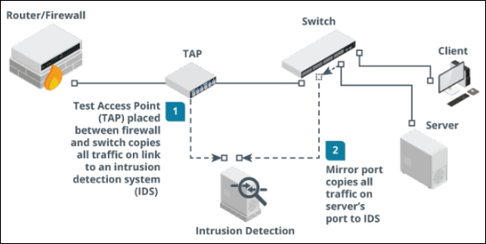

**Network-based intrusion prevention systems (IPS)** - An ips provides an active response to any network threat.

Typical responses to a threat can include blocking the attacker's ip address (shunning), throttling the bandwidth to attacking hosts and applying complex firewall filters.

**Next generation firewall (NGFW)** - HGFW is a product that combines application-aware filtering with user account-based filtering and the ability to act as an ips.

**Uni ied threat management (UTM)** - This refers to a security product that centralizes many types of security controls - firewall, antimalware, spam filtering, VPN etc into a single appliance. The downside is that this creates a single point of failure that can affect the entire network. they can also struggle with latency issues if they are subject to too much network activity.

**Content/url filter** - A firewall typically has to sustain high loads of traffic which can increase latency and even cause network outages. a solution is to treat security solutions for server traffic differently from that of user traffic.

A Content Filter Is Designed To Apply A Number Of User-Focused Filtering Rules Such As Applying Time-Based Restrictions To Browsing.


Content filters are now implemented as a class of product called secure web gateway (SWG) which can also integrate filtering with the functionality of data loss prevention.

**Host-based IDS** - a host-based ids (HIDS) captures information from a single host. the core ability is to capture and analyze log files but more sophisticated systems can also monitor OS kernel files, monitor ports and network interfaces.

One other core feature is file integrity monitoring (FIM). FIM software will audit key system files to make sure they match the authorized versions.

**Web Application Firewall (WAF)** - a WAF is designed to specifically protect software running on web servers and their back-end databases from code injection and dos attacks. they use application-aware processing rules to filter traffic and perform application-specific intrusion detection.


## 9.6 Web Filtering

Its primary function is to block users from accessing malicious or inappropriate websites, thereby protecting the network from potential threats.

Web filters analyze web traffic, often in real time, and can restrict access based on various criteria such as URL, IP address, content category, or even specific keywords.

#### Agent-Based Web Filtering

Agent-based web filtering involves installing a software agent on desktop computers, laptops, and mobile devices. The agents enforce compliance with the organization's web filtering policies.

Agents communicate with a centralized management server to retrieve filtering policies and rules and then apply them locally on the device.

#### Centralized Web Filtering

A centralized proxy server plays a crucial role in web content filtering by acting as an intermediary between end users and the Internet.

When an organization routes Internet traffic through a centralized proxy server, it can effectively control and monitor all inbound and outbound web content.

The primary role of the proxy in web content filtering is to analyze web requests from users and determine whether to permit or deny access based on established policies.

#### Centralized Web Filtering Techniques

- URL Scanning - Where the proxy server examines the URLs requested by users.

- Content Categorization - Classifies websites into categories

- Block Rules - Uses the proxy server to implement block rules based on various factors such as the website's URL, domain, IP address and even specific keywords within the web content.

- Reputation-Based Filtering - This leverages continually updated databases that score websites based on their observed behavior and history.


# SECTION 10 ASSESS ENDPOINT SECURITY CAPABILITIES

## 10.1 Endpoint Security

**Hardening** - this is the process of putting an os or application in a secure configuration however hardening must be balanced against the access requirements and usability in a particular situation.

The essential principle is of least functionality meaning the system should run only the protocols and services required by legit users and no more. Interfaces, services and application service ports not in use should be disabled.

**Patch Management** - on residential and small networks, hosts can be configured to auto-update either by the windows update process or in Linux with the commands **yum-cron** or **apt unattended-upgrades** depending on the package manager used by the distribution.

Patches can become incompatible with a particular application and cause availability issues. update repositories can also be infected with malware that can then be spread via automatic updates.


**Anti-virus (a-v)/ anti-malware** - first generation of anti-virus scanned for only viruses but today they can perform generalized malware detection. While a-v software remains important, signature-based detection is widely regarded to be insufficient for the prevention of data breaches.

**Host-based intrusion Detection/Prevention (hids/hips)** - HIDS provide threat detection via logs and file system monitoring. other products may also monitor ports and network interfaces and process data and logs generated by specific applications such as http or ftp.

**Endpoint Protection Platform (EPP)** - An EPP is a single agent performing multiple security

tasks, including malware/intrusion detection and prevention but also other features such as firewall, web content filtering and file/message encryption.

**Sandboxing** - this is a technique that isolates an untrusted host or app in a segregated environment to conduct tests. sandbox offers more than traditional anti-malware solutions because you can apply a variety of different environments to the sandbox instead of just relying on how the malware might exist in your current configuration.

## 10.2 Segmentation

This is the division of an enterprise into security zones based on function, performance and security requirements.

Security zones are enforced by firewall ingress and egress access control lists

**Security Zones**

- Untrusted - The organization has no control

- Screened Subnet - Has connections to both trusted and untrusted networks

- Trusted - The organization has complete control

- Enclave Is a restricted network within a trusted network

- Air Gapped - Does not connect to any untrusted network

- Physically Isolated - Does not connect to any other network

- Wireless - Supports wireless transmissions

- VPN - Designed to facilitate secure communications over a public circuit


**Micro-Segmentation** - This is a method of creating zones within data centers and cloud environments to isolate workloads from one another and secure them individually.


It allows for the implementation of a zero trust protect surface environments.

A protect surface is made up of the network's most critical and valuable data, assets and applications.

North-South traffic is one that flows into and out of a data center or cloud while East-West refers to traffic within a data center or cloud.

**Isolation** - This is when zones, devices, sessions or even components need to be segregated so as not to cause harm or be harmed.

**Virtualization** - creates multiple environments from a single physical hardware system.

**Logical** - A VLAN divides a single existing network into multiple logical network segments which can be restricted.


## 10.3 Mobile Device Management

Mobile Device Deployment Models Include

- Bring Your Own Device (BYOD) the mobile device is owned by the employee and will have to meet whatever security profile is required. it's the most common model for employees but poses the most difficulties for security managers. 
- Corporate Owned Business Only (COBO) - the device is owned by the company and may only be used for company business
- Corporate Owned, Personally-Enabled (COPE) - the employee may use it to access personal email, social media accounts and for some personal web browsing.

- Choose Your Own Device (CYOD) - very similar to cope except that here, the employee is given a choice of device from a list.

- Enterprise Mobility Management (EMM) - this is a class of management software designed to apply security policies to the use of mobile devices and apps in an enterprise.

- Mobile Device Management (MDM) - sets device policies for authentication, feature use (camera and microphone) and connectivity. MDM also allows device resets and remote wipes.
- Mobile Application Management (MAM) - sets policies for apps that can process corporate data and prevents data transfer to personal apps.


**loS in the enterprise** - In apple's ios ecosystem, third-party developers can create apps using apple's software development kit available only on macos.

Corporate control over los devices and distribution of corporate and b2b apps is facilitated by participating in the device enrollment program, the volume purchase program and the developer enterprise program.

**Android in the enterprise** - Android is open source meaning there is more scope for vendor-specific versions and the app model is far more relaxed.

The sdk is available on linux, windows and macos.

**Mobile access control systems -** If a threat actor is able to gain access to a smartphone,

they might be able to gain access to plenty of confidential data as well as cached passwords for email, social media etc.

**Smartphone authentication** - Access control can be implemented by configuring a screen

lock that can be bypassed using a password, pin or swipe pattern. Some devices also support biometrics like fingerprint readers.

**Screen lock -** The screen lock can also be configured with a lockout policy. For example, the device can be locked out for a period of time after a certain number of incorrect password attempts.


**Context-aware authentication -**Smartphones now allow users to disable screen locks when the device detects it is in a trusted location (home) however an enterprise may seek more stringent access controls to prevent misuse of a device.

For example, even if a device has been unlocked, the user might need to reauthenticate in order to access the corporate workspace.

**Remote wipe** - If the phone is stolen, it can be set to factory defaults or cleared of any personal data with the use of the remote wipe feature. it can also be triggered by several incorrect password attempts.

In theory, the thief could prevent the remote wipe by ensuring the phone cannot connect to the network then hacking the phone and disabling its security.


Full device encryption & external media in ios, there are various levels of encryption:

- All user data on the device is always encrypted but the key is stored on the device. It's this key that is deleted in a remote wipe to ensure the data is inaccessible.

- Email data and any apps using the "data protection" option are subject to a second round of encryption using a key derived from the user's credential.

Location services location services make use of two systems:

- **Global positioning system (gps)** - Means of determining the device's latitude and longitude based on information received from satellites via a gps sensor.

- **Indoor positioning system (ips)** - Works out a device's location by triangulating its proximity to other radio sources such as cell towers and wi-fi access points.

**Geofencing and camera /microphone enforcement** - Geofencing is the practice of creating a virtual boundary based on real-world geography and can be a useful tool for controlling the use of camera or

video functions or applying context-aware authentication.

**GPS tagging** - This is the process of adding

geographical identification metadata such as latitude and longitude, photographs, sms messages, video and so on.

GPS tagging is highly sensitive personal information and potentially confidential organizational data also.

**Content management** - Containerization allows the employer to manage and maintain the portion of the device that interfaces with the corporate network. a container can also enforce storage segmentation where the container will be associated with a directory.


#### rooting & jailbreaking

- **Rooting** - Associated with android devices and typically involves using custom firmware
- **Jailbreaking** - Associated with ios and is accomplished by booting the device with a patched kernel
- **Carrier unlocking** - For either ios or android and it means removing the restrictions that lock a device to a single carrier.

Rooting or jailbreaking mobile devices involves subverting the security measures on the device to gain super administrative access to it but also has the side effect of permanently disabling certain security features.


## 10.4 Secure Mobile Device Connections

**Personal area networks (pans) -** These enable connectivity between a mobile device and peripherals. Ad hoc (peer-to-peer) networks between mobile devices or between mobile devices and other computing devices can also be established

For corporate security, these peer-to-peer functions should generally be disabled.

**Ad hoc wi-fi and wi-fi direct -** An ad hoc network involves a set of wireless stations establishing peer-to-peer connections with one another rather than using an access point.

Wi-fi directly allows one-to-one connections between stations though one of them will serve as a soft access point.

**Tethering and hotspots -** A smartphone can share its internet connection with other devices via wi-fi making it a hotspot.

Where the connection is shared by connecting the smartphone to a pc via usb or bluetooth, it can be referred to as tethering.

### Bluetooth connection methods

- **Device discovery** - Allows the device to connect to any other bluetooth devices nearby.

- **Authentication & authorization** - Use of a simple passkey to "pair" connecting devices

- Malware

**Bluetooth connection methods -** Discoverable devices are vulnerable to **bluejacking**, where the spammer sends unsolicited messages to the device.

**Bluesnarfing** refers to using an exploit in bluetooth to steal information from someone else's phone.

Infrared & rfid connection methods - infrared has been used for pan but it's use in modern smartphones and wearable technology focuses on two other uses:

- **Ir** **blaster** - This allows the device to interact with an ir receiver and operate a device such as a tv as though it were the remote control.

- **Ip** **sensor** - These are used as proximity sensors and to measure health information (heart rate & blood oxygen levels).


Radio frequency id (rfid) is a means of encoding information into passive tags which can easily be attached to devices, clothing and almost anything else.

Skimming involves using a fraudulent rfid reader to read the signals from a contactless bank card

**Microwave radio connection methods** - Microwave radio is used as a backhaul link from a cell tower to the service provider's network and these links are important to 5g where many relays are required and provisioning fiber optic cable backhaul can be difficult.

A microwave link can be provisioned in two modes:

- Point-to-point (p2p) - Microwave uses high gain antennas to link two sites and each antenna is pointed directly at the other. It's very difficult to eavesdrop on the signal as an intercepting antenna would have to be positioned within the direct path.

- Point-to-multipoint (p2m) - Microwave uses smaller sectoral antennas each covering a separate quadrant. P2m links multiple sites to a single hub and this can be cost-efficient in high density urban areas.

# SECTION 11 ENHANCE APPLICATION SECURITY CAPABILITIES

## 11.1 DNS Security, Directory Services & Snmp

**DNS Security** - to ensure dns security on a private network, local DNS servers should only accept recursive queries from local authenticated hosts and not from the internet.

Clients should be restricted to using authorized resolvers to perform name resolution. DNS footprinting means obtaining information about a private network by using its DNS server to perform a zone transfer (all the records in a domain) to a rogue DNS.

**Security Extensions (DNSSEC)** - These Help to Mitigate against spoofing And Poisoning Attacks by Providing a Validation Process For DNS responses.

**Secure Directory Services** - a network directory lists the subjects (users, computers and services) and objects (directories and files) available on the network plus the permission subjects have over objects.

Most Directory Services Are Based on The Lightweight Directory Access Protocol (LDAP) Running over Port 389.


Authentication Referred To As Binding To The Server Can Be Implemented By:

- No Authentication - Anonymous Access Is Granted

- Simple Bind - The Client Must Supply Its Distinguished Name And Password In Plaintext

- Simple Authentication And Security Layer (Sasl) - The Client And Server Negotiate The Use Of A Supported Authentication Mechanism Such As Kerberos.

- Ldap Secure (Ldaps) - The Server Is Installed With A Digital Certificate Which It Uses To Setup A Secure Tunnel For The User Credential Exchange. Ldaps Use Port 636.

Generally Two Levels Of Access To The Directory Can Be Granted Which Are Read-Only Access (Query) And Read/Write Access (Update) And Is Implemented Using An Access Control Policy.

**Time Synchronization** - Many Network Applications Are Time Dependent And Time Critical. The Network Time Protocol (Ntp) Provides A Transport Over Which To Synchronize These Time Dependent Applications

Ntp Works Over Udp On Port 123.


```
NTP has Historically Lacked Any Sort Of Security Mechanism but There Are Moves to Create a Security Extension For the Protocol Called Network Time Security.

Simple Network Management Protocol (SNMP) Security - This Is a Widely used Framework For Management And Monitoring And Consists of an SNMP Monitor and Agents. The agent is a Process (Software Or Firmware) running on a Switch, Router, Server or other SNMP-Compatible network device.

This Agent Maintains a Database Called a Management Information Base (MIB) that Holds Statistics Relating to The activity Of the Device. The Agent Is also Capable Of Initiating a Trap Operation Where It Informs The Management System Of a Notable Event Like port failure.
```


## 11.2 Secure Application Operations Protocols

**HTTP** enables clients to request resources from an HTTP server. The server acknowledges the request and responds with the data or an error message.

**HTTP** is a stateless protocol which means the server preserves no information about the client during a session.

**Transport Layer Security** - Secure Sockets Layer (SSL) was developed by Netscape in the 1990s to address the lack of security in HTTP and was quickly adopted as a standard named Transport Layer Security (TLS).

To implement TLS, a server is assigned a digital certificate signed by some trusted CA. The certificate proves the identity of the server and validates the server's public/private key pair.

The server uses its key pair and the TLS protocol to agree mutually supported ciphers with the client and negotiate an encrypted communications session.

**SSL/TLS Version** - A server can provide support for legacy clients meaning a TLS 1.2 server could be configured to allow clients to downgrade to TLS 1.1 or 1.0

TLS 1.3 was approved in 2018 and the ability to perform downgrade attacks was mitigated by preventing the use of unsecure features and algorithms from previous versions.

**Cipher Suites** - This is a set of algorithms supported by both the client and server to perform the different encryption and hashing operations required by the protocol.

Prior to TLS 1.3, a cipher suite would be written like this

```
ECDHE-RSA-AES128-GCM-SHA256

This means that the server can use Elliptic Curve Diffie-Hellman Ephemeral mode for a session key agreement, RSA signatures, 128-bit AES-GCM (Galois Counter Mode) for symmetric bulk encryption and 256-bit SHA for HMAC functions.

TLS 1.3 uses simplified and shortened suites

TLS_AES_256_GCM_SHA384

Only ephemeral key agreement is supported in 1.3 and the signature type is supplied in the certificate so the cipher suite only lists the bulk encryption key strength and mode of operation (AES_256_GCM) plus the cryptographic hash algorithm (SHA384).
```


## 11.3 File Transfer, Email & Video Services

FTP - File Transfer Protocol is the most popular protocol for transferring files across networks because it is very efficient and has wide cross-platform support but has no security mechanism.

**SSH FTP (SFTP) & FTP over SSL (FTPS)** - SFTP addresses the lack of security by encrypting the authentication and data transfer between client and server. SFTP uses port 22.

**Explicit TLS (FTPES)** - Use the AUTH TLS command to upgrade and insecure connection established on port 21 to a secure one.

**Implicit TLS (FTPS)** - Negotiates an SSL/TLS tunnel before the exchange of any FTP commands. This mode uses the secure port 990 for the control connection.

#### Email Services: These use two types of protocols:

- The Simple Mail Transfer Protocol (SMTP) which specifies how mail is sent from one system to another.

- A mailbox protocol stores messages for users and allows them to download them to client computers or manage them on the server.

#### Secure SMTP (SMTPS) - communications can be secured using TLS and there are two ways to do this:

- STARTTLS - This command will upgrade an existing unsecure connection to use TLS. Also referred to as explicit TLC or opportunistic TLS.

- SMTPS - This establishes the secure connection before any SMTP commands are exchanged. Also referred to as implicit TLS.


Typical SMTP configurations use the following ports and secure services:

- Port 25 - Used for message relay between SMTP servers or Message Transfer Agents (MTA)

- Port 587 - Used by mail clients to submit messages for delivery by an SMTP server

- Port 465-Some providers and mail clients use this port for message submission over implicit TLS (SMTPS)


**Secure POP (POP3S)** - The Post Office Protocol v3 is a mailbox protocol designed to store the messages delivered by SMTP on a server.


**Secure IMAP (IMAPS) -** The Internet Message Access Protocol v4 (IMAP4) supports permanent connections to a server and connecting multiple clients to the same mailbox simultaneously.

**Secure/Multipurpose Internet Mail Extensions (S/MIME)** - Is a means of applying both authentication and confidentiality on a per-message basis.


## 11.4 Email Security

**Sender Policy Framework (SPF)** - Is an email authentication method that helps detect and prevent sender address forgery commonly used in phishing and spam emails.

SPF works by verifying the sender's IP address against a list of authorized sending IP addresses published in the DNS TXT records of the email sender's domain.

**DomainKeys Identified Mail (DKIM)** - Leverages encryption features to enable email verification by allowing the sender to sign emails using a digital signature, The receiving email server uses a DKIM record in the sender's DNS record to verify the signature and the email's integrity.

**Domain-based Message Authentication, Reporting & Conformance (DMARC)** - Uses the results of SPF and DKIM checks to define rules for handling messages, such as moving messages to quarantine or spam, rejecting them outright or tagging the message.

**An email gateway** Is the control point for all incoming and outgoing email traffic. It acts as a gatekeeper, scrutinizing all emails to remove potential threats before they reach inboxes. Email gateways utilize several security measures, including anti-spam filters, antivirus scanners, and sophisticated threat detection algorithms to identify phishing attempts, malicious URLs, and harmful attachments.


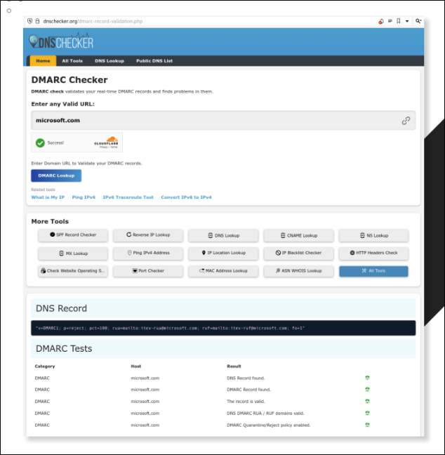


The combined use of SPF, DKIM, and DMARC significantly enhances email security by making it much more difficult for attackers to impersonate trusted domains, which is one of the most common tactics used in phishing and spam attacks.


## 11.5 Secure Coding Techniques

**Input Validation** malicious input could be crafted to perform an overflow attack or some type of script or SQL injection attack. To mitigate this, there should be routines to check user input and anything that does not conform to what is required must be rejected.

**Normalization and Output Encoding -** normalization means that a string is stripped of illegal

characters or substrings and converted to the accepted character set. this ensures that the string is in a format that can be processed correctly by the input validation routines.

**Output encoding** means that a string is re-encoded safely for the context in which it is being used.

**Server-side versus Client-side** **Validation** a web application can be designed to perform

code execution and input validation locally (on the client) or remotely (on the server). The main issue with client-side validation is that the client will always be more vulnerable to some sort of malware interfering with the validation process.

Main issue with server-side validation is that it can be time-consuming as it may involve multiple transactions between the server and client. Client-side validation is usually restricted to informing the user that there is some sort of problem with the input before submitting it to the server, relying on client-side validation only is poor programming practice.

#### Web Application Security In Response Headers

A Number Of Security Options Can Be Set In The Response Header

- Http Strict Transport (HST) - Forces Browser to Connect Using HTTPS Only, Mitigating Downgrade Attacks Such as SSL Stripping.

- Content Security Policy (CSP) - Mitigates Clickjacking, Script Injection And Other Client-Side Attacks.

- Cache Control - Sets Whether The Browser can Cache Responses. Preventing Caching Of Data Protects Confidential And Personal Information Where The Client Device Might Be Shared By Multiple Users.


**Data Exposure And Memory Management** - Data Exposure is a Fault that allows Privileged Information such as a Password or Personal Data to be Read without being Subject to the appropriate access controls.

A Well-Written application must be able to Handle Errors and Exceptions Gracefully. Ideally the Programmer should have Written a **Structured Exception Handler (SEH)** to dictate what the application should ther do


The Error Must Not Reveal Any Platform Information Or Inner Workings Of The Code To An Attacker.

**Secure Code Usage** - A Program May Make Use Of Existing Code In The Following Ways:

- Code Reuse - using a block of code from elsewhere in the same application or from another application to perform a different function.

- Third-Party Library - using a binary package (such as a dynamic link library) that implements some sort of standard functionality such as establishing a network connection.

- Software Development Kit (SDK) - using sample code or libraries of pre-built functions from the programming environment used to create the software.

- Stored Procedures - Using a Pre-Built Function to Perform a database query.

#### Unreachable code and dead code

**Unreachable code** is a part of application source code that can never be executed (if ... then conditional logic that is never called because the conditions are never met).

**Dead code** is executed but has no effect on the program flow (a calculation is performed but the result is never stored as a variable or used to evaluate a condition).

**Static code analysis** - this is performed against the application code before it is packaged as an executable process. The software will scan the source code for signatures of known issues.

Human analysis of software source code is described as a manual code review. It is important that the code be reviewed by developers other than the original coders to try to identify oversights, mistaken assumptions or a lack of experience.

Dynamic code analysis - static code review will not reveal any vulnerabilities that exist in the runtime environment. dynamic analysis means that the application is tested under real world conditions using a staging environment.

**Fuzzing** is a means of testing that an application's input validation routines work well. fuzzing will deliberately generate large amounts of invalid or random data and record the responses made by the application.

Associated with fuzzing is the concept of stress testing an application to see how an application performs under extreme performance or usage scenarios.

Finally, the fuzzer needs some means of detecting an application crash and recording which input sequence generated the crash.


# SECTION 12 - EXPLAIN INCIDENT RESPONSE AND MONITORING CONCEPTS

## 12.1 - Incident Response Process

This is a set of policies and procedures that are used to identify, contain, and eliminate cyberattacks. The goal is to allow an organization to quickly detect and stop attacks, minimize damage and prevent future attacks of the same type.

Principal stages in incident response life cycle

- Preparation - Makes the system resilient to attack. this includes: hardening systems, writing policies and procedures, and creating incident response resources and procedures

- Identification - Determine whether an incident has taken place, assess how severe it might be and then notify the appropriate personnel.

- Containment - Limits the scope and magnitude of the incident. The main aim of incident response is to secure data while limiting the immediate impact on customers and business partners.

- Eradication - Once the incident is contained, the vulnerability/issue is removed and the affected systems are restored to a secure state.

- Recovery - The restored system is then reintegrated back into the business process that it supports

- Lessons learned - Analyze the incident and responses to identify whether procedures or systems could be improved. It is also imperative to document the incident.


## 12.2 Cyber Incident Response Team

Preparing for incident response means establishing the policies and procedures for dealing with security breaches and the personnel and resources to implement those policies.

First task is to define and categorize types of incidents. in order to identify and manage incidents, you should develop some method of reporting, categorizing and prioritizing them.

An incident response team can be referred to as a cyber incident response team (CIRT), computer security incident response team (CSIRT) or computer emergency response team (cert).

For Major Incidents, Expertise from Other Business Divisions might be needed

- Legal - The Incident Can Be Evaluated From The Perspective Of Compliance With Laws And Industry Regulations.

- Human Resources (Hr) - Incident Prevention And Remediation Actions May Affect Employee Contracts, Employment Law And So On.

- Marketing - The Team Is Likely To Require Marketing Or Public Relations Input So Any Negative Publicity From A Serious Incident Can Be Managed.

Incident response policies should establish clear lines of communication both for reporting incidents and for notifying affected parties.

Status and event details should be circulated on a need-to-know basis and only to trusted parties identified on a **call list.** Trusted parties might include both internal and external stakeholders.

Obligations to report the attack must be carefully considered and it may be necessary to inform affected parties during or immediately after the incident so that they can perform their own remediation e.g "change your passwords immediately"

## 12.3 Incident Response Plan

This lists the Procedures, Contacts and Resources Available to Responders for Various Incident Categories.

A **Playbook** Is a Data-Driven Standard Operating Procedure (SOP) to assist Junior Analysts in Detecting and Responding to Specific Cyber threat Scenarios.

One Challenge In Incident Management is to allocate Resources Efficiently and there are several factors that can affect this Process.

- Data Integrity - The Most important factor In Prioritizing Incidents

- Downtime - An Incident can Either Degrade or Interrupt the Availability Of an asset Or system.

- Economic/Publicity - both data integrity and downtime will have important economic effects. short-term might involve lost business opportunity while long-term may involve damage to reputation and marketing standing.

- Scope - Refers To the number of affected Systems In an Incident
- Detection Time - research has shown that more than half of data breaches are not detected for weeks or months. this demonstrates that systems used to search for intrusions must be thorough.

- Recovery Time - Some Incidents require Lengthy Remediation as the system Changes Required are Complex to Implement.

A key tool for threat research is a framework to use to describe the stages of an attack and these stages are referred to as a **cyber kill chain.**


**MITRE att&ck** - an alternative to the kill chain is the MITRE corporation's adversarial tactics, techniques and common knowledge.

It provides access to a database of known TTPS and tags each technique with a unique id and places it in one or more tactic categories such as initial access, persistence or command & control.

**Diamond model of Intrusion Analysis** - this suggests a framework to analyze an intrusion

event (e) by exploring the relationships between four core features: adversary, capability, infrastructure and victim.

Each event may also be described by meta-features such as date/time, kill chain phase etc.

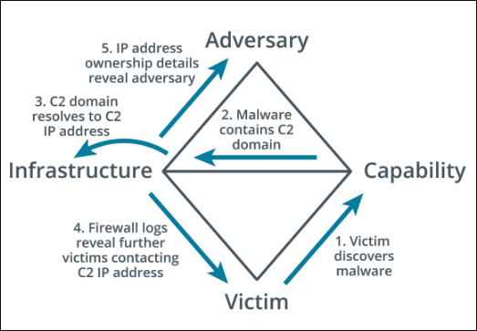


## 12.4 Incident Response Exercises, Recovery And Retention Policy

**Identi ication** - This is the Process of Collating Events and Determining whether any of them should be Managed as Incidents or as Possible Precursors to an Incident.

- **Tabletop** - least costly where the facilitator presents a scenario and the responders explain what action they would take to identify, contain and eradicate the threat. flashcards are used in place of computer systems.

- **Walkthroughs** - similar to tabletop except here the responders demonstrate what actions they would take in response such as running scans and analyzing sample files.

- **Simulations** a team based exercise where the red team attempts an intrusion, the blue team operates response and recovery controls and the white team moderates and evaluates the exercise.

**Disaster recovery plan** - Also called the emergency response plan. This is a document meant to minimize the effects of a disaster or disruption. meant for short term events and implemented during the event itself.

**Business continuity plan** - Identifies how business processes should deal with both minor and disaster-level disruption. a continuity plan ensures that business processes can still function during an incident even if at a limited scale.

**Continuity of operation planning (COOP)** - This terminology is used for government facilities but is functionally similar to business continuity planning. In some definitions, coop refers specifically to backup methods of performing mission functions without IT support.

**Retention policy -** a retention policy for historic logs and data captures sets the period of which these are retained. indicators of a breach might be discovered only months after the breach and this would not be possible without the retention policy to keep logs and other digital evidence.

#### Training On Specific Incident Response Scenarios Can Use Three Forms

- **Tabletop** - Least Costly where the Facilitator presents a Scenario and The Responders explain what action they Would Take to Identify, Contain and Eradicate the Threat. Flashcards are used in place of Computer Systems.

- **Walkthroughs** - Similar to Tabletop Except here The Responders Demonstrate what actions they would Take In Response Such As Running Scans and Analyzing Sample Files.

- **Simulations** - A Team Based Exercise where the Red Team Attempts an Intrusion, the Blue Team Operates Response and Recovery Controls and the White Team moderates and Evaluates The Exercise.


**Disaster recovery plan** - also called the emergency response plan. This is a document meant to minimize the effects of a disaster or disruption. meant for short term events and implemented during the event itself.

**Business continuity plan** - identifies how business processes should deal with both minor and disaster-level disruption. a continuity plan ensures that business processes can still function during an incident even if at a limited scale.

**Continuity of operation planning (COOP)** - this terminology is used for government facilities but is functionally similar to business continuity planning. In some definitions, coop refers specifically to backup methods of performing mission functions without IT support.

**Retention policy** a retention policy for historic logs and data captures sets the period of which these are retained. indicators of a breach might be discovered only months after the breach and this would not be possible without the retention policy to keep logs and other digital evidence.

## 12.5 Incident Identification

Training On Specific Incident Response Scenarios Can Use Three Forms

- Using Logs, Error Messages And Ids/Firewall Alerts

- Comparing Deviations To Established Metrics To Recognize Incidents And Their Scopes

- Manual Or Physical Inspections Of Site, Premises, Networks And Hosts

- Notification By An Employee, Customer Or Supplier

- Public Reporting Of New Vulnerabilities


**Correlation** - This Means Interpreting The Relationship Between Individual Data Points To Diagnose Incidents Of Significance to The Security Team.

A SIEM (Security Information and Event Management System) Correlation Rule Is a Statement That Matches Certain Conditions.

These Rules Use Logical Expressions such as And And or And Operators (==, <,>, In)

A Single-User Logon Failure Might Not Raise an Alert However Multiple Failed Logins For The Same Account Over A Short Period Of Time Should Raise One.

**Error.Logonfailure > 3 And Logonfailure.Alice And Duration < 10 Minutes**

One of the biggest challenges in operating a SIEM is tuning the system sensitivity to reduce false positive indicators being reported as an event.

The correlation rules are likely to assign a criticality level to each match.

**Trend analysis** - This is the process of detecting patterns or indicators within a data set over a time series and using those patterns to make predictions about future events.

- Frequency-based trend analysis establishes a baseline for a metric such as number of errors per hour of the day. if the frequency exceeds the threshold for the baseline, then an alert is raised.

- Volume-based trend analysis - this can be based on logs growing much faster than usual. This analysis can also be based on network traffic and endpoint disk usage.

- Statistical deviation analysis can show when a data point should be treated as suspicious. For example, a data point that appears outside the two clusters for standard and admin users might indicate some suspicious activity by that account.

**Logging platforms** - Log data from network appliances and hosts can be aggregated by a siem either by installing a local agent to collect the data or by using a forwarding system to transmit logs directly to the siem server.

**Syslog** - Provides an open format, protocol and server software for logging event messages and it's used by a very wide range of host types.

A syslog message comprises a pri code, a header containing a timestamp and host name and a message part. usually uses UDP port 514

- Rsyslog uses the same configuration file syntax but can work over tcp and use a secure connection.

- Syslog-ng uses a different configuration file syntax but can also use tcp/secure communications and more advanced options for message filtering.

In linux, rather than writing events to syslog-format text files, logs from processes are written to a binary-format called **journald**.

Events captured by journald can be forwarded to syslog and to view events in journald directly, you can use **journalct** command to print the entire journal log.

#### System & security logs - The five main categories of windows event logs are:

- Application - Events generated by applications and services
- Security - Audit events such as a failed logon or denied access to a file
- System - Events generated by the os and its services such as storage volume health checks

- Setup - Events generated during the windows installation

- Forwarded Events - Even Trang 125 / 176 sen 179 the Tocal froth other hosts.


Network logs can be generated from routers, firewalls, switches and access points.

Authentication attempts for each host are likely to be written to the security log.

DNS event logs may be logged by a dns server while web servers are typically configured to log http traffic that encounters an error or traffic that matches some predefined rule set.

The status code of a response can reveal something about both the request and the server's behavior.

- Codes in the 400 range indicate client-based errors

- Codes in the 500 range indicate server-based errors

- "403" may indicate that the server is rejecting a client's attempts to access resources they are not authorized to.

- "502" (bad gateway) response could indicate that communications between the target server and its upstream server are being blocked or the upstream server is down.

**Dump files** - A system memory dump creates an image file that can be analyzed to identify the processes that are running, the contents of temporary file systems, registry data, network connections and more.

It can also be a means of accessing data that is encrypted when stored on a mass storage device.

**Metadata** - This the properties of data as it is created by an application stored on media or transmitted over a network. Metadata sources are useful during an investigation as they can establish timeline questions as well as containing other types of evidence.

**File** - File metadata is stored as attributes. The file system tracks when a file was created, accessed and modified. The acl attached to a file showing its permissions also represents another type of attribute.

**Web** - when a client requests a resource from a web server, the server returns the resource plus headers setting or describing its properties. headers describe the type of data returned.

**Email** - An email's internet header contains address information for the recipient and sender plus details of the servers handling transmission of the message between them.

**Mobile** - Phone metadata comprises call detail records (CDRs) of incoming, outgoing and attempted calls and sms text time, duration and the opposite party's number. meta data will also record data transfer volumes and the location history of the device can be tracked by the list of cell towers it has used to connect to the network.

**Netflow**/**ipfix** - A flow collector is a means of recording metadata and statistics about network traffic rather than recording each frame.

#### Flow analysis tools can provide features such as:

- Highlighting trends and patterns in traffic generated by particular applications, hosts and ports.

- Alerting based on detection of anomalies or custom triggers

- Identification of traffic patterns revealing rouge user behavior or malware in transit


## 12.6 Digital Forensics Documentation

Digital forensics is the practice of collecting evidence from computer systems to a standard that will be accepted in a court of law.

Prosecuting external threat sources can be difficult as the threat actor may be in a different country or have taken effective steps to disguise their location. Like dna or fingerprints, digital evidence is latent meaning that the evidence cannot be seen with the naked eye; rather it must be interpreted using a machine or process.

**Due Process** - term used in us and uk common law that requires that people only be convicted of crimes following the fair application of the laws of the land. The first response period following detection and notification is often critical. to gather evidence successfully, it's vital that staff do not panic or act in a way that would compromise the investigation.

**Legal Hold** - this refers to the fact that information that may be relevant to a court case must be preserved. This means that computer systems may be taken as evidence with all the obvious disruption to a network that entails.

**Chain of Custody** - this documentation reinforces the integrity and proper handling of evidence from collection, to analysis, to storage and finally to presentation. It is meant to protect an organization against accusations that evidence has been tampered with during a trial.


**Digital Forensics Reports** - a report summarizes the significant contents of the digital data and the conclusions from the investigator's analysis.

- Analysis must be performed without bias. conclusions and opinions should be formed only from the direct evidence under analysis.

- Analysis methods must be repeatable by third parties with access to the same evidence

- A Ideally, the evidence must not be changed or manipulated.

**E-Discovery -** this is a means of filtering the relevant evidence produced from all the data gathered by a forensic examination and storing it in a database in a format such that it can be used as evidence in a trial.

#### Some Of The Functions Of E-Discovery Suites Are:

- A Identify And De - Duplicate Files and Metadata

- Search - Allows Investigators to Locate Files of Interest to the Case.

- Tags - Apply standardized Keywords or labels to Files and Metadata to Help Organize The Evidence.

- Security - At all Points Evidence must be Shown to have Stored, Transmitted and analyzed without Tampering.

- Disclosure - An Important part of the Trial Procedure is that Evidence Is made available to Both Plaintiff And Defendant.


**Video and witness interviews** - The first phase of a forensics investigation is to document the scene by taking photographs and ideally audio and video.

As well as digital evidence, an investigator should interview witnesses to establish what they were doing at the scene and whether they observed any suspicious behavior or activity.

**Timelines** - A very important part of a forensic investigation will involve tying events to specific times to establish a consistent and verifiable narrative. This visual representation of events in a chronological order is called a timeline.

Operating systems and files use a variety of methods to identify the time at which something occurred but the benchmark time is coordinated universal time (UTC).

Local time will be offset from UTC by several hours and this local time offset may also vary if a seasonal daylight saving time is in place.

NTFS uses UTC "internally" but many OS and file systems record timestamps as the local system time and when collecting evidence, it is vital to establish how a timestamp is calculated and note the offset between the local system time and utc.

**Event logs and network traffic** - An investigation may also obtain the event logs for one or more network appliances and/or server hosts. network captures might provide valuable evidence.

For forensics, data records that are not supported by physical evidence (data drive) must meet many tests to be admissible in court. if the records were captured by a SIEM, it must demonstrate accuracy and integrity.

#### The intelligence gathered from a digital forensic activity can be used in two different ways:

- **Counterintelligence** - Identification and analysis of specific adversary tactics, techniques and procedures (TTPS) provides information on how to configure and audit systems so they are better able to capture evidence of attempted and successful intrusions.

- **Strategic** **Intelligence** - Data that has been analyzed to produce actionable insights. These insights are used to inform risk management and security control provisioning to build mature cybersecurity capabilities.

## 12.7 Digital Forensics Evidence Acquisition

Acquisition is the process of obtaining a forensically clean copy of data from a device held as evidence. if the system is not owned by the organization then the seizure could be challenged legally (BYOD)

Data acquisition is also more complicated when capturing evidence from a digital scene compared to a physical one (evidence may be lost due to system glitches or loss of power).

Data acquisition usually proceeds by using a tool to make an image from the data held on the target device. the image can be acquired from either volatile or nonvolatile storage.

Digital acquisition and order of volatility - the general principle is to capture evidence in the order of volatility from more volatile to less volatile.

#### According to the ISOC, the order is as follows

- Cpu registers and cache memory

- Contents of ram including routing table, arp cache, kernel statistics

- Data on persistent mass storage devices like hard drives, usbs

- Remote logging and monitoring data
- Physical configuration and network topology
- Archival media and printed documents


#### Digital forensics software include:

- Encase forensic is a digital forensics case management product. contains workflow templates showing the key steps in diverse types of investigation.

- The forensic toolkit (ftk) from accessdata. a commercial investigation suite designed to run on windows server.

- **The sleuth kit** - an open source collection of command line tools and programming libraries for disk imaging and file analysis. autopsy is the gui that sits on top of the kit and is accessed through a web browser.

- **Winhex** - a commercial tool for forensic recovery and analysis of binary data, with support for a range of file systems and memory dump types.

- The volatility framework which is widely used for system memory me analysis.


Disk image acquisition refers to acquiring data from non-volatile storage. it could also be referred to as device acquisition meaning the ssd storage in a smartphone or media player.

There are three device states for persistent storage acquisition

**Live acquisition** - Means copying the data while the host is still running. this may capture more evidence or more data for analysis and reduce the impact on overall services. however the data on the actual disks will have changed so this method may not produce legally acceptable evidence.

Static acquisition by shutting down the host - runs the risk that the malware will detect the shut-down process and perform anti-forensics to try and remove traces of itself.

**Static acquisition by pulling the plug** - This means disconnecting the power at the wall socket. This will likely preserve the storage device in a forensically clean state but there is the risk of corrupting data.

Whichever method is chosen, it is important to document the steps taken and supply a timeline of all actions.

**Preservation and integrity of evidence** - It is vital that the evidence collected at the crime scene conform to a valid timeline. recording the whole process establishes provenance of the evidence as deriving directly from the crime scene.

To obtain a clean forensic image from a non-volatile storage, you need to ensure nothing you do alters the data or metadata on the source disk or file system. A write blocker can ensure this by preventing any data from being changed by filtering write commands.

The host devices and media taken from the crime scene should be labeled, bagged and sealed using tamper-evident bags. bags should have anti-static shielding to reduce the possibility that data will be damaged or corrupted on the electronic media by electrostatic discharge.

The evidence should be stored in a secure facility.

#### Acquisition of other data types includes:

- **Network** - Packet captures and traffic flows can contain evidence. most networks will come from a SIEM.

- **Cache** - Software cache can be acquired as part of a disk image. the contents of hardware cache are generally not recoverable.

- **Artifacts and data recovery -** Artifact refers to any type of data that is not part of the mainstream data structures of an os. Data recovery refers to analyzing a disk for file fragments that might represent deleted or overwritten files. The process of recovering them is referred to as carving.

- **Snapshot** - Is a live acquisition image of a persistent disk and may be the only means of acquiring data from a virtual machine or cloud process.

- **Firmware** - Is usually implemented as flash memory. Some types like the pc firmware can potentially be extracted from the device or from the system memory using an imaging utility.


## 12.8 Data Sources

Incident investigation often requires analysis of several data sources in order to draw a defensible conclusion.

- Vulnerability Scans

- Log files

- SIME dashboards

- Metadata

- Packet capture


#### Log Analysis and Response Tools

- Security Information Event Management (SIEM) is an automation tool for real-time data capture, event correlation, analysis and reporting

- Threat Intelligence Platform (TIP) is an automation tool that combines multiple threat intelligence feeds and integrates with existing SIEM solutions

- User & Entity Behavior Analytics (UEBA) - is an automation tool that models human and machine behavior to identify normal and abnormal behavior.

- Security Orchestration, Automation and Response (SOAR) is an automation tool that responds to alerts and takes remediation steps.

**Packet Capture - This is the process of intercepting and logging traffic for analysis.**

- A protocol analyzer (sniffer) is a tool used to capture and analyze network packets

- A port mirror captures network traffic from one or several ports of a switch and forwards a copy of the traffic to an analysis device

- A network TAP is a dedicated hardware device that is inserted between network devices and makes copies of the traffic and forwards to an analysis device.


**Packet Capture Modes**

- Normal - The network interface card (NIC) only captures frames intended for the interface (filtering by MAC address)

- Promiscuous - The NIC accepts any frame it captures even if it was not the intended recipient

- Unfiltered - Packet capture regardless of data elements

- Filtered - Packet capture limited to specific data elements

# SECTION 13 - ANALYZE INDICATORS OF MALICIOUS ACTIVITY

## 13.1 Malware Classification

Some malware classifications such as Trojan, virus and worm focus on the vector used by the malware. the vector is the method by which the malware executes on a computer and potentially spreads to other network hosts.

#### The Following Categories Describe Some Types Of Malware According To Vector:

- **Viruses & Worms** - spread without any authorization from the user by being concealed within the executable code of another process.

- **Trojan** - Malware Concealed within an Installer Package for Software that Appears to be Legitimate

- **Potentially Unwanted Programs/Applications (Pups/Puas)** - These are software installed alongside a package selected by the user. unlike a Trojan, their presence isn't necessarily malicious. they are sometimes referred to as grayware.

Other Classifications are Based on the Payload Delivered By the Malware. The Payload Is the Action Performed by the Malware

Examples Of Payload Classification Include:

- Spyware

- Rootkit

- Remote Access Trojan (Rat)

- Ransomware


## 13.2 Computer Viruses

This is a type of malware designed to replicate and spread from computer to computer usually by "infecting" executable applications or program code.

The Following Categories Describe Some Types Of Malware According To Vector:

- **Non-Resident/File Infector** - the virus is contained within a host executable file and runs with the host process. the virus will try to infect other process images on persistent storage and perform other payload actions.

- **Memory Resident -** when the host file is executed, the virus creates a new process for itself in memory. the malicious process remains in the memory even if the host process is terminated.

- **Boot**-the virus code is written to the disk boot sector and executes as a memory resident process when the OS starts.

- **Script And Macro Viruses** the malware uses the programming features available in local scripting engines for the OS and/or browser such as PowerShell, javascript, Microsoft office documents or PDF documents with JavaScript enabled.

The term **multipartite** is used for viruses that use multiple vectors and **polymorphic** for viruses that can dynamically change or obfuscate their code to evade detection. Viruses must infect a host file or media. an infected file can be distributed through any normal means on a disk, on a network, a download from a website or email attachment.


## 13.3 Computer Worms & Fileless Malware

Computer Worms - this is a memory resident malware that can run without user intervention and replicate over network resources. viruses need the user to perform an action but worms can execute by exploiting a vulnerability in a process and replicate themselves.

Worms can rapidly consume network bandwidth as the worm replicates and they may be able to crash an operating system or server application. worms can also carry a payload that may perform some other malicious action.

Fileless malware - as security controls got more advanced so did malware and this new sophisticated modern type of malware is often referred to as fileless.

The Following Categories Describe Some Types Of Malware According To Vector:

- Fileless malware do not write their code to disk. the malware uses memory resident techniques to run its own process within a host process or dynamic link library (DLL). the malware may change registry values to achieve persistence.

- Fileless malware uses lightweight shell code to achieve a back door mechanism on the host. the shell code is easy to recompile in an obfuscated form to evade detection by scanners. it is then able to download additional packages or payloads to achieve the actor's objectives.

- Fileless malware may use "live off the land" techniques rather than compiled executables to evade detection. this means that the malware code uses legitimate system scripting tools like power-shell to execute payload actions.


## 13.4 Spyware, Keyloggers, Rootkits, Backdoors, Ransomware & Logic Bombs

**Spyware** - This is malware that can perform adware-like tracking but also monitor local application activity, take screenshots and activate recording devices.

**Adware** - Grayware that performs browser reconfigurations such as allowing cookies, changing default search engines, adding bookmarks and so on.

**Tracking cookies** - Can be used to record pages visited, the user's ip address and various other metadata.

**Keylogger** - Spyware that actively attempts to steal confidential information by recording keystrokes.

**Backdoors & rats** - A backdoor provides remote user admin control over a host and bypasses any authentication method. A remote access trojan is a backdoor malware that mimics the functionality of legitimate remote control programs but is designed specifically to operate covertly. a group of bots under the same control of the same malware are referred to as a botnet and can be manipulated by the herder program.

**Rootkits** - This malware is designed to provide continued privileged access to a computer while actively hiding its presence. it may be able to use an exploit to escalate privileges after installation.software processes can run in one of several "rings".

- Ring 0 is the most privileged and provides direct access to hardware

- Ring 3 is where user-mode processes run

- Ring 1 or 2 is where drivers and i/o processes may run.

**Ransomware** - This type of malware tries to extort money from the victim by encrypting the victim's files and demanding payment. ransomware uses payment methods such as wire transfer or cryptocurrency.

**Logic bombs** - Logic bombs are not always malware code. a typical example is a disgruntled admin who leaves a scripted trap that runs in the event his or her account is disabled or deleted. anti-malware software is unlikely to detect this kind of script and this type of trap is also referred to as a mine.

## 13.5 Malware Indicators & Process Analysis

#### There Are Multiple Indicators Of Malware:

- Antivirus Notifications

- Sandbox Execution

- Resource Consumption - Can Be Detected Using Task Manager Or Top Linux Utility.

- File System


Because shellcode is easy to obfuscate, it can easily evade signature-based a-v products. Threat hunting and security monitoring must use behavioral-based techniques to identify infections.

Along with observing how a process interacts with the file system, network activity is one of the most reliable ways to identify malware.

## 13.6 Password Attacks

**Plain text/ unencrypted attacks** - an attack that exploits unencrypted password storage such as those used in protocols like http, pap and telnet.

**Online attacks** - The threat actor interacts directly with the authentication service using either a database of known passwords or a list of passwords that have been cracked online. This attack can be prevented with the use of strong passwords and restricting the number of login attempts within a specified period of time.

**Password spraying** - A horizontal brute force attack where the attacker uses a common password (123456) and tries it with multiple usernames.

**Offline attacks -** An offline attack means the attacker has gotten access to a database of password hashes e.g %systemroot%\system32\config\sam or %systemroot%\ntds\ntds.dit (the active directory credential store)

**Brute force attack** - Attempts every possible combination in the output space in order to match a captured hash and guess the plaintext that generated it. the more the characters used in the plaintext password, the more difficult it would be to crack.

**Rainbow table attack** - A refined dictionary attack where the attacker uses a precomputed lookup table of all possible passwords and their matching hashes.


**Hybrid attack** - Uses a combination of brute force and dictionary attacks.

**Password crackers** - There are some windows tools including cain and IOphtcrack but the majority of password crackers like hashcat run primarily on linux.

#### Password managers can be implemented with a hardware token or as a software app:

- Password Key - Usb tokens for connecting to pcs and smartphones.

- Password Vault - Software based password manager typically using a cloud service to allow access from any device.


## 13.7 Tactics, Techniques & Procedures

A tactic, technique or procedure (TTP) is a generalized statement of adversary behavior. ttps categorize behaviors in terms of campaign strategy and approach (tactics), generalized attack vectors (techniques) and specific intrusion tools and methods (procedures).

An indicator of Compromise (IOC) is a residual sign that an asset or network has been successfully attacked. in other words, an ioc is evidence of a ttp.

#### Examples Of locs Include

- Unauthorized Software And Files

- Suspicious Emails
- Suspicious Registry And File System Changes
- Unknown Port And Protocol Usage

- Excessive Bandwidth Usage
- Rouge Hardware
- Service Disruption And Defacement
- Suspicious Or Unauthorized Account Usage

Strictly speaking an IOC is evidence of an attack that was successful. The term indicator of attack (IOA) is sometimes also used for evidence of an intrusion attempt in progress.


## 13.8 Privilege Escalation & Error Handling

**Application Attack** this attacks a vulnerability in an os or application and a vulnerability

refers to a design flaw that can cause the application security system to be circumvented or to crash. the purpose of this attack is to allow the attacker to run his/her own code on the system and this is referred to as **arbitrary code execution.**

Where the code is transmitted from one computer to another, this is referred to as remote code execution.

**Privilege Escalation** - a design flaw that allows a normal user or threat actor to suddenly gain extended capabilities or privileges on a system.

- Vertical Privilege Escalation - The User or Application Is Able to Gain Access To Functionality Or Data That Shouldn't be Available to Them.

- Horizontal Privilege Escalation - The User Or Application Is Able to Access Data Or Functionality Intended For Another User.

**Error Handling** an application attack may cause an error message. as such applications in the event of an error should not reveal configuration or platform details that can help the attacker.

**Improper Input Handling** good programming practice dictates that any input accepted by a program or software must be tested to ensure that it is valid. most application attacks work by passing invalid or maliciously constructed data to the vulnerable process.


## 13.9 Uniform Resource Locator Analysis & Percent Encoding

**Uniform Resource Locator Analysis** - besides pointing to the host or service location on

the internet, a url can encode some action or data to submit to the server host. this is a common vector for malicious activity.

**Http Methods** - It Is Important To Understand how Http Operates.

- An Http Session Starts With A Client (Web Browser) Making A Request To An HTTP Server.

- The Connection Establishes a TCP Connection

- The connection can be used for multiple requests or a client can start new TCP connections for different requests.

A request typically contains a method, resource (URL path), version number, headers and body. the principal method is get but other methods include:

- Post - Send Data To The Server For Processing By The Requested Resource

- Put - Create Or Replace The Resource. Delete Can Be Used To Remove The Resource

- Head - Retrieve The Headers For A Resource Only (Not The Body)

Data can be submitted to the server using a post or put method and the http headers and body or by encoding the data within the URL used to access the resource.

Data submitted via a URL is delimited by the ? character which follows the resource path and query parameters are usually formatted as one or more name=value pairs, with ampersands delimiting each pair.


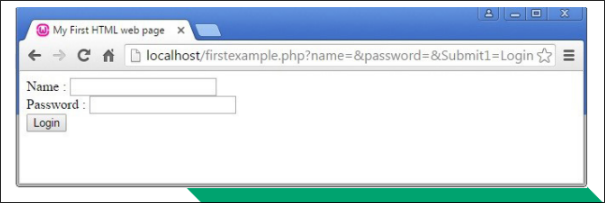


**Percent Encoding** a URL can contain only unreserved and reserved characters from the ASCII set. reserved ASCII characters are used as delimiters within the URL syntax.

Reserved Characters: **/?#[] @!$ &'()*+,; =**

There are also unsafe characters which cannot be used in a URL. Control characters such as null string termination, carriage return, line feed, end of file and tab are unsafe.

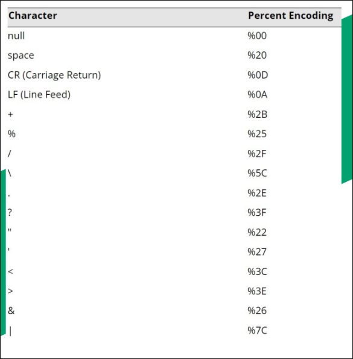


## 13.10 Api & Replay Attacks, Cross-Site Request Forgery, Clickjacking & Ssl Strip Attacks

**Application Programming Interface Attacks** web applications and cloud services

implement application program interfaces (APIs) to allow consumers to automate services.

If the API isn't secure, threat actors can easily take advantage of it to compromise the services and data stored on the web application. API calls over plain http are not secure and could easily be modified by a third party.

#### Some Other Common Attacks Against APIs Include

- Ineffective secrets management, allowing threat actors to discover an API key and perform any action authorized to that key.

- Lack of input validation allowing the threat actor to insert arbitrary parameters into api methods and queries. this is often referred to as allowing unsanitized input.

- Error Messages Revealing Clues to a Potential Adversary. (Username/Password)

- Denial of Service (DoS) by Bombarding the API with Bogus Calls.


**Replay Attacks** - session management enables web applications to uniquely identify a user across a number of different actions and requests.

To establish a session, the server normally gives the client some type of token and a replay attack works by sniffing or guessing the token value and then submitting it to re-establish the session illegitimately.

HTTP by default is a stateless protocol meaning the server preserves no information about the client but cookies allow for the preservation of data.

A cookie has a name, value and optional security and expiry attributes. cookies can either be persistent and non-persistent.

**Cross-Site Request Forgery** a client-side or cross-site request forgery (CSRF or XSRF) can exploit applications that use cookies to authenticate users and track sessions.

In order to work, the attacker must convince the victim to start a session with the target site. the attacker must then pass an http request to the victim's browser that spoofs an action on the target site such as changing a password or an email address.


if the target site assumes the browser is authenticated because there is a valid session cookie, it will accept the attacker's input as genuine. this is also referred to as a confused deputy attack.

**Clickjacking** - this is an attack where what the user sees and trusts as a web application with some sort of login page or form contains a malicious layer or invisible iframe that allows an attacker to intercept or redirect user input.

Clickjacking can be launched using any type of compromise that allows the adversary to run arbitrary code as a script. it can be mitigated by using http response headers that instruct the browser not to open frames from different origins.

**SSL Strip** - this is launched against clients on a local network as they try to make connections to websites. the threat actor first performs a MITM attack via ARP poisoning to masquerade as the default gateway. When a client requests an http site that redirects to an HTTPs site in an unsafe way, the SSL strip utility proxies the request and response, serving the client the http site with an unencrypted login form thus capturing any user credentials.


## 13.11 Injection Attacks

XML and LDAP injection attacks - an injection attack can target other types of protocols where the application takes user input to construct a query, filter or document.

Extensible markup language (xml) injection - xml is used by apps for authentication and authorizations and for other types of data exchange and uploading.

Lightweight directory access protocol (Idap) injection - Idap is another example of query language. Idap is specifically used to read and write network directory databases. a threat actor could exploit either unauthenticated access or a vulnerability in a client app to submit arbitrary Idap queries. This could allow accounts to be created or deleted or for the attacker to change authorizations and privileges.

For example a web form could construct a query from authenticating the valid credentials for bob and pa$$w0rd like this:

**(& (username = bob)(password = pa$$w0rd))**

If the form input is not sanitized, the threat actor could bypass the password check by entering a valid username plus an Idap filter string

**(& (username = bob)(&))**

Directory traversal & command injection attacks - directory traversal is another type of injection attack performed against a web server.

The threat actor submits a request for a file outside the web server's root directory by submitting a path to navigate to the parent directory (../)

The threat actor might use a **canonicalization** attack to disguise the nature of the malicious input.

Canonicalization refers to the way the server converts between different methods by which a resource (file path or url) may be represented and submitted to the simplest method used by the server to process the input.

Server-side request forgery (SSRF) - SSRF causes the server application to process an arbitrary request that targets another service either on the same host or a different one.

It exploits both the lack of authentication between the internal servers and services and weak input validation allowing the attacker to submit unsanitized requests or api parameters.


# SECTION 14 - SUMMARIZE SECURITY GOVERNANCE CONCEPTS

## 14.1 Regulations, Standards & Legislation

Key Frameworks, Benchmarks And Configuration Guides May be Used to Demonstrate Compliance With A Country's Legal Requirements.

**Due Diligence** Is a Legal Term meaning that Responsible Persons have not been negligent in Discharging their Duties.

- Sarbanes-Oxley Act (Sox) Mandates The Implementation Of Risk Assessments, Internal Controls And Audit Procedures.

- The Computer Security Act (1987) Requires Federal Agencies To Develop Security Policies For Computer Systems That Process Confidential Information.

- In 2002, The Federal Information Security Management Act (Fisma) Was Introduced To Govern The Security Of Data Processed By Federal Government Agencies.

Some Regulations Have Specific Cybersecurity Control Requirements While Others Simply Mandate "Best Practice" As Represented By A Particular Industry Or International Framework.

**Personal Data And General Data Protection Regulation (GDPR)**

This legislation focuses on information security as it affects privacy or personal data.

GDPR means that personal data cannot be collected, processed or retained without the individual's informed consent.

Compliance issues are complicated by the fact that laws derive from different sources e.g gdpr does not apply to american data subjects but it does apply to american companies that collect or process the personal data of people in eu countries.

National, Territory Or State Laws

In the US there are federal laws such as the gramm-leach-bliley act (GLBA) for financial services and the health insurance portability and accountability act (HIPAA).


## 14.2 ISO and Cloud Frameworks

**ISO 27k** - The International Organization For Standardization (ISO) Has Produced A Cybersecurity Framework In Conjunction With The International Electro Technical Commission (IEC).

Unlike The NIST Framework, The ISO 27001 Must be Purchased. The ISO 27001 Is part of an Overall 27000 Series Of Information Security Standards Also Known As 27k.

There Are 3 Main Versions Of The ISO 27k

- 27002-Security Controls

- 27017 & 27018 - Cloud Security

- 27701-Personal Data & Privacy


**ISO 31k** - This Is An Overall Framework For Enterprise Risk Management (ERM). Erm Considers Risks And Opportunities Beyond Cybersecurity By Including Financial, Customer Service And Legal Liability Factors.

**Cloud Security Alliance (CSA)** - The Not-For-Profit Organization Produces Various Resources To Assist Cloud Service Providers (CSP) In Setting Up And Delivering Secure Cloud Platforms.

**Security Guidance -** A Best Practice Summary Analyzing The Unique Challenges Of Cloud Environments And How On-Premises Controls Can Be Adapted To Them.

**Enterprise Reference Architecture** - Best Practice Methodology And Tools For CSPs To Use In Architecting Cloud Solutions.

**Cloud Controls Matrix** - Lists Specific Controls And Assessment Guidelines That Should Be Implemented By CSPs.

**Statements On Standards For Attestation Engagements (SSAE)** - the SSAE are audit specifications developed by the American institute of certified public accountants (AICPA). These audits are designed to assure consumers that service providers (notably cloud providers) meet professional standards.

Within SSAE No. 18, There Are Several Levels Of Reporting:

**Service Organization Control (Soc2)** - Soc2 Evaluates The Internal Controls Implemented By The Service Provider To Ensure Compliance With Trust Services Criteria (TSC) When Storing And Processing Customer Data.

An Soc Type 1 Report Assesses The System Design, While A Type 2 Report Assesses The Ongoing Effectiveness Of The Security Architecture Over A Period Of 6-12 Months.

Soc2 Reports Are Highly Detailed And Designed To Be Restricted.

**Soc 3** - A Less Detailed Report Certifying Compliance With Soc2. They Can Be Freely Distributed.


## 14.3 Governance Structure

**Enterprise Governance -** This is a system that holds to account, directs and controls all entities involved in an organization.

Governance is useful in identifying roles and responsibilities.

A role is a specific position or job title that an individual occupies within an organization.

Stewardship is the responsible oversight and protection of something entrusted to one's care. Responsibility refers to the specific duties or tasks that an individual is expected to fulfill within a given role.

### Board of Directors

- Determine the desired future state of information/cyber security and provide funding.

- Exercise Due Care (providing the standard of care that a prudent person would have provided under the same conditions.)

- A fiduciary is a person or organization who holds a position of trust

- They also provide oversight and authorization of organizational activities.


### Executive Management Duties

- Make decisions to achieve strategic goals and objectives

- Manage risks to an acceptable risk and also comply with applicable laws and regulations.

- Manage resources and the budget efficiently

- Evaluate performance measures

- Implement oversight process


### Information Security Steering Committee

- Make decisions to achieve information security strategic goals and objectives

- Set a cybersecurity budget, authorize risk decisions and report to the board of committee.
- They provide an effective communication channel for ensuring the alignment of the security program and business objectives.


**Chief Information Security Officer (CISO)** - Interprets strategic decisions and is ultimately responsible for the success or failure of the information security program.

Supporting roles include Information Assurance Officer/Manager (IAO/IAM), Information Security Officer (ISO)

### Complimentary Organization Roles

- Privacy Officer - Responsible for developing and implementing all aspects of the privacy program.

- Compliance Officer - Responsible for identifying all applicable regulatory and contractual requirements.

- Physical Security Officer - Responsible for ensuring that appropriate physical security procedures are implemented

- Internal Audit - Responsible for providing independent and objective assurance services.

### Functional Roles

- Owners - Responsible for oversight and decisions related to access control and protection.

- Custodians - Responsible for advising, managing and monitoring data protection controls.

- Users - Responsible for treating data in accordance with security policies and objectives.


## 14.4 Governance Documents

These are used to communicate direction, expectations and rules.

They are typically derived from the information security strategy which is also derived from the desired future state.

### Policies

- These codify the high-level requirements for securing information assets and ensure CIA

- They should be approved and authorized by the organization's highest governing body

- Modifications should be minor over extended periods of time


### Standards, Baselines & Guidelines

- Standards serve as precise specifications for the implementation of policy and dictate mandatory requirements.

- Baselines are the aggregate of standards for a specific category or grouping such as a platform, device type or location

- Guidelines assist in helping to understand and conform to a standard. Guidelines are not mandatory.


**Procedures** - Procedures are instructions for how to carry out an action. They focus on discrete actions or steps with a specific starting and ending point.

- Simple Step - Lists sequential actions. There is no decision making

- Hierarchical - Organizes the instructions in a hierarchical structure where each level is nested within the one above it.

- Graphic - Presents in pictorial or symbol form.

- Flowchart - Is used to communicate a process and when decision making is required.


**Plan** - This is a detailed strategy or tactic for doing or achieving something.

The function of the plan is to provide instructions and guidance on how to execute or respond to a situation within a certain timeframe usually with defined stages and with designated resources.

**Acceptable Use Policy (AUP)** - This details user community obligations pertaining to


Information and information systems. It contains rules that specifically pertain to acceptable behavior and actions that are prohibited.

It's a teaching document that develops security awareness and must be written in a way that is easy to understand.

**Non-disclosure Agreement (NDA)** - Establishes data ownership and the reason why the data is being provided.

It's primarily used to prevent data disclosure and prevents forfeiture of patent rights.

**Acceptable Use Policy Agreement** - When a user signs it, they acknowledge that they understand and agree to abide by the AUP including violation sanctions up to and including termination.

Agreement should be executed prior to being granted access to information and information systems.


## 14.5 Change Management

The objective is to drastically minimize the risk and impact a change can have on business operations.

### Types of Changes

- Standard - Occurs frequently, is low risk and has a pre-established procedure with documented tasks for completion (updates, patch management)

- Normal - Not standard but also not an emergency. Can be approved by the change control board (change of anti-malware product)

- Major - May have significant financial implications and could be high risk. May require multiple levels of management approval (change to new Operating system)

- Emergency - This is one that must be assessed and implemented without prior authorization to quickly resolve a major incident (switch to a backup server)

**Configuration Management KPIs** - Key Performance Indicators (KPIs) are business metrics used to measure performance in relation to strategic goals and objectives.

- Successful Changes - The higher the better

- Backlog of Changes - Changes not yet completed and should not grow over time

- Emergency Changes - It should not trend upward


## 14.6 Configuration Management

This is a set of practices designed to ensure that Configuration Items (CI) are deployed in a consistent state and stay that way through their frame. The primary goal is to minimize risk and ensure the configuration of services are known, good and trusted.

### Configuration Management Elements

- Configuration Item (CI) -This is an aggregation of information system components and treated as a single entity throughout the configuration management process.

- Baseline Configuration (BC) - A set of specifications for a Cl that has been reviewed and agreed upon and can be changed only through change control procedures.

**Automated Provisioning** - This is the ability to deploy information technology (IT) or operational technology (OT) systems and services using predefined automated procedures without requiring human intervention.

The primary goal is to reduce or eliminate manual dependencies and human error.

### Provisioning Processes

- Demand - Generated Resource Allocation is the automatic provisioning and deprovisioning of resources based upon demand.

- Idempotence - Is a principle that every time an automated configuration script is run, the same exact result is produced.

- Immutable System - Immutability is the principle that

- resources should not be changed, only created and destroyed (replace not fix).

- Infrastructure as Code - Is using code to manage configurations and automate provisioning of infrastructure. Supports Idempotence.


## 14.7 Scripting, Automation & Orchestration

**Scripting** - This is a set of instructions (interactive/non-interactive) used to automate a sequence of repetitive tasks.

Usually written in a scripting language which means they are interpreted and not compiled (the scripts are read and executed line-by-line by the processor at runtime).

### Scripting Tools

- Python - Interpreted, open-source programming language with an extensive available library.

- PowerShell - Microsoft automation and configuration management framework

- Bash - Linux | Unix shell command line interface (CLI) and scripting language.

- Macro - An automated input sequence that imitates keystrokes or mouse actions.

### Adversarial Scripting

- Python - Very easy to learn and is used for writing attack code and tools

- PowerShell - Can be used to direct the execution of a local script, retrieve and execute remote resources using various network protocols and encode payloads.

- Bash - Can be used to direct the execution of a local script, retrieve and execute remote resources using various network protocols and automate tasks on a LINUX/UNIX platform

- Macro - A macro virus can infect a software program and trigger a set of actions when the program is opened or run.

**Automation** - This is the execution of tasks without human intervention.

The goals are to eliminate manual dependencies and human error, improve quality of service, increase agility and reduce risk. Typically requires significant investment.

**Orchestration** - Orchestration is the coordination and management of multiple computer systems, applications and/or services, stringing together multiple tasks in order to execute a larger workflow or process.


# SECTION 15- EXPLAIN RISK MANAGEMENT

## 15.1 Risk management process

Risk management involves all processes from assessing the risk to managing it.

- Identify Assets Humans, data, emails, hardware (scoping)

- Identify Vulnerabilities - Weak passwords, unpatched systems

- Identify Exploits & Threats Hackers, natural disasters

- Determine Safeguards & Countermeasures - Security policies, backups, patches, updates etc

- Determine which risks are acceptable or not

**Enterprise risk management** Risk management is treated very differently in companies of different sizes and compliance requirements. most companies will institute enterprise risk management (erm) policies and procedures based on frameworks such as nist's rmf

### Risk Types

- External
- Internal
- Multiparty (Supply Chain Attack)

- Intellectual Property (Ip) Theft

- Software Compliance/Licensing

- Legacy Systems


**Quantitative risk assessment** - This aims to assign concrete values to each risk factor:

- Single loss expectancy (sle) - The amount that would be lost in a single occurrence of the risk factor. it's calculated by multiplying the value of the asset by an exposure factor (ef). ef is the percentage of the asset value that would be lost.

- Annualized loss expectancy (ale) The amount that would be lost over the course of a year. done by multiplying the sle by the annualized rate of occurrence (aro)

It's important to realize that the value of an asset isn't just about its material value but also the damage its compromise could cost the company (e.g a server is worth more than its cost).

**Qualitative risk assessment** - Seeks out people's opinions of which risk factors are significant. assets and risks may be placed in categories such as high, medium or low value and critical, high, medium or low probability respectively.


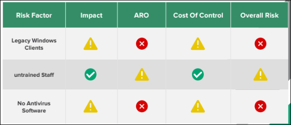


## 15.2 Risk Controls

**Risk Mitigation** - This is the most common method of handling risk and typically involves the use of countermeasure or safe guards. The likelihood of the risk occurring must be reduced to the absolute minimum.

**Risk Avoidance** - The cost of the risk involved is too high and must be avoided. Mitigation means the risk probabilities are reduced to the maximum while avoidance means the risk is eliminated completely

**Risk Transference** - This involves assigning or transferring the risk to another entity or organization. In other words, the risk is outsourced because the organization cannot mitigate the risk on it's own due to cost.

**Risk Acceptance** - The cost of mitigating the risk outweighs the cost of losing the asset. Risk can also be accepted when there isn't a better solution.

**Risk Appetite & Residual Risk** - Where risk acceptance has the scope of a single system, risk appetite has a project or institution-wide scope and is typically constrained by regulation and compliance. Where inherent risks are the risks before security controls have been applied, residual risks are those carried over after the controls have been applied.

Control risk is a measure of how much less effective a security control has become over time e.G antivirus.

**Risk Register** - A document showing the results of risk assessments in a comprehensible format.


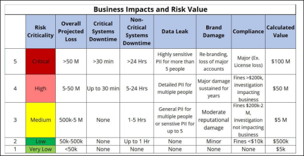


## 15.3 Business Impact Analysis

**Business Impact Analysis (BIA)** - This is the process of assessing what losses might occur for a range of threat scenarios.

Where BIA identifies risks, the business continuity plan (BCP) identifies controls and processes that enable an organization to maintain critical workflows in the face of an incident.

**Mission Essential Function (MEF)** - This is one that cannot be deferred. the business must be able to perform the function as close to continually as possible.

**Maximum Tolerable Downtime (MTD)** - The maximum amount of time a business can be down before it can no longer recover in a reasonable time or manner.

**Recovery Time Objective (RTO) -** The targeted amount of time to recover business operations after a disaster.

**Work Recovery Time (WRT) -** Following systems recovery, there may be additional work to reintegrate different systems, test overall functionality and brief system users on any changes.

**Recovery Point Objective (RPO)** - Refers to the maximum amount of data that can be lost after recovery from a disaster before the loss exceeds what is tolerable to an organization.


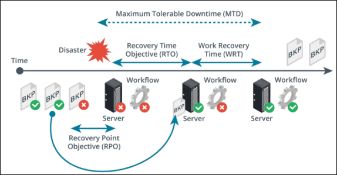


**Identification of critical systems** - Asset types include:

- People

- Tangible assets

- Intangible assets (ideas, reputation, brand)

- Procedures (supply chains, critical procedures)


**Single points of failure** - A SPOF is an asset that causes the entire workflow to collapse if it is damaged or unavailable. Can be mitigated by provisioning redundant components.

**Mean time to failure (MTTF) and mean time between failures (MTBF)** represent the expected lifetime of a product. MTTF should be used for non-repairable assets for example, a hard drive can be described with an MTTF while a server with MTBF.

- Calculation for mtbf is the total time divided by the number of failures. For example 10 devices that run for 50 hours and two of them fail, the mtbf is 250.

- Calculation for mttf for the same test is the total time divided by number of devices so 50 hours/failure.

**Mean time to Repair (MTTR)** is a measure of the time taken to correct a fault so that the system is restored to full operation. This metric is important for determining the overall RTO.

### Disasters

- Internal Vs External - Internal Could Be System Faults Or Malicious/Accidental Act By An Employee

- Person-Made - War, Terrorism, Pollution

- Environmental - Natural Disaster


A Site Risk Assessment Should Be Conducted To Identify Risks From These Factors.

### Disaster Recovery Plans

- Identify Scenarios For Natural And Non-Natural Disasters And Options For Protecting Systems Identify Tasks, Resources And Responsibilities For Responding To A Disaster

- Train Staff In The Disaster Planning Procedures And How To React Well To Change.

### Functional Recovery Plans

- Walkthroughs, Workshops And Seminars

- Tabletop Exercises - Staff "Ghost" The Same Procedures As They Would In A Disaster Without Actually Creating Disaster Conditions.

- Functional Exercises - Action Based Sessions Where Employees Can Validate The Drp By Performing Scenario-Based Activities In A Simulated Environment

- Full-Scale Exercises - Action Based Sessions That Reflect Real Situations. Held On Site And Uses Real Equipment And Real Personnel.


## 15.4 Third-Party Risk Management & Security Agreements

A root of trust is only trustworthy if the vendor has implemented it properly. Anyone with time and resources to modify the computer's firmware could create some sort of backdoor access.

For a tpm to be trustworthy, the supply chain of chip manufacturers, firmware authors and the administrative staff responsible for providing the computing device to the user must all be trustworthy.

When assessing suppliers for risk, it is helpful to distinguish two types of relationship

- **Vendor** - This means a supplier of commodity goods and services possibly with some level of customization and direct support.

- **Business partner** - This implies a closer relationship where two companies share quite closely aligned business goals.

**End of life systems** - When a manufacturer discontinues the sales of a product, it enters an end of life (EOL) phase in which support and availability of spares and updates become more limited.

**An end of service life (EOSL)** system is one that is no longer supported by its developer or vendor. Windows versions are given five years of mainstream support and five years of extended support (during which only security updates are provided).

**Organizational security agreements** - It is important to remember that although one can outsource virtually any service to a third party, one cannot outsource legal accountability for these services.

Issues of security risk awareness, shared duties and contractual responsibilities can be set out in a formal legal agreement.

**Memorandum of understanding (mou)** - A preliminary agreement to express an intent to work together. They are usually intended to be relatively informal and not contract binding.

**Business partnership agreement (bpa)** - The most common model of this in it are the agreements between large companies and their resellers and solution providers.

**Nondisclosure agreement (NDA)** - Used between companies and employees/contractors/other companies as a legal basis for protecting information assets.

**Service level agreement (SLA)** - A contractual agreement describing the terms under which a service is provided.

**Measurement systems analysis (MSA)** - A means of evaluating the data collection and statistical methods used by a quality management process to ensure they are robust.

## 15.5 Audit & Assurance

**Information security assessment -** This is the process of determining how effectively the entity being evaluated meets the specific security requirements.

- **Examination** - is the process of interviewing, reviewing, inspecting, studying and observing to facilitate understanding, comparing standards or to obtain evidence (audit)

- **Testing** - is the process of exercising objects under specified conditions to compare actual and expected behaviors (pen testing)

**Assurance** -This is the measure of confidence that intended controls, plans and processes are effective in their application.

The objective of an audit is to provide independent assurance based on evidence.

**Audit** **plan** - This is a high-level description of audit work to be performed in a specific time frame.

The plan may include objectives, resource requirements and reporting expectations. The final audience for the audit results is either an executive or board audit committee.

### Audit focus

- Compliance - Meeting laws, regulations and industry standards.

- Security & privacy - Attaining required levels of cia and privacy

- Internal controls - Evaluation of the design of the controls and assessment of the operational effectiveness and efficiency of the controls

- Alignment - Assure alignment with organizational and control objectives.


**Sampling** - This is used to infer characteristics about a population based upon the characteristics of a sample of that population.

Evidence sampling is applying a procedure to less than 100% of the population.

### Audit examination opinions

- Unqualified - Rendered when the auditor does not have any significant reservations (clean report)

- Qualified - Rendered when there are minor deviations or scope limitations.

- Adverse - Rendered when the target is not in conformance with the control objectives or when the evidence is misleading or misstated.

- Disclaimer - This means the auditor was not able to render an opinion due to certain/named circumstances.


**Audit framework** - This is a structured and systematic approach used by auditors to plan, execute and report on an audit engagement. They are typically developed by auditing standards-setting bodies.

- Isaca cobit 5

- Aicpa (ssae18)

### Ssae 18 soc versions

- Soc1 is a report of controls relevant to user entities financial statements

- Soc2 is based upon trust services principles (tsp) reports on controls intended to mitigate risk related to security, cia and privacy

- Soc 3 is similar to soc2 but does not detail testing performed and is designed for public distribution.


## 15.6 PenTest Attack Life Cycle

- Reconnaissance - Is typically followed by an initial exploitation phase where a software tool is used to gain some sort of access to the target's network.

- Persistence - this is the tester's ability to reconnect to the compromised host and use it as a remote access tool (rat) or backdoor.

- Privilege escalation - The tester attempts to map out the internal network and discover the services running on it.

- Lateral movement - Gaining control over other hosts and usually involves executing the attack or scripting tools such as powershell.

- Pivoting - If a pen tester achieves a foothold on a perimeter server, a pivot allows them to bypass a network boundary and compromise servers on an inside network.

- Actions on objectives - For a threat actor, this means stealing data while for a tester it would be a matter of the scope definition.

- Cleanup - For an attacker, this means removing evidence of the attack while for a pen tester, this means removing any backdoors or tools and ensuring the system is not less secure than its pre-engagement state.


# SECTION 16- SUMMARIZE DATA PROTECTION AND COMPLIANCE CONCEPTS

## 16.1 Privacy & Sensitive Data Concepts

The value of an information asset can be determined by how much damage its compromise would cause the company.

It is important to consider how sensitive data must be secured not just at rest but also in transit.

#### Information life cycle management

- Creation/collection

- Distribution/use

- Retention

- Disposal


**Data roles & responsibilities** - A data governance policy describes the security controls that will be applied to protect data at each stage of its life cycle.

**Data owner** - A senior executive role with ultimate responsibility for maintaining the cia of the information asset. The owner also typically chooses a steward and custodian and directs their actions and sets the budget and resource allocation for controls.

**Data steward** - Primarily responsible for data quality. Ensuring data is labeled and identified with appropriate metadata and that it is stored in a secure format

**Data custodian** - This role handles managing the system on which the data assets are stored. This includes responsibility for enforcing access control, encryption and backup measures.

**Data privacy officer (dpo)** - This role is responsible for oversight of any personally identifiable information (pii) assets managed by the company.


In the context of legislation and regulations protecting personal privacy, the following two institutional roles are important

**Data controller** - The entity responsible for determining why and how data is stored, collected and used for ensuring that these purposes and means are lawful. The controller has ultimate responsibility for privacy breaches and is not permitted to transfer that responsibility.

**Data processor** - An entity engaged by the data controller to assist with technical collection, storage or analysis tasks. A data processor follows the instructions of a data controller with regard to collection or processing.

**Data classifications** - Data can be classified based on the degree of confidentiality required.

- Public (unclassified) - no restrictions and can be viewed by the public. Poses no real risk to the company.

- Confidential (secret) - Highly sensitive information to be viewed only by authorized people and possibly by trusted parties under an nda.

- Critical (top secret) - Extremely valuable information and viewing is severely restricted.


Data can also be classified based on the kind of information asset.

- Proprietary/intellectual property (ip) - Information created and owned by the company typically about the products they make.

- Private/personal data - Information that relates to an individual identity.

- Sensitive - Refers to company data that could cause serious harm or embarrassment if it is leaked to the public. Sensitive personal data includes political opinions, sexual orientation, health records, tax records etc.


### Data types

**Personally identifiable information (PII) -** This is data that can be used to identify, contact or locate an individual such as a social security number.

An IP address can also be used to locate an individual and could be considered to be a type of pii.

**Customer data** -This can be institutional information but also personal information about the customer's employees such as sales and technical support contacts.

**Financial information** -This refers to data held about bank and investment accounts plus tax returns and even credit/debit cards. The payment card industry data security standard (pci dss) defines the safe handling and storage of this information.

**Government data -** Government agencies have complex data collection and processing requirements. The data may sometimes be shared with companies for analysis under very strict agreements to preserve security and privacy.

**Data retention** -This refers to backing up and archiving information assets in order to comply with business policies and applicable laws and regulations.


## 16.2 Data Sovereignty, Privacy Breaches & Data Sharing

**Data sovereignty & geographical considerations** - Some states and nations may respect data more or less than others and likewise some nations may disapprove of the nature and content of certain data.

**Data sovereignty** refers to a jurisdiction preventing or restricting processing and storage from taking place on systems that do not physically reside within that jurisdiction. For example gdpr protections are extended to any eu citizen while they are within the eu borders.

Geographic access requirements fall into two different scenarios

- Storage locations might have to be carefully selected to mitigate data sovereignty issues. Most cloud providers allow choice of data centers for processing and storage, ensuring that information is not illegally transferred from a particular privacy jurisdiction without consent.

- Employees needing access from multiple geographic locations. Cloud-based file and database services can apply constraint-based access controls to validate the user's geographic location before authorizing access.

A data breach occurs when information is read, modified or deleted without authorization.


**Notification & escalation** - Responses to a data breach must be configured so the appropriate personnel are notified immediately of the breach.

The first responders might be able to handle the incident if its a minor issue however in more serious cases, the case may need to be escalated to a more senior manager.

In certain cases, a timescale might also be applied. For example with gdpr, all affected individuals must be informed of the breach within 72 hours after the breach occurred.

### Data sharing & privacy terms of agreement

- Service level agreement (SLA) - A contractual agreement setting out the detailed terms under which a service is provided.

- Interconnection security agreement (ISA) : ISAS set out a security risk awareness process and commits the agency and supplier to implementing security controls.

- Nondisclosure agreement (NDA) - This is a legal basis for protecting information assets.

- Data sharing and use agreement - Personal data can only be collected for a specific purpose but data sets can be subject to deidentification to remove personal data. However there are risks of re identification if combined with other data sources. A data sharing and use agreement is a legal means of preventing this risk. It can specify terms for the way a data set can be analyzed and proscribe the use of re identification techniques.


## 16.3 Privacy And Data Controls

Data can be described as being in one of three states:

- Data at rest - Data is in some sort of persistent storage media. This data can be encrypted and acls can also be applied to it

- Data in transit - This is the state when data is transmitted over a network, In this state it can be protected by a transport encryption protocol such as tls or ipsec.

- Data in use/processing - This is the state when data is present in volatile memory such as the ram cache. Trusted execution environment (tee) mechanisms e.G intel software guard extensions are able to encrypt the data as it exists in memory.


**Data exfiltration** Data exfiltration can take place via a wide variety of mechanisms:

- Copying the data to removable media such as usb drive or smartphone

- Using a network protocol such as ftp, http or email

- Communicating it orally over a phone or even with the use of text messaging.

**Data protection against exfiltration**

- All sensitive data is encrypted at rest

- Create and maintain offsite backups of data

- Ensure that systems storing or transmitting sensitive data are implementing access controls.

- Restrict the types of network channels that attackers can use to transfer data from the network to the outside.

- Train users about document confidentiality and the use of encryption to store and transmit data securely.


### Data loss prevention

Dip products automate the discovery and classification of data types and enforce rules so that data is not viewed or transferred without proper authorization.

- Policy server - to configure classification, confidentiality and privacy rules and policies, log incidents and compile reports

- Endpoint agents - to enforce policy on client computers even when they are not connected to the network

- Network agents - to scan communications at network borders and interface with web and messaging servers to enforce policy.


**Remediation** is the action the dip software takes when it detects a policy violation.

- Alert only

- Block - The user is prevented from copying the original file but retains access to it. User may not alerted to the policy violation but it will be logged as an incident by the management engine.

- Quarantine - Access to the original file is denied to the user.

- Tombstone - The original file is quarantined and replaced with one describing the policy violation and how the user can release it again.

**Privacy enhancing technologies -** data minimization is the principle that data should only be processed and stored if that is necessary to perform the purpose for which it is collected.

Data minimization affects the data retention policy and its necessary to track how long a data point has been stored for and whether continued retention is necessary for a legitimate processing function.

**Pseudo-anonymization** modifies identifying information so that reidentification depends on an alternate data source which must be kept separate. With access to the alternated data, pseudo-anonymization methods are reversible.


### Database identification methods

**Data masking** - Can mean that all or part of the contents of a field are redacted by substituting all character strings with "x".

**Tokenization** - Means that all or part of data in a field is replaced with a randomly generated token. The token is stored with the original value on a token server or vault separate to the production database. It's often used as a substitute for encryption.

**Aggregation/binding** - Another identification technique is to generalize the data such as substituting a specific age with a broader age band.

**Hashing & salting** - A cryptographic hash produces a fixed-length string from arbitrary-length plaintext data using an algorithm such as sha. If the function is secure, it should not be possible to match the hash back to a plaintext. A salt is an additional value stored with the hashed data field. The purpose of salt is to frustrate attempts to crack the hashes.

## 16.4 Privacy Principles

**Privacy -** This is the right of an individual to control the use of their personal information.

Data minimization approach limits data collection to only what is required to fulfill a specific purpose.

**Privacy Statement** - This describes how an organization collects, uses, shares and protects personal information collected from individuals.

**Right to be Forgotten** - This pertains to an individual's right to have their personal information removed or deleted from online platforms, search engine results or other publicly accessible sources.

It is not an absolute right and needs to be balanced against other rights such as freedom of expression, public interest or legal obligations.


### Privacy Enhancing Technologies

- Data Masking - A technique used to protect sensitive data by replacing it with fictional or deidentified data

- Tokenization - A technique used to desensitize data by replacing the original data with an unrelated value of the same length and format.

- Anonymization - Is the process in which individually identifiable data is altered in a way it can no longer be traced back to the original owner

- Pseudo-Anonymization - Is a method to substitute identifiable data with a reversible consistent value

#### Privacy Management Components

- Privacy Program - Privacy statement, tools for data mapping, executive sponsorship and privacy impact assessment

- Operations - Cookie compliance, privacy enhancing technologies, reporting and assessment and consent mechanisms

- Incident and Breach Response - Incident prevention, detection, management, notification triggers and reporting obligations.


## 16.5 Compliance Monitoring

**Compliance** - This means acting in accordance with applicable rules, laws, policies and obligations.

Organizations are responsible for complying with all local, state, federal and union laws and regulations, international treaties as well as contractual obligations.

**Jurisdiction** - This is the power or right of a legal or political body to exercise their authority over a person, subject or territory.

Consequences of Non-Compliance

- Fines & Sanctions

- Loss of License

- Reputational Damage

- Contractual Impact

- Resource Utilization


**Compliance Monitoring -** This is the active process of evaluating activities and behaviors to verify compliance and identify any deviations or non-compliant actions.

Monitoring activities include:

- Manual Inspections

- Audits

- Data Analysis

- Automated Systems

- Specialized Tools


**Automated Compliance Monitoring** - This utilizes automated tools to monitor and assess compliance.

Automated systems can analyze large volumes of data in real time to identify compliance breaches and also generate alerts when specific conditions or thresholds are met.


## 16.6 Education, Training & Awareness


| Security  | Education                    | Training                      | Awareness                         |
| --------- | ---------------------------- | ----------------------------- | --------------------------------- |
| Attribute | Why                          | How                           | What                              |
| Level     | Insight                      | Knowledge                     | Information                       |
| Object    | Understanding                | Skill                         | Behavior                          |
| Method    | Discussion, Seminar, Reading | Lecture, case study, hands-on | Interactive vedio, posters, games |
| Measure   | Essay                        | Problem solving               | True/false, multiple choice       |
| Impact    | Long-term                    | Intermediate                  | Shorts-terms                      |


## 16.7 Personnel Policies

- Acceptable use policy (aup)

- Code of conduct and social media analysis

- Use of personally owned devices in the workplace

- Clean desk policy


**User and role-based training** - Appropriate security awareness training needs to be delivered to employees at all levels including end users, technical staff and executives.

- Overview of the organization's security policies

- Data handling

- Password & account management


Awareness of social engineering and phishing

**Diversity of training techniques** - Using a diversity of training techniques helps to improve engagement and retention.

- Phishing campaigns

- Capture the flag - Usually used in ethical hacker training programs and gamified competitions.

- Computer-based training and gamification


